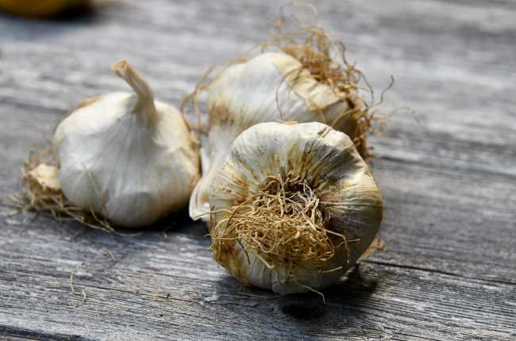

Dr. Weil appeared on the Kevin Rose Show podcast yesterday with some immune-boosting tips to best deal with the coronavirus. I couldn't find a website with show notes, so I took my own notes, which I am posting here.

-   Hand washing plus not touching your face is the best defense against viral infections.
-   Take 2,000-4,000 IU Vitamin D3 daily
-   Dr. Weil really likes the Chinese herb Astragalus. It is a powerful anti-viral agent with lots of research behind it. He says to take 1-2 capsules of a standardized twice a day.
-   Mushroom extracts. Stamets 7 Immune is mentioned. Weil likes the Cinnamon flavor of the Microshield throat spray when he travels or thinks he might been exposed to someone sick.
-   He really likes allicin, which is an anti-microbial compound found in garlic. You can purchase a supplement or get it from garlic.

In order to get it from garlic, the garlic needs to be chopped up and exposed to room temperature for 10-15 minutes. Weil said you can then cook with it, but that didn't sound correct. The Healthy Home Economist said in the article [How to Maximize the Allicin in Garlic](https://www.thehealthyhomeeconomist.com/maximize-allicin-benefits/):

> Allinase is destroyed once the garlic is heated above 117 °F/ 47 °C for wet heat and 150 °F/ 66 °C for dry heat.

Dr. Weil read a letter from a Chinese doctor that mentions a county in China with 1.3 million people where most of the garlic is produced. There hasn't been a single case of Coronavirus there, even though 30,000 of their residents work in the Wuhan region. Those residents consume a lot of garlic.

What other tips would you add to this list?

_Photo by [Shelley Pauls](https://unsplash.com/@shelleypauls)_

---

## Comments

### Jim
*March 2 at 2020 at 4:15 PM*

I like Dr. Weil.
However, over the years, I've become highly skeptical of vitamins and supplements.

Ever since I've been working from home, I rarely if ever get sick.  I think it's a combination of being able to avoid exposure to sick colleagues, and the choice of whether or not to go out into cold and windy weather.

---

### Ant
*March 6 at 2020 at 7:20 AM*

High dose zinc &amp; ester-C to add to your list.

---

### Jim
*March 6 at 2020 at 4:20 PM*

@MAS
Forgot you were in Seattle.  
How is everyone handling it there?
Not many cases in NJ yet.
Here, people appear to be generally not focussed on it.  But the stores are sold out of hand sanitizer, etc.

---

### MAS
*March 6 at 2020 at 4:31 PM*

@Ant - Congrats on being the 11,000th comment on this blog!  

@Jim - It is all people are talking about here. Not quite panic, but close. I stopped going to the gym and have minimized leaving the house. My job was already remote, so I am fine there.

I'm still waiting on my Amazon order of the supplements listed in this post. They should arrive today. Until then, I have been eating lots of garlic.

---

### Chris
*March 11 at 2020 at 3:15 PM*

I get the sense it has gone beyond Vitamin D and Garlic.  The recent Joe Rogan and Sam Harris podcasts were a bit more realistic if quite alarming.

---

### Colin
*March 31 at 2020 at 1:27 PM*

Going strong on garlic and vitamin D, with some fresh lemon juice for the C. So far so good

---

