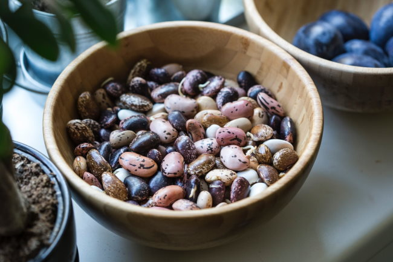

In the post [Lipid Levels After Going 90% Pesco-Vegan](/2020/03/lipids-levels-after-going-90-pesco-vegan/) Ant asked:

> I’m debating whether or not to go completely plant-based or keep some fish in. What are your thoughts on going sans animal products?

This is a good question. For now, I am sticking with the 90% number for a few reasons. Here are my random thoughts on how I landed at 90%. Although the WFPB (whole-food plant-based) crowd makes very strong cases for many of their views, I feel their least persuasive arguments are against fish and non-fat dairy. That doesn't make them wrong. Just less persuasive to me. I also want to have a diverse diet. I want to be flexible enough to eat 10% of my calories however I need to without getting stuck to honoring a label. I've watched enough people do enough diets over the years to see that they normally see most of the benefits early on and they get most of the benefits from eliminating the prior ways of eating that were unhealthy. The new diet will often get more credit than it deserves. I need to be careful of that effect myself. Continuing on the last point. I do see people get into trouble when they go stricter. Being restrictive and not developing any nutritional imbalances takes skill, practice, and probably some testing. Vegetarian leads to vegan which leads to raw vegan and so on. For an extreme example of this, see my post [Death By Orthorexia](/2019/01/death-by-orthorexia/). There are numerous videos on YouTube where someone had great early on success with a vegan diet and then things got worse. Other channels then play "Monday morning quarterback" on how they did something wrong. Perhaps they are correct, but the fact so many people get the diet wrong shouldn't be dismissed. For me that 10% represents a hedging strategy to get the nutrients that failed vegans are most likely to miss. By limiting myself to about 10% of my calories from non-seafood animal products, I will make those calories count more. They won't come from conventional lean-ground beef or the chicken thighs that went on sale. That was [peasant diet thinking](/2018/02/using-price-knowledge-lean-peasant-diet/). It was fine for the time, but now the focus is on optimal health, not an optimal weight. I am a frequent blood donor. I've learned through experience that I need to [supplement with Beef Liver and Organ capsules](/2019/08/spiking-iron-levels-quickly-with-beef-organ-capsules/) before and after donating to support a healthy iron level. Legumes don't provide enough bioavailable iron for me. One of the benefits of fish and non-fat Greek yogurt have is that they don't have fiber. But fiber is good, right? Yes, up to a point. Too much fiber can speed up things a little too much. Between buckwheat, quinoa, legumes, and other plants, I'm getting more than enough fiber. Sometimes the animal option is the most healthy choice when at restaurants or traveling. I need to have the freedom to make the best choice for the situation. Those are my views now in March 2020. Perhaps in a year or two, I'll revisit this post with a more updated opinion. 

_Photo by Milada Vigerova_

---

## Comments

### ant
*March 12 at 2020 at 8:18 PM*

Thanks for the detailed post, I'm inclined to agree with pretty much everything you wrote.  I don't like a lot of the narrow black &amp; white thinking coming from many of the vegan/wfpb proponents, it sounds too much like propaganda to my ears, despite me wanting it to be the healthiest diet for the sake of my, maybe naive, ethical beliefs, and despite eventually coming around to believing in, if not all, a lot of the foundations they're basing their conclusions from.

The two approaches to the messiness of nutrition science that I've come to trust the most and rely on for my diet decisions are Valter Longo's 5 pillars framework and Ray Cronise's metabolic winter hypothesis.  Neither of them are ethical vegans or beholden to any ideology, and both use impeccable epistemic methods based on the best evidential data we have, and they've both come to very similar conclusions, at least if your goal is to maximize healthspan/longevity with the least risk &amp; uncertainty.  I don't know if these diets are the only way to achieve such benefits (look at Art Devany), or if they're the best for everyone (look at epileptics on keto), but they are the only ones with the most evidence for sustainably preserving overall health and youthfulness systematically and reliably after reproductive age.   

The main difference is Longo's inclusion of fish and olive oil vs Cronise's recommendation against all animal products and all oils.  Longo has said the fish is optional as long as you supplement properly, but he strongly recommends it because he's not confident in the average person's ability to go without it responsibly for optimal long-term nutrition, and also that fully plant-based has much less long-term data to support it so far.  He says something similar about the olive oil, he strongly recommends it as being protective and beneficial, even for heart disease patients, and though he admits that there's data for the efficacy of the Esselstyn/Ornish/McDougal style minimal fat no-oil approach to heart disease reversal, he thinks that is unnecessary for most people, even most heart disease patients.  

I'm not too fond of the flavor of fish to make a fuss about leaving it out, it would definitely save me money not to have to buy it, especially wild caught, and the environmental and ethical benefits are obvious, though could be overstated.  However, there's two nagging, possibly irrational, fears of mine that keep me struggling with going completely fish free and/or going very low fat.  Firstly, my main concern outside of general health &amp; disease prevention is for optimal brain health and cognition, and it remains to be seen whether or not mental performance would take a hit, especially as we age.  Secondly, I don't think we definitively know how well supplementation works or the downsides of relying on them instead of whole foods, or if we even know everything we're missing by leaving animal products out completely.  A third fear I might add now that I think of it is the orthorexia issue you've written about.  Trying to stick to zero animal products could exacerbate orthorexic tendencies.

So that's where I'm at after certainly overthinking things way too much. I'm currently doing a Longo compatible slow-carb/4-hour body peasant diet centering on lentils, sardines, vegetables, and olive oil, and I think I could do a Longo diet more easily than Cronise's long term, so I'll have to see more convincing data or have more of an incentive before I give up the fish and olive oil.

---

### MAS
*March 13 at 2020 at 2:21 AM*

@Ant - Thanks for the detailed comment.

The way I reconcile Longo and Cronise is that Longo is backward-looking and Ray is forward-looking.

In the past, we lived in environments of under-nutrition. Longo looks at the data from the longest-lived peoples and extrapolates back his recommendations. Which makes sense in an age when calories were less abundant.

Ray C. is looking at the current era of over-nutrition and makes his adjustments for the diet to be 100% WFPB. 

I could reconcile the two through experimentation. Perhaps do Longo in the winter months and Ray C. in the summer months? A hedging strategy with a seasonal twist.

---

### ant
*March 13 at 2020 at 4:16 PM*

Yes, I was thinking the same thing exactly.  A fair compromise I was thinking of is to remove the olive oil and stick to whole foods, mostly plants, and stick to fish as the animal food, but not every day.

---

### Jim
*March 29 at 2020 at 4:10 PM*

Another complication is short term versus long term effects.  As an experiment, I've recently greatly reduced my intake of beans, legumes and vegetables due to minor digestive issues. I've actually been eating mostly starches like bread, potatoes, pasta and rice.  And I've never felt better -- on a day-to-day basis. However, the long term outlook cannot be detrmined at this time.

---

### Andre
*April 3 at 2020 at 8:56 PM*

Hey MAS,

I've been trying to find a good starting point for a diet (health and energy-wise) to start experimenting with. My weight is on point, but my diet is still largely a typical western diet and I feel big swings of energy throughout the day that I'm trying to minimize in order to increase my focus. 

Where do I start? I was looking at your past posts for clues, but you have been experimenting for way longer than I have (zero), so I'm kinda lost. Do you have any tip for a good diet framework to build (or strip) upon?

Some info that might be relevant: I don't have any restrictions other than I don't digest dairy very well and I've experimented with vegetarian for a while and I hated it, I had no energy whatsoever. Once or twice a week may be doable, though. I have access to higher-quality grass-fed local meat so I prefer those to fish.

I have no problem eating the same meals ad nauseam, so if I could meal prep some staples for the entire week in one go that would be a plus!

---

### Andre
*April 3 at 2020 at 8:59 PM*

I should also mention that I lift weights regularly and other sports on top of that, so I'm also trying to reduce inflammation and increase recovery.

---

### MAS
*April 4 at 2020 at 2:29 PM*

@Andre - I put together where I am at with my diet today in this post:

https://criticalmas.org/2020/02/what-i-eat-and-what-i-dont-eat-2020-edition/

I think it is a good starting spot. It may not work for everyone. Tweak it to meet your needs and goals. Having an Instapot or another Pressure Cooker will help a lot. 

I too am still trying to solve the energy and recovery puzzle. Going more plant based has helped, but I still have room to make improvements. For me, too much caffeine and lack of sunlight for half the year are likely larger factors now than my diet.

---

### Andre
*April 4 at 2020 at 7:40 PM*

I did check out that post, it's a great summary! But my question was more *how* you ended up eating those foods. What is the most time-effective "order" or "principles" for experimenting that you would put in place to arrive at that list if you had to start over again?

Eg, do you think it's better to start with a small variety of foods and add a couple more every few weeks or do the opposite and remove/substitute some foods from your current diet until you strike a balance?

Another thing is: I don't know which of the dozens of dietary principles (vegan, keto, WAPF, etc) to start with. So whenever I try to search for something, eg "should I cook with XYZ oil?" I'll find 10 conflicting results instead of having a single "North" that I can experiment with over time. 

The end result will probably be a mix of different principles but I don't know which one is a good base to start running experiments on.

---

### MAS
*April 4 at 2020 at 8:13 PM*

@Andre - I don't know how to answer your first question. Whatever approach to get healthy food in your diet is the one that rings true to you. Back in 2008, I started this journey inspired by the SuperFood concept.

https://criticalmas.org/2008/03/150-superfoods-because-14-just-wasnt-enough/

Then I got sidetracked with Paleo and WAPF, which I suppose were connected. Then came the injury and the weight gain. Which took me to the Potato Hack and my Peasant Diet. 

Today, I am back at the SuperFood route. It just so happens to be 90% Pesco-Vegan I posted about. If I were to start with a diet, it would absolutely be Vegan++. Meaning a whole-food plant-based diet would be the template. Then add whatever you need. 

My bias is anti-low carb though. Even if low-carb diets were as heart-healthy as their supporters believe, I don't think it is wise to consume a lot of animal fat, due to the high levels of environmental toxins that were not present in the Paleolithic and pre-industrialized era.

---

### Andy
*April 11 at 2020 at 8:48 AM*

MAS I apologise for the personal q but has your libido changed? For better or worse? That's the last lingering thing making me suspicious of full vegan, and I really don't know what to believe

---

### MAS
*April 11 at 2020 at 3:25 PM*

@Andy - This week I watched Forks over Knives. It was OK. One of the scenes talks about how these unhealthy men increased their libido when they went plant-based. They went from an unhealthy diet to a very healthy diet. They dropped their meds and everything improved.

But you can get the same benefit by moving to a number of healthy diets. If you dig through any forum be it Paleo or low-carb, you will see the libido benefit. I suspect it is more a function of moving from a nutrient-poor diet to a nutritient-dense diet. 

I never went 100% plant-based. My diet over the last year has been gradual moves. Not the about-face diet changes that we see in documentaries. My energy fluxuations at this stage are based more on caffeine and sunshine levels. 

My advice is to run your own experiments. Move towards greater nutrient density and you should  be fine.

---

### mat
*April 15 at 2020 at 3:40 AM*

Are you no longer eating organ meats, in particular liver? Given its extremely nutritious, very high in iron (and very low in saturated fat), its hard to see a down side, even its very high cholesterol levels are no longer considered a problem even by the american heart association (" Cholesterol is not a nutrient of concern for overconsumption.")

---

### MAS
*April 15 at 2020 at 2:47 PM*

@Mat - In the post above, I mentioned I supplement with Beef and Organ capsules for iron, because I am a frequent blood donor.

---

