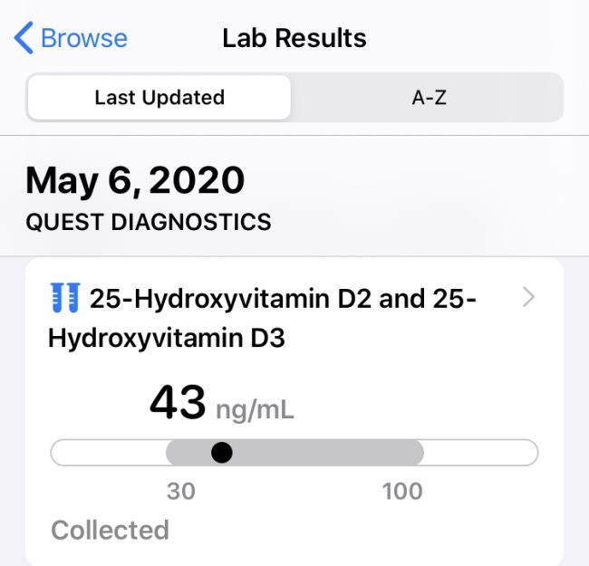

In the post [My Coronavirus Plan](/2020/04/my-coronavirus-plan/), I mentioned that I was Vitamin D deficient and that one of the strategies I would focus on as a defense against the Coronavirus would be getting my levels up to optimal. My plan:

> Every day, I take 5000 IU of a Vitamin D3 (with K2) supplement with food. I also go for a walk outside between 11 am – 4 pm when the UV index is the strongest. And unlike my fellow neighbors, I am not bundling myself head-to-toe covering every inch of exposed skin. I want my Vitamin D.

How did I do?

-   March 3rd: VITAMIN D, 25-OH, TOTAL: **19 ng/mL** (deficient)
-   May 6th: VITAMIN D, 25-OH, TOTAL: **43 ng/mL**

In 64 days, I more than doubled my Vitamin D levels. By most metrics, I am no longer deficient. However, based on a few charts I am still considered "insufficient". What is optimal? There does not seem to be an agreed-upon level. The two most common ranges I see for optimal are:

-   **50-70 ng/mL**
-   **40-60 ng/mL**

I'll be aiming for **55 ng/mL**. That gives me padding on each side. Now that the UV index has increased here in Seattle and I'm no longer in the deficient zone, I will reduce my D3 supplement from the 5000 IU bottle to the 500 IU bottle for 2 weeks. Then I'll stop the supplements and rely solely on mid-day sun exposure and food. I'm guessing I'll hit my goal before June. 😎

### 🚀 Energy Levels WAY UP!

Back in October, I posted [Dear Future Tired Self](/2019/10/dear-future-tired-self/). In that post, I blamed too much coffee for my lack of energy. Once I cut my coffee intake in half, my energy went up. All that is true, but I now know it was just one variable. Increasing my Vitamin D levels has been a jolt to my energy levels. More than reducing coffee. It was gradually, but noticeable.

### 🏥 Test yourself!

I went my whole life thinking I was fine and didn't need to be tested. And because I avoid doctors, I have been avoiding tests. The good news is we don't need a doctor to get tests. With websites such as Ultalabs or Directlabs, you can test yourself at a very affordable price. I was able to get each of my Vitamin D tests for $39.20 from Ultalabs. I didn't need to go through a doctor or my health insurance provider. Last year, before I knew about Ultalabs, I went to my regular doctor. He ran a bunch of tests that ended up costing me over $800 out of pocket. I learned almost nothing from the tests. Ironically, even though I was fatigued and living in the PNW, he never bothered to order a Vitamin D test. 🤦🏻‍♂️ Ultalabs and Directlabs act as brokers between you and the places that perform the tests. I ordered the test online. I printed out a form and then drove a few miles away to a Quest Diagnostic facility for a blood draw. No wait, no appointment, and no lobby full of sick people. A few days later, I received an email with my results. And because I have an iPhone, I was able to have my health records sent directly to the Health app. For less than $100 I was able to get two Vitamin D tests and a bottle of Vitamin D3/K2 capsules. I fixed my deficiency and have escaped the Vitamin D danger zone. No doctor needed.  _On the iPhone, open the Health app, click summary, scroll to the bottom to add accounts. Add your health care provider and testing facilities. A few days later, all your health data will be there for easy access._

---

## Comments

### Jay
*May 10 at 2020 at 6:57 AM*

What vitamin D supplement did you take? Be interested to know. Thanks for this post!

---

### MAS
*May 10 at 2020 at 3:34 PM*

@Jay - Yes, I have Purely Holistic K2 & D3. I don't recall why I got this brand. I probably just liked the design of the bottle.

---

### Joanna
*May 11 at 2020 at 9:20 AM*

Why not keep taking the 5000 IU until you've reached the range you want? Are you worried about getting too much (which I realise can be toxic). I've been taking 5000 IU every other day, even with some sun exposure. Here in the UK, Vit D3 usually comes alongside K1 instead of K2, which I don't understand. Any insights?

---

### MAS
*May 11 at 2020 at 1:54 PM*

@Joanna - Yes. There is a risk of taking too much. 5000 IU is a fine dose for a deficient person in the winter. I'm scaling back primarily because I've made so much progress so quickly and summer hasn't even started. If my levels were below optimal at the end of summer, I'd reach for the 5000. 

I have not looked into the K1 vs K2 pairing. Maybe one is better or maybe they both work?

---

### nomalarkey
*May 15 at 2020 at 12:51 AM*

I've always known Vit D deficiency is a real thing because some people with internal medicine issues are prescribed Vit D.  We are going to see a precipitous drop in COVID cases over the summer.  One reason is for Vit D being addressed indirectly with more people getting more sun.  Another reason is better treatment options and catching mild cases earlier.

Maybe it will come back in the Fall but to a much lesser degree due to social-distancing protocols.  Which are actually more of a psychological placebo for many people and aren't "really" that effective, but what it will do is create much less people going out at all. AT ALL.  So thus by that reason alone, i.e. volume distancing rather than social-distancing cases will decrease.  In that way there are some similarities between COVID and cooties you may have avoided getting as a child at recess.  People will be much less socially intimate behaviourally with much less people to transmit it to/from.

---

### nomalarkey
*June 6 at 2020 at 11:00 PM*

I was right...precipitous drop in COVID cases.  Now, I don't think there will be a resurgence in Fall either.  I'm not a nut, but this was one of the strangest ways to handle a pandemic.  I got knocked for saying we should offer support to the most vulnerable early on and was knocked for it.  Bet I'm right and that is what we will do if it happens again.

---

