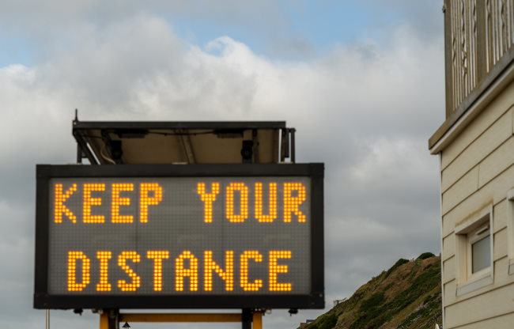

In my last post, [The End of Gyms?](/2020/05/the-end-of-gyms/) Part 1, I covered some of the macro challenges gyms are facing in a post-Coronavirus world. I suspect many gyms are going to fail for the reasons cited in that post. However, not all gyms or locations are going to be the same. In this post, I want to drill down on different gyms and different regions will have different outcomes.

### Types of Gyms

I want to start by breaking down gyms into three different groups.

1.  Glitter Gyms - LA Fitness, 24 Hour Fitness, Fitness 19.
2.  Cross Fit and Hardcore Gyms
3.  Studio Gyms - 1-on-1 personal training gyms. HIT and Super Slow come to mind. But this also might include pilates or other specialized gyms.

**Group A** is what I was mostly thinking about in Part 1. I think this group will be hit the hardest. What will it look like for them? Stuart shared this story, [Will It Ever Be Safe to Go Back to the Gym?](https://elemental.medium.com/will-it-ever-be-safe-to-go-back-to-the-gym-7566d98df9e8) _(if you can't see the full article, open it in a private window to get around the paywall)_

> If you can’t move outdoors, you want to be sure that the area has good ventilation (ideally open windows and fans) and a low density of people so you can keep your distance from other exercisers. Also, stay out of the locker room, make sure that shared equipment is cleaned before and after use. Ask the gym about their procedures, and bring disinfectant wipes with you to thoroughly wipe down any surface before and after you touch it. Finally, don’t linger.

The culture of fear - be it real or hyped - will be greatest in the Glitter Gym. Exercise reduces stress levels, but probably not if you think you will get infected or infect someone else. **Group B** will probably do fine. Crossfitters are fearless risk-takers and powerlifters will be forced to return because bodyweight exercises aren't going to cut it for them. Plus building out a home gym when you are benching, squatting, and deadlifting hundreds of pounds is expensive and requires space, which is not practical for most. **Group C** could explode in popularity. These businesses are already skilled at 1-on-1 training. Scheduling, efficiency, and cleanliness. This is their moment. The HIT / Super Slow trainers no longer need to make the case that a shorter workout can be more effective than a longer one. Now they can just make the case that they are the cleanest exercise option around. Safe movements, safe environment.

### Fear Cities vs Rebel Cities

As I put this post together at the end of May 2020, I see a huge division in the country. One group is in fear and one group is fearless when it comes to the Coronavirus. There is a strong regional component to the fear. And now a political one. 🤦🏻‍♂️ The more fearful a city is, the harder it is going to be for the gym to reopen. Unfortunately, here in Seattle, the people are in total fear. You would think everybody here was a diabetic asthmatic 70-year old from Wuhan. The reality is Seattle is one of the healthiest cities in America. But it is what it is. This means that those of us in Fear Cities will have to wait additional months and that factor in itself could put more gyms out of business.

### Not Optimistic

Maybe if I lived somewhere else my opinion would be different, but I'm not hopeful. I don't see my local gyms making a comeback. If they do make a comeback, the environment might be too stressful. The site of someone wearing a mask serves as a constant reminder of sickness and death. I'll let other debate if that fear is still deserved, but fear comes at a price. Fear increases cortisol levels, which - wait for it - reduces one's immune system. 😧 I'd be interested in hearing where you are from, what type of gym you attend, what the local fear level is, and your level of optimism on if and when things will return to normal.  _Photo by [Nick Fewings](https://unsplash.com/@jannerboy62?utm_source=unsplash&utm_medium=referral&utm_content=creditCopyText)_

---

## Comments

### Jim
*May 30 at 2020 at 2:25 AM*

@MAS
I'm in NJ.  It's tough to call at the moment.  We went from not a care in the world to total lockdown in a matter of weeks.  So it's possible this whole thing will flip back just as quickly.  But we've had 11k deaths.  So it may take a while.
Joshua Newman had an interesting post regarding his 70x70 rule for businesses.  If only 70% of people return to a gym or restaurant, and they only go back 70% of the time, 70% x 70% only gets you to about 50% (49%) of the original business.  Which would not be sustainable for most businesses.

---

### Geoff
*May 30 at 2020 at 1:29 PM*

@MAS

My home is a small city in rural, central Virginia. Overall low rates of cases and deaths here. Honestly the pressure here is more to reopen bars than gyms (sigh).

My gym was studio trading (1:1) in the early AM at a youth sports training facility. I was usually the first client at 5:30 AM and my coach would roll through her clients throughout the morning. The good news is that she and her husband own the strength and conditioning equipment. The bad news is that training was their main source of income and if the space can’t open they can’t work.  She’s been doing outdoor group fitness classes, but those just don’t appeal to me.

I think the biggest challenge to lifting weights at home for the average is space, not cost.  Decent used equipment can be gotten relatively cheaply. Someone who knows the lifts with good form, doesn’t move large loads, and doesn’t go to failure can probably be pretty effective in a home gym  of space is available, and in a few month’s time the cost of the equipment will offset the cost of a gym membership.

---

### MAS
*May 30 at 2020 at 3:01 PM*

@Jim - Thanks for sharing the 70% rule. 

@Geoff - You are correct. Somehow "and space" didn't make it into that sentence. I'll update the post now. It is a very important point that will be the jumping off point to the next post.

---

### Diane
*May 30 at 2020 at 4:08 PM*

I'm in East Texas and from the second the govern began reopening the state the general attitude has seemed to be business as usual. (Actually there was a lot of business as usual even we were supposed to be staying home.) I'm not a gym goer so I can't speak to that specifically but I do frequent the yoga studios. I am lucky to have found a very small class non-heated option in someone's home studio where this time of year the air runs/circulates continuously. I started back this weekend.

---

### Joanna
*June 1 at 2020 at 9:51 AM*

Not sure if you're interested in experiences outside the UK, but in the US there is an association of gym companies/ public "leisure centres" (which are gyms run as a social enterprise and have specific community engagement activities too) that is negotiating differnent opening options. My local gym is going to let us book 1-hour slots in advance so they can manage the numbers, and are spreading out equipment to create greater distances, and closing the showers/changing rooms. There are still a lot of discussions about what to do with pools.

---

### Stuart
*June 1 at 2020 at 7:24 PM*

MAS,
        Of sure about your assessment of studio gyms being able to prosper. I read recently of a Pilates studio owner having to close the business for good as they could no longer get close to their clients in order to help make the corrective.adjustments necessary for correct technique. This situation may actually spoil the one thing that studio gyms are best known for...the personal " touch" and one to one interaction and close attention of the trainer with the trainee. Things like "spotting" a lift will be out.
   As for home gym equipment, that may be cheap now...but in the UK during the virus outbreak, prices were already starting to rise. Watch them hit the roof if gyms start to close in numbers.

---

### Stuart
*June 1 at 2020 at 7:24 PM*

Ha ha... I meant NOT sure...

---

### MAS
*June 1 at 2020 at 7:58 PM*

@Stuart - To be clear, I am saying studio gyms will have the opportunity to prosper after the "social distancing" rules are relaxed. They still would need to pick off the customers that will be ending their Glitter Gym membership.

---

### Hunter
*June 3 at 2020 at 1:16 AM*

I manage a gym in a small town in Tennessee. We re-opened as soon as we got the go-ahead from the governor. Since that time our business has exploded with new memberships to the point that we're having to add on to the gym just to accommodate everyone. Southerners have a strong "The government can't tell me what to do" mentality.

---

### MAS
*June 3 at 2020 at 1:26 AM*

@Hunter - Thanks for the report. If I ever leave the west coast, TN and TX are on my short list.

---

### nomalarkey
*June 6 at 2020 at 11:10 PM*

I think things will go back to business as usual pretty quickly.  There is a very high cost to being in and running a super-hygenic gym, its unsustainable.  People are already giving up wearing the masks (that Fauci himself said was a anxiety-placebo more than a protective measure  before he switched).  However, there will be a culling of older members who go to gyms and germaphobes in general.

---

