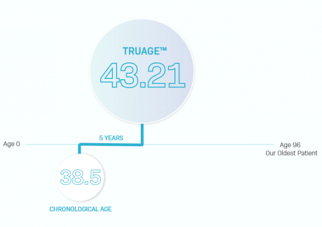

After having used a 90% pesco-vegan diet to [hack my lipid levels to optimal](/2020/07/lipid-levels-on-2-mostly-pesco-vegan-meals-a-day/) and sun/supplementation to [double my Vitamin D levels](/2020/05/doubling-my-vitamin-d-levels-in-2-months/) in 2 months, I've been looking for my next health test, so I had to listen to the interview on the Ben Greenfield Fitness podcast about an epigenetic diagnostic test to measure your biological age.

[Is This The Most Advanced Anti-Aging Analysis & Epigenetic Diagnostic Test Of The Future?](https://bengreenfieldlife.com/podcast/epigenetic-testing/)

Early in the interview, the case is made that TruDiagnostic has developed the most cutting-edge test to measure our biological age by analyzing epigenetic markers and running a battery of tests. Sounds super cool.

Our host Ben Greenfield is an endurance and strength athlete. He is super-knowledgable about all aspects of health, longevity, and biohacking. He does it all. Supplements, diet, training, performance gadgets, sleep tracking, saunas, meditation, and probably 10 other performance avenues I'm not thinking of right now. He looks to be an extremely fit Millennial. Top 1% for sure.

Back to the interview. When discussing patterns they saw that impacted biological age beyond the obvious (smoking, not exercising, poor diet, etc) they brought up that endurance training was a factor in accelerated aging. An example mentioned was an Ironman athlete who tested 10 years older than his chronological age. Ben, an endurance athlete, pushed back a little on this point, offering plausible reasons why the test might report a higher biological age.

In the nutrition discussion, the guests talked about the diet our ancestors ate. The one we are most genetically set up to thrive on. They cite how ancestors of the Inuit would fare better on a diet higher in saturated fat and lower in starch. They referred to the Mediterranean Diet as a universal healthy diet that provides "huge epigenetic impacts". Ben is an author of low-carb/ketogenic dieting books and articles.

At the time of the interview, Ben's test results hadn't come back, but he posted his report once he had the data. He tested almost 5 years older than his age. That's got to sting.

### Possible Explanations

Everything I say here is pure speculation. I don't know his family history, nor am I aware of any health challenges he is facing. On the surface, he appears to be the kind of perfect human you'd build in a lab.

Many years ago, I came up with the idea I called [stacking stressors](/2014/11/cold-exposure-not-one-size-fits/). Stressors such as a low-carb diet, endurance training, saunas, or cryotherapy are all fine and can provide tremendous benefits. However, when you stack them without breaks, the body doesn't have time to learn and adapt to the stressors. Health declines.

From my 2014 post:

> Weight training, fasting, cold exposure, and even low carb diets are stressors. Doing them together amplifies the stress and I suspect the body’s ability to learn a positive response from the experiment.

I've been highly skeptical of the keto craze. It is a diet based on sending starvation signals to the body. Dipping into and out of ketosis from fasting makes total sense, but I have trouble believing that staying in a near-chronic ketogenic state is healthy, let alone optimal. My ancestors were not Inuit, nor were most of the ketogenic followers. A keto diet might be the best diet to look your best for a class reunion in a few weeks, but is it the best for longevity? I doubt it, but I'll keep an open mind.

It is possible that the test results Ben sent in were flawed because he did a massive endurance workout the day before. He would need to test again to see if that is the case. But it is also possible he would age better by dialing back his workouts and increasing his carbs. He is 100 times smarter than I, and I have no doubt he will figure this out.

### The Report

I read the 78-page report and concluded I won't be purchasing the test. I didn't see much personalized epigenetic information. The section on diet confirms that I am likely already on an optimal path, which is the Mediterranean Diet with periods of fasting. Dr. Longo's [Fasting Mimicking Diet](/2018/11/simplified-fasting-mimicking-diet-protein-cycling-diet/) is mentioned in the report, which is also a topic on this blog and something I've done a few times.

If I were at the start of a health journey and knew I needed to make changes, I would likely get the test, as it would let me know where I was and provide quantifiable motivation to take action.

---

## Comments

### ant
*September 1 at 2020 at 7:15 PM*

Do you think daily intermittent fasting is an unnecessary stressor like Valter Longo believes?  I remember you said you eat 2 meals a day, which I'm assuming you're doing by skipping breakfast (16:8 IF)?  Longo suggests breakfast and dinner, skipping lunch, and eating within a 10-12 hour window.  Of all the recommendations Longo has given, I do (or plan to) follow most of them except for maybe this one, just because I'm never hungry in the mornings and find it convenient to just eat in a ~4 hour window in the evenings.

---

### MAS
*September 1 at 2020 at 7:43 PM*

@ant - I don't think anyone knows for certain if there is a one-size-fits-all approach. I suspect there isn't. De Vany likes adding randomness to the fasts.

Is it a stressor? Could be. I understand the argument, which I posted in this 2015 post:
https://criticalmas.org/2015/10/intermittent-fasting-finding-a-new-middle-ground/

During the summer, I fast more. 2 meals on most days. Some days just 1 meal. As it gets colder, I intuitively increase my eating window. Is that good or bad? I don't know. I track more data in 2020 than I did in 2015. So, I am still learning and adjusting.

---

