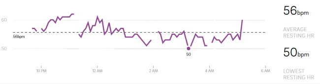

I sometimes think the only reason I still post blogs is when there is a topic of interest to me that I suspect a few of my readers know more about the topic than myself and can guide me in the comments. That happened with my previous post [Oura Ring Sleep Tracker – 42 Day Review](/2020/09/oura-ring-sleep-tracker-42-day-review/). My understanding of HRV was lacking. CW commented:

> HRV; that’s a deep dive. The TLDR answer is the HRV measurement you should use to understand the impact of training, sleep, stress, and etc. is a different measurement than the “coherence” score from HeartMath.

I was unaware there were two different measurements. Although I am interested in both, the "coherence" is my primary interest currently. There were a few app suggestions that use the camera on your phone. CW mentioned HRV4Biofeedback and Jillian mentioned Welltory. I got the HRV4Biofeedback, as I was able to test out their reader with a free Camera Heart Rate app first. I'll do a follow-up post on this app once I have more experience with it. Brock mentioned Whoop. I went to their website and discovered they had a podcast episode dedicated to understanding HRV, which I found extremely helpful. [Podcast No. 29: Heart Rate Variability (HRV), with Kristen Holmes and Emily Capodilupo](https://www.whoop.com/thelocker/podcast-29-heart-rate-variability-hrv/) The big takeaway I got from this show was that HRV data can be very messy. The more accurate readings are when the body is in the Deep Sleep phase. Readings taken throughout the day can be noisy unless you are a mathematics expert. This means that the Oura Ring is a valid tool for capturing deep sleep HRV. I probably don't need another device to capture HRV 24/7. The $8 HRV4Training is enough for right now. Thank you all for saving me money! I still have issues with Oura data. Sunday I had a great night of sleep, but Oura gave me a 76. Then Monday, I had worse sleep and Oura gave me an 85. I am also seeing gaps in the data. Support told me to face the sensors of the ring towards my palm. It is still happening, but the gaps are smaller.  _Resting Heart Rate with data gaps._ The Whoop HRV podcast talked about running 2-week experiments to see the impact of changing a life variable to see an impact. Oura Ring does have a [Tag feature](https://blog.ouraring.com/tags/), which I just learned about.

> For example, you could test whether taking a hot bath before bedtime leads to better sleep. In this experiment, you can use tags to easily identify any correlations in Trends. Before you know it, you’ll be running your own single-subject clinical trials, with you as the one and only focus.

Another thing I learned from support is that the Oura Ring can hold up to 6-weeks of data before needing to sync. That is a nice feature. However, until I can develop confidence in the Oura data, I do not recommend buying it. This opinion contradicts many of the "biohackers" out there, but I have noticed that many of these cheerleaders are either advisors/investors in Oura or they were receiving an affiliate kickback at one time for sales referrals.

---

## Comments

### Jim
*October 2 at 2020 at 8:54 PM*

@MAS.  It's interesting that your perception of how well you slept does not match the Oura data.  I think these devices are just measuring our movements?  The (logical sounding) assumption is that movement is inversely related to sleep quality. But maybe it's more complicated than that.

---

