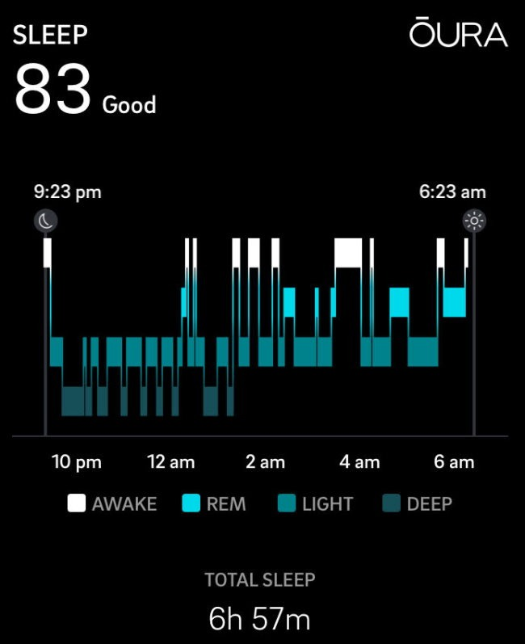

This summer I went looking for my next health challenge. After reading Super Human by Dave Asprey and listening to Peter Attia's Drive podcast, I decided to tackle improving my sleep quality. They both like the Oura Ring as a way to track and measure sleep. Before I bought the ring, I considered my sleep to be good. Not great, but good. I have made tremendous improvements in the past 7 years or so. But, I wanted to go from good to great. If I could learn to hack my sleep as well as I've hacked my weight and blood tests, then why not? In addition to sleep tracking, the Oura ring also provides activity tracking. Since I have an iPhone and an  Apple Watch, I had no need for those features. I purchased the Oura Ring for two features.

1.  Detecting and measuring the stages of my sleep (Light, REM, and Deep).
2.  Measuring HRV (Heart Rate Variability)

Although I have mixed feelings with the sleep measurements, I am disappointed that the Oura Ring only tracks HRV during sleep and when you use their meditation/breathing app called "Take a Moment". I really want to know my HRV throughout the day. Knowing when it drops would give me feedback to make adjustments. I have an  Apple Watch Series 1, which only tracks my HRV when I do the Breath app. I believe the newer  Apple Watch models track it all the time. 🤷🏼‍♂️ I think this means I'll need to get another wearable device to get 24/7 HRV. I'll revisit this point later in the post.

### Current Sleep Habits

Before I dive into the data, I want to share my current sleep habits. I have been very consistent with my routine and I follow all the basic good sleep hygiene practices.

1.  Daily meditation and breathing practice. Always in the morning, sometimes also in the evening. _(540-day streaks)_
2.  My last coffee is before 2 PM. Actually, I only drink 1/2 cup of coffee at a time. Most days, I drink a 1/2 cup of coffee at 6 AM, 9 AM, and 1 PM. Occasionally, I will have an additional 1/2 cup of coffee or green tea around 11 AM. Drinking just 1/2 a cup at a time might be one of my greatest health hacks ever. All the flavor with 1/2 the caffeine. Read [Dear Future Tired Self](/2019/10/dear-future-tired-self/) for details. _(I use an [AeroPress](https://ineedcoffee.com/upside-aeropress-coffee-brewing-tutorial/), which makes it easy to brew just 1/2 a cup)_
3.  I do not engage with any financial decisions after 2 PM. If there is a billing error or some money issue I need to solve, I want to do in the AM, so there is a resolution well before it is time to sleep.
4.  I stop checking my email at 7:30 PM. I quit Facebook (2018) and Instagram (2020) already.
5.  I reduce lighting to 50% in the evening.
6.  I don't drink alcohol, except a few times a year, I will drink just a few ounces of a hard cider or very-low IBU ale from a local brewery.
7.  My last meal is finished usually by 7:30 PM. This might be my one "bad" habit, as I tend to eat later than what is considered optimal. However, so far I sleep better when I eat later.
8.  Reduce beverage consumption as the evening approaches. I am so much better on this than I used to be. I've gone from getting up multiple times a night to usually just once.
9.  I put my phone in airplane mode around 8:45 PM.
10.  My room is dark with nothing emitting a light.
11.  I obey the [TV Sleep Tip](/2018/11/tv-sleep-tip/) that I posted about in 2018.
12.  I'm usually in bed by 9:30 PM and I fall asleep quickly.

### How's My Sleep?

I would have predicted that my sleep would average 85 out of 100 before getting the ring. I was close. It was 79.69. But that number is low because there were two nights that had data gaps. Data gaps can happen when the battery is low or if your hand goes numb or if the sensor is dirty. I question the quality of the Oura sleep data that I'm getting. There have been several mornings that I think my score will be excellent and it isn't. The highest score I've been able to achieve was 92. The lowest was 63. My plan was to establish a predictable baseline based upon my current habits which are very consistent. But I couldn't. I felt I was close at times, but I don't know how much I trust the data. It feels mostly accurate, but there are mornings when the data doesn't match how I feel. I'm not alone in questioning the data. Here is a [Reddit thread](https://www.reddit.com/r/ouraring/comments/iwlzdv/dr_rhonda_patrick_says_the_oura_ring_likely/) on that very topic including an audio clip by Dr. Rhonda Patrick and her experience. And this writer had a ring replacement and saw the [scores change significantly](https://theunconventionalroute.com/oura-ring-review/) with the replaced ring.

> My average deep sleep scores with my new ring have jumped up by 37% and my REM scores have decreased by 30%. I didn’t make any changes that I know of to my sleeping habits, so I suspect that somehow a difference between the rings is causing these different scores. This indicates that the deep sleep and REM scores are completely unreliable.

### Initial Tests

I wanted to see if I could move my sleep score with minor adjustments. The first thing I tested was alcohol. At 4 PM one day, I had just a few ounces of a hard cider. My sleep score tanked to 70. That is very good to know. Moving my meal or last coffee up an hour or 90 minutes had no predictive effect on my sleep. I do know from previous experiments that having coffee after 3 PM was bad for my sleep. 12:30 PM - 2 PM seems to be the sweet spot for me.  _A typical night for me. Oura penalizes you if fall asleep too fast. And although it says I was awake multiple times before 4 am, I have no recollection that was true. I recall sleeping straight to 4 am uninterrupted._

### Now What?

I found the recommendations by Oura to be worthless. There is no guidance beyond little paternal - _you can do better -_ messages. Considering the audience for the Oura are health geeks that know the basics, I'd like to see some more actionable feedback. The charting software on the web version seems clumsy and not well designed for the task of finding patterns. The iOS version has prettier charts, but the same issue. How many clicks do I need to do to discover some sort of pattern that I can take action on? The obvious thing for me to do would be to run multiple week tests alongside my Oura data. It would be nice if I could feed Oura additional data such as caffeine intake or meal timing or room temperature or whatever metric. There is not that option. I would need to download the CSV files or connect to their API and then construct my own additional dataset and then run my own analysis. Do I need to learn ML (machine learning) to do that? And if I did, how predictive would the recommendations be given my concerns already with the data quality. Ideally, I would want recommendations not just based on my dataset, but datasets from all users that are like me. The problem with the Oura data is it just giving us the results without knowing (other than the time we went to bed and got up) any other inputs. I paid $300 for the ring hoping it would do more.

### 42 Day Review

I'm still undecided on the Oura Ring for myself. I'm going to keep collecting data for myself, but I don't think I would recommend it for others unless they had the cash to drop and wanted something now. There are other products that will be competing with Oura soon. Amazon Halo comes to mind. Currently, I am shopping for my next health tracker. I want to be able to track and train my HRV in realtime. [Heart Math](https://store.heartmath.com/tech/#most-popular-products-section) looks interesting, but I don't like the idea of clipping the sensor to my ear, but if that is what it takes to get accurate data, it is an option. Updating my Apple Watch to the newest version is also an option. It would track the HRV 24/7, but unless I'm missing something it wouldn't provide the tools to train in realtime. And could it provide alerts should my HRV drop too low? The [Muse 2](https://www.alexfergus.com/blog/muse-2-review) looks interesting. Instead of measuring HRV, it measures brain waves in real-time. That ultimately might be the best path for indirectly training HRV. 🤷🏼‍♂️

### How About You?

Do you have any experience with the Oura Ring or other wearables for tracking and improving sleep or HRV? Drop a comment and share what you learned. Thank you.

---

## Comments

### CW
*September 23 at 2020 at 7:24 AM*

HRV; that's a deep dive. The TLDR answer is the HRV measurement you should use to understand the impact of training, sleep, stress, and etc. is a different measurement than the "coherence" score from HeartMath. 

Both are helpful. 

I've been using HRV4Training for several years to collect my daily HRV measurement. It reads your beat to beat measurements with your iPhone's camera for one minute and produces the HRV measurement using RMSSD. The developer has good data about the quality of the camera sensor, justification for a one-minute measurement, using a normal breathing pattern, and doing it just after waking in the morning. 

I have also been using HeartMath for years to help me get into its state of coherence which for me is a deep, round, almost exaggerated breathing pattern of 5 breaths per minute. The HRV4Training developer has recently released HRV4Biofeedback, and I think it's just as good as HeartMath. I love the coherence state and look forward to it.

---

### MAS
*September 23 at 2020 at 6:28 PM*

@CW - Thanks for the info. 

I downloaded Camera Health, which is the free app made by the same developer as HRV4Biofeedback.

I tested my HRV and it read 74. Then I immediately tested my HRV with the Apple Watch and it was 45. Both were 1-minute readings. That is quite the difference. I don't know which (or either) is accurate.

I'm going to do more tests to see if the numbers converge.

---

### Jim
*September 23 at 2020 at 11:06 PM*

I used to have a Fitbit watch and tracked my sleep data.  It had a regular setting and a sensitive setting.  When I set it to regular, I had a 95% sleep score.  When I set it to sensitive, I had a 25% sleep score and it looked like I was waking up every half hour.  It was interesting, but I didn't know how to use that data. (I used the edit feature to add this last sentence.)

---

### Jim
*September 23 at 2020 at 11:09 PM*

@MAS.  I see you're trying out an edit feature with a time window.  I used it on my previous comment.  It looks good.

---

### Jillian
*September 24 at 2020 at 2:32 AM*

On sleep: I track mine using my fitbit, and had been concerned at the low rate of deep sleep I was getting (~12%). In doing some research on that, people reported that low carb diets helped them improve deep sleep. I did try Keto for a few weeks (had to quit, WAY too much meat for me) and will say I've had the highest deep sleep percentages I've ever had, up in the 20-24% range.

On HRV: I use an app called Welltory (paid version). You can track it live by using your finger on the flash/camera. I believe they also have it hooked up to the apple watch too (not sure what version tho). I'm maybe 3/5 stars on it. They have some issues with the user experience and being able to consume your data (which they do give you a lot - and tie it in to a lot of other apps).  They did just release a very new and very different version TODAY, and seems to have still some bugs to work out (I'm thinking they didn't prepare their servers adequately), but after doing some research and finding apps like the others mentioned, I decided to stick it out and see if they improve.

Fwiw!

Good luck!

---

### MAS
*September 24 at 2020 at 3:52 PM*

@Jim - I've heard complaints that FitBit's although they have good data tend to fall apart quickly. Not sure. I haven't looked into them. I think they are more popular with Android users. I could be mistaken. 

@Jillian - Great to hear from you. 

I like your idea as it matches with CW. Instead of a new gadget, find a better app. Both your suggestions - although different apps - use the camera. I'm leaning towards HRV4Biofeedback as it is a 1-time cost and not a subscription. 

@All - In the end, I suspect I'll need to cut my caffeine level further to see my numbers improve. It is likely the truth I don't want to face. Especially as we head into October in the rainy Pacific NW.

---

### Brock
*September 25 at 2020 at 2:58 AM*

Two questions / comments, from opposite ends of the spectrum:

1) When you started measuring sleep, did you think that your sleep patterns were leaving your waking hours sub-optimal?  Or you didn't know if they could be better and it was a goal of measurement to see if you could make it better?  Have your waking hours gotten better at all with the Oura feedback? Or are you now over-focused on sleep habits and how all your daily activities affect your sleep?  (from the perspective of maybe overanalyzing the data is bad)

2) Did you consider the Whoop, which is a larger form factor, but may be more robust because of that? (from the perspective of maybe overanalyzing the data is good, so get the Meredes of data gathering tools)

As you can tell, I'm both jealous and not that you bought the Oura and looked at your data.  It's always fun to play with these types of gadgets, until they become your robot overlords.  If I bought one, not sure where I would end up.

---

### MAS
*September 25 at 2020 at 2:24 PM*

@Brock 

#1  I felt my sleep was a B and I wanted to see if I could push it to an A. So far the Oura has been wasted money because I've learned nothing (except the magnitude of a few ounces of alcohol - which I suspected anyway). When I do wake up at night or change positions, I am aware that my score is dropping, which isn't good. 

There are quite a few "biohackers" online that love the Oura ring. Maybe I will learn to love it, but I also notice that many of these hackers either have or had at one point an affiliate link, so they were getting paid to pimp the product. 

#2 I never heard of Whoop. Looking now.

---

### Anna
*March 29 at 2021 at 11:27 PM*

Any updates from anyone on sleep tracking options? I've found that mouth-taping seems to help with sleep apnea. Was waking every 3 min but had no idea until I was assessed at an overnight clinic. Things that didn't help/work: teeth build-ups (clenching to open airways was wearing down my molars), custom night guard to keep my jaw from falling back and choking myself out lol; laser palate treatment (to tighten palate, remove excess tissue); sleep apnea machine (difference in pressure when I'd open my mouth to breath woke me). And that's how I discovered I'm a mouth breather! So after many thousands of dollars, a small strip of medical tape is what gives me a good night's rest. (When I don't use, back to intermittent waking. When I do, I sleep 7.5 hours straight, no bathroom breaks.) I'm 5'6" 135lbs (not overweight). Check out Dr. Andrew Huberman (neurobiologist at Stanford) on breathing. Can't remember where I originally discovered mouth breathing as a culprit (through my own research, not suggested by any of a dozen health practitioners I've been dealing with). Hope this info has helped someone.

---

### MAS
*March 30 at 2021 at 12:57 AM*

@Anna - thanks for sharing. I was mouth-taping early last year, but got out of the habit. I will start back up to see if it helps my sleep. Thanks.

---

