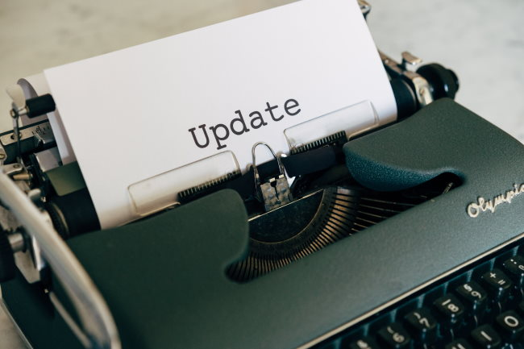

I haven't posted anything new in almost two months, but behind the scenes, I have been working a lot on improving this blog.

In 2017, I set up the Grammarly plugin. It is a godsend. It catches so many mistakes I make in my writing. Spelling errors, punctuation, and grammatical suggestions. It isn't always 100% accurate, but that is fine. Since 2017, the quality and number of suggestions I received have greatly improved. This of course is wonderful for new posts, but what about my archives?

In the process of removing some broken links, I discovered numerous grammatical errors on older posts. Each time I saw what Grammarly caught, I cringed and then fixed it immediately. I've gone through almost 200 older posts. Counting this post, I have 1,590 posts. This could take a while.

Back in 2012, I became inspired (obsessed) with removing double-spaces following periods and question marks after reading a persuasive article on Slate. You can read that story here: [Spacing Out on Extra Spaces](/2012/05/spacing-out-on-extra-spaces/)  Note that in 2012 this blog had 1700 posts and 1590 today. I did a huge purge in 2017 of posts that I deemed worthless.

Back then I said:

> Whenever I went back into the blog archives to collect a link, I’d cringe a little seeing all those extra spaces.

I have that same feeling again. I'm also updating the grammar for articles on [INeedCoffee](https://ineedcoffee.com), some of which are more than twenty years old.

I use the free Grammarly plugin, which is perfect for my needs. I highly recommend it. If you tried a long time ago and didn't care for it, I encourage you to give it another try.

_Photo by_ [_Markus Winkler_](https://unsplash.com/@markuswinkler?utm_source=unsplash&utm_medium=referral&utm_content=creditCopyText)

---

## Comments

### Tony
*December 21 at 2020 at 6:55 AM*

Greetings again, fellow ectomorph. I was wondering if you'd return at some point. Glad that you're still writing on this blog since we need more fellow ectomorph voices to speak for us in a world that's thirsty for thiccness. Speaking of ectomorphs, I'll ask if you've managed to read more of NattyorNot's posts. I may not always agree with him, but we have common ground due to how our stick boy genetics deny us swoleness unless we go on gear. Hope to hear from you and happy holidays.

---

### MAS
*December 21 at 2020 at 3:51 PM*

@Tony - I was just reading NattyorNot again last week. He clearly knows more than me. It took me longer to figure out the importance of volume for us.

I don't have much fitness on my mind right now. My gym likely won't be "all clear" to April or May. Between NattyorNot and Athlean-X, I have a lot of ideas I want to test out. It will be like starting over.

---

### tml_mpls
*December 21 at 2020 at 9:21 PM*

Always fun to read your posts. Sorry about the grammatical issues, but I understand that urge to fix.

You haven't written about iron and blood donation in awhile, but I thought I'd share that I've shed about 15 pounds in the past year and the proximate cause of all this appears to be reducing my body stores of iron down to better levels. I found out I had hemochromatosis from a 23andMe test plus a visit to the doctor three years ago and I've been slowly lowering my iron levels through blood donations since then - just got my 2 gallon pin.

For the first two years this had no discernable impact on my weight, but this year weight I've literally never been able to lose before started coming off in 3-4 pound increments following each donation. Makes me wonder if iron plays a bigger role in body composition than is generally understood, particularly as the losses have come when my iron levels were in the range that would be considered high but essentially normal for somebody without hemochromatosis.

---

### Tony
*December 22 at 2020 at 5:31 AM*

@MAS Putting fitness on hold? Your deal, but I imagine that you're still maintaining some muscle even though our stick boy genetics betray us. Any advice that you have for fellow ectos will be appreciated. I would. I'm a short ecto at five-foot-nine. That's right—one can be short AND thin at the same time. Who knows? You might even trade pointers with NattyorNot. We ectos and hardgainers must stick together while thiccness rules.

---

### MAS
*December 22 at 2020 at 4:00 PM*

@tml_mpls - That is great news!

@Tony - The thing comforting me now is the knowledge of muscle memory. I know that when things open up again, I will regain my lost strength in short time.

---

### Tony
*December 23 at 2020 at 6:40 AM*

@MAS Here's hoping that my muscle memory is as fast, too. Meanwhile, I'll lift 15-pound rice bags when possible.

---

