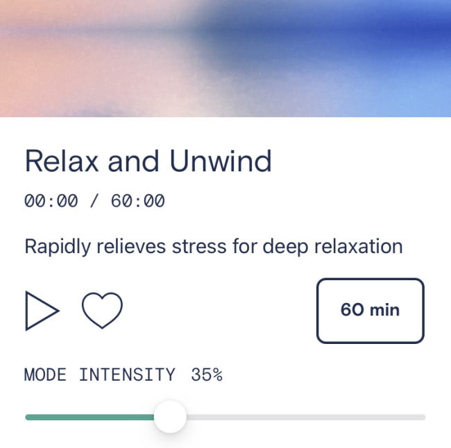

The more I used my Oura Ring, the [more I liked it](/2021/02/learning-to-love-my-oura-ring/).

The more I used my Muse 2, the [more I disliked it](/2021/02/the-muse-2-is-stressing-me-out/).

How about the Apollo Neuro? Three months of daily use and I'm still not sure if I like it or not.

The Apollo Neuro is a wearable that sends different sound waves into your body to generate different responses from energy to relaxation. The different options are:

1.  Energy and Wake Up
2.  Social and Open
3.  Clear and Focused
4.  Rebuild and Recover
5.  Meditation and Mindfulness
6.  Relax and Unwind
7.  Sleep and Renew

Although I've used them all, the ones I've used the most are the last 3 on the list. I learned about the device in an interview on the Energy Blueprint podcast.

[Apollo Neuro - Hack Your Nervous System and Decrease Stress w/ Dr. David Rabin & Ari Whitten](https://www.youtube.com/watch?v=RW0HmhM4tT4)

I think I feel more relaxed when I use the Relax and Unwind mode, but I'm not sure. If there is an effect it is minor. The same goes for Sleep and Renew.

_Relax and Unwind on the Apollo Neuro_

If you listen to the interview, one of the Apollo goals is to help lower stress and improve HRV. It is also mentioned that many users are able to fall asleep faster on the Sleep setting (reduced latency).

I have been using the Apollo daily since November. As I put this post together, I have logged 22,985 minutes with the device. I wear it on my right ankle. **During that time, my sleeping HRV measured by my Oura Ring has not improved. The time it takes me to fall asleep is also unchanged.**

As far as the data goes, the Apollo Neuro has done nothing for me. Yet, I'm still not sure it is worthless. At the end of the day, I reach for the device. Does my body know something that isn't being measured in the data? Or is it wishful thinking on my part? A placebo effect that works still works. Yet, I question if it is doing anything.

Both Ari Whitten (of The Energy Blueprint) and Ben Greenfield (of Ben Greenfield Fitness) seem to love the device. They also both have an affiliate relationship with Apollo. Does that inflate their opinion? Don't know.

After a discount and shipping, I paid $310 for my Apollo. Unless you have the money to burn, I personally can't recommend buying one.

### Other Devices?

When I purchased the Apollo, I was unaware there were other devices in the space, such as the Neuvana Xen, Sensate Pebble 2, and the Beurer Stress Releazer. I don't know if they are superior, inferior, or do about the same.

I'm still interested in finding a wearable that can help me improve my sleeping HRV, which has been stubbornly stuck in the low 30s since I began tracking it in August.  That's considered an unhealthy number for an active Gen-Xer, right?

Whether it is one of the devices listed above or the HeartMath, I'm ready to try something new (or 2 things new), as I've done daily breathing exercises for 2 years now and cold showers for months. I need to try something different.

Has anyone tried any of these devices? And have you seen any improvements in HRV or any other metric? Please leave a comment.

**UPDATE (Feb 23, 2021):** Shortly after posting, I read an article that stated taking your HRV just before sleep or just after waking is a more accurate measure than sleeping. I don't know if that is true or not, but I got a much higher 100 HRV.

**UPDATE (Feb 25, 2021):** I have a lot to learn about HRV measurements. The low 30s number is a healthy number based on the rMSSD formula. The 100 HRV I scored above was taken with a different app and the reading was too brief to be accurate. So, I got work to do on calibrating my numbers.

**UPDATE (Feb 28, 2021):** Maybe my HRV improved after all. I'm collecting more data and will compare it against some data I collected back in October.