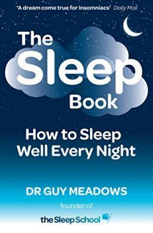

Back in January, I posted some notes from the book [Say Goodnight to Insomnia](/2021/01/say-goodnight-to-insomnia-notes/). I initially made progress with those techniques, but have had continued trouble sleeping this year. I'll do well for a few weeks and then insomnia returns.

Here are two more sleep books I read and the points I found important.

### Buddha's Book of Sleep by Joseph Emet

I didn't get much value from this book, although someone without a background in mindfulness and meditation might like it more.

Keep your eyes open when you can't sleep.

> ...by keeping your eyes open when you go to bed, instead of closing them in anticipation of sleep. Let sleep close your eyes, rather than your anticipation.

This is what babies do.

> Keeping our eyes open helps us in the here and now, and in our senses. That makes sleep easier. Closing the eyes in anticipation of sleep often has the opposite effect: it switches the focus of the mind from our senses to our thoughts.

On controlling sleep:

> We do not control sleep. We can control only our mental and physical readiness for sleep. The paradox is that, with a goal such as sleep, it is better to forget about the goal, and just get into enjoying the relaxation of being in bed...
> 
> We can be open to sleep, and give up all striving. That is what we can do. Any kind of effort or trying to force sleep can be counterproductive. It can keep us awake.

### The Sleep Book by Dr. Guy Meadows

I really liked this book, even though at times, it disagreed with the advice of Say Goodnight to Insomnia. The core theme of this book was acceptance.

> Accepting insomnia requires being willing to sit with, lean into, make space or open up to the pain and suffering that you have been trying so desperately to control and avoid. By doing so, you'll allow yourself to sleep naturally and move forward with your life.

This means that some of the standard advice of doing things to correct insomnia isn't helpful, because the motivation behind those actions is trying to control a process that is not controllable.

> Any attempts to fight, avoid, change or get rid of experiencing your insomnia tell your brain that you are being threatened, triggering your innate survival response. In this moment you become mentally and physically alert as your brain prepares you to stand and fight or withdraw in flight. Your mind begins to race with thoughts, your mood darkens, your muscles tense, your body shrinks, and you become wide away. How you choose to respond towards your insomnia therefore determines your insomnia, and only by learning to welcome it can you retrain your brain to sleep soundly once more.

Say Goodnight to Insomnia says to get out of bed after 30 minutes of not sleeping and go to another room until you get sleepy and then try again. The Sleep Book implies this is an avoidance strategy and one should sit with insomnia in acceptance. The Sleep Book states clearly that sleep will probably get worse at first.

Which method is better? I still don't know. I'm trying both. Last night was another awful night. I slept for 2 hours (9:45 pm - 11:45 pm) and then woke up and was unable to return to sleep all night long despite being very tired. I am working on improving my response to the situation. And although I have made progress there, my sleep continues to get worse.

I gave up caffeine 11 days ago. So far it hasn't helped my sleep at all.

---

## Comments

### Justin
*June 21 at 2021 at 5:30 PM*

Sorry to hear you're suffering. I've been coping with severe chronic insomnia for 20+ years and I can certainly empathize. I'm 42.

I'd support the well studied method recommended as part of "sleep hygiene", getting up and changing spaces after 30 minutes, over some sentimental notion of acceptance -vs- avoidance. You can practice acceptance while changing your space and waiting to get sleepy again. There are psychological and subconscious ramifications to changing your space and context that, in my experience, does seem to work. Sometimes I can get some sleep on the couch or another comfortable space that is not my bedroom, and after a sleep cycle, return to bed. I've even had luck sleeping on the floor, or laying on the floor to get drowsy, then returning to bed. 

Other practices I try to maintain:

No screens after 7-8pm. Blue blocking goggles when looking at my kindle paperwhite or other device. 

Bed is for sleep and sex only. Read elsewhere. 

Light meals early in the evening. Having some carbs helps.

Occasionally having a granola bar or other carbohydrate snack when I can't sleep will induce drowsiness. 

No alcohol.

Decaf coffee only, or green tea, before noon.

Occasionally I can fall asleep listening to something interesting but boring, like a lecture or calm interview on an unfamiliar subject. I keep a list of podcasts for this. Somehow, by listening, I'm prevented from fixating on the sleeplessness, and I can relax and drop down.

Then there are the meds I've tried and continue to experiment with: Zolpidem, Bupoprion, Trazodone, Gabapentin, Hydroxyzine, Amitryptaline, Tamazepam, Mirtazapine. Among others. Let me know if you'd like to share experiences with pharmaceuticals or look at survey research and methodology for prescribing for insomnia. I've got a psych NP friend who sends papers when my prescribing doctor is not so forthcoming.

---

### Justin
*June 21 at 2021 at 5:34 PM*

Also, Take a Nap, Change your Life, by a UC Irvine cognitive neuroscientist, 
has been helpful in debunking the notion that napping harms sleep. You can design a nap that will take the edge off and by reducing stress and anxiety, promote better sleep the following evening.

https://www.amazon.com/dp/B00B8UDC1U/

---

### MAS
*June 21 at 2021 at 8:43 PM*

@Justin - Thank you for the comments. I do follow most of the sleep hygiene ideas. The blue blocking glasses arrive this week. 

I love the idea of taking a nap, but I've never been able to nap successfully, no matter how tired I get. I would guess I've napped successfully maybe 1-2 times a year since adulthood. I still try daily. I do get some relaxation with yoga nidra, which I do daily for 20 minutes. 

Does the nap book address any tips for those like me that can't fall asleep during day hours?

---

### Glenn
*June 21 at 2021 at 9:02 PM*

https://www.ncbi.nlm.nih.gov/pmc/articles/PMC5946849/

---

### Glenn
*June 21 at 2021 at 9:03 PM*

https://www.youtube.com/watch?v=U62ZcevDyrs

---

### Glenn
*June 21 at 2021 at 9:05 PM*

https://lairdsuperfood.com/products/renew-rest-and-recover

---

### Alex
*June 21 at 2021 at 11:13 PM*

Genevieve Davis has some sleep books.

---

### Glenn
*June 22 at 2021 at 12:03 AM*

https://www.bbc.co.uk/sounds/brand/p09652n3

---

### Simon
*June 22 at 2021 at 10:35 AM*

@MAS - I have the same problem as you and I'm sorry to hear you are suffering as well.

You might find some of the things mentioned by Andrew Huberman in the below useful: https://hubermanlab.com/master-your-sleep-and-be-more-alert-when-awake/

Two things that provided some mild improvements for me related to the above:
1) Getting up and getting daylight in my eyes sat on my balcony listening to a podcast for 30mins from around 7am (or earlier if you can manage it - as long as the sun is up) - with WFH rules still in place in the UK (and it currently allegedly being "summer") this is easy to do before I turn on my PC to start working (rather than just getting up and shambling into my living room straight away)
2) Got an alarm for my phone for when the sun comes up/goes down - the latter alert reminds me to make sure I am at least starting to have my last meal of the day rather than let it get delayed and allowing other things to take precedence.

And as mentioned elsewhere - listen to worthy (dull) podcasts on topics that you think you should know about - I find listening to voices with mild attention does send me to sleep.  Even if the recommended podcast above doesn't have anything interesting in it it might at least lull you to sleep!

best wishes, Simon

---

### MAS
*June 22 at 2021 at 3:00 PM*

@Simon - Thanks. Yeah. I've listened to all Huberman's shows. I follow all the good sleep hygiene recommendations, including getting outside for a mini-walk first thing the AM.

@Glenn - That cold link is interesting. Supplements don't work for me and I've tried a long list of recommended ones. I've been doing some form of meditation and breathing routine for 3 years now. But I do not do TM like Ray. Perhaps it would be better?

@All - A comment I got on Twitter was able to answer the question in the post in a way that rings true. They favor the "Say Goodnight to Insomnia" method and pointed me in the direction of the Insomnia Coach and his YouTube channel.

---

### cxc
*June 22 at 2021 at 4:06 PM*

I highly recommend Transcendental *style* meditation. You don't have to go for the expensive TM course.

---

### Matthew
*June 25 at 2021 at 7:20 AM*

Interesting post. the acceptance approach strikes a chord with me, ie trying to reverse the negative worrying about worrying cycle. the sleep hygiene practice of sleep promoting habits, has value for sure, but if it becomes a ritual then theres a danger i think that it becomes seen as a necessity, and that may amplify the fear or sense of vulnerability to insomnia. also the idea of acceptance in a Buddhist sense does seem compelling to me, a lot of negative behaviors/emotions are self reinforcing, addiction obviously, but also depression and anxiety (and surely insomnia is caused by anxiety?); the mind gets stuck in a loop, a fear of fear in some cases. i think acceptance, particularly in the case of anxiety, defangs the vicious cycle. OK I cant sleep, if theres nothing i can do, then theres also nothing that I need to do, i might as well lay back and go with it. and ultimately its a cycle, it will pass, patience and I guess a bit of stoicism is called for, its not the end of the world...
separate to that, and something that doesnt seem to have been mentioned is that isnt poor sleep (when its periodic like yours, or mine) symptomatic of something amiss in one's waking life? quite literally, whats keeping you up at night? is there something that can be addressed there?

anyway good to see your new posts, i consider them useful, particularly the post on how muscle damage doesnt trigger muscle growth.

---

### MAS
*June 25 at 2021 at 3:28 PM*

@All - I decided to follow the CBT-I approach. After some research from the Insomnia Coach, I realized I was going to bed too early. I'll report back in a few months if I learn something worth sharing.

---

### Hs
*June 27 at 2021 at 5:00 PM*

I think I’ve read before that giving up caffeine can cause sleep issues at least temporarily. I feel like I’ve experienced that myself as someone who drinks caffeine for a while and then gives it up for a while. Just something to consider as a possible factor that could be overlooked.

---

### MAS
*June 27 at 2021 at 10:11 PM*

@Hs - Your comment reminded me of my 2012 caffeine detox - where my sleep got worse initially.

https://ineedcoffee.com/a-month-without-coffee/

I ended my caffeine detox at day 16 by accident. I consumed some chocolate. I'll return to 1/2 or 1 cup of coffee this week.

---

