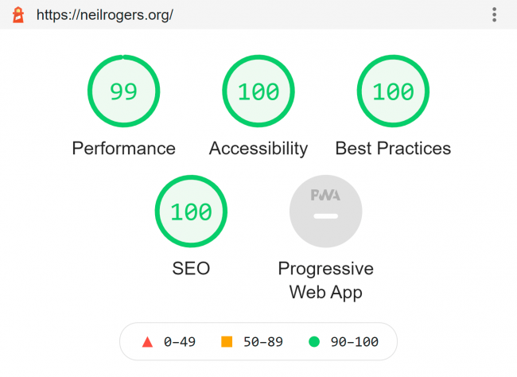

I recently released a brand new version of my radio tribute site [NeilRogers.org](https://neilrogers.org/). This is what I added to the footer of the site.

> _2012-2021 NeilRogers.org is a project maintained by Michael Allen Smith with the support of Neil's heir, attorney, and fans._ _The code for this site is freely available on GitHub. Use however you like. Creative Commons 4.0._ _This site does not track users or display ads. No pop-up windows either. It is a hobby site made in the spirit of the early web._

I have become increasingly frustrated with the web in recent years. Almost every site you visit, you get hit with ads, newsletter pop-ups, warnings to turn off ad-blockers, and a button to accept site cookies. So much noise. No wonder people camp out on Twitter and Facebook. As problematic as those sites are, the regular web feels like you are getting pickpocketed on Times Square.

### Doing My Part

I can't change the world, but I can make websites in the vision that I as a user would prefer to visit. No tracking. No ads. No cookie acceptance buttons. And no need to turn off your ad blockers. Privacy extensions are cool with me. The site was coded using [GatsbyJS](https://www.gatsbyjs.com/), which is a static site builder that uses React. I deploy the site on [Netlify](https://www.netlify.com/) for free which monitors my [GitHub repo](https://github.com/digitalcolony/neil-rogers-gatsby) for changes. The user gets static HTML. No server-side code is needed. A fast WordPress site that uses server-side code will take 1-2 seconds to load. Most take double or triple that. A static site on a CDN (Content Delivery Network) often takes less than 1/2 a second. I learned GatsbyJS from YouTube videos and online tutorials. I'm still a beginner in that tech stack, but I learned enough to accomplish the task.  _Not bad for a newbie._

### Rejecting Monetization

The spirit of the early web was about sharing. I share something and you share something, and we both benefit. Today everything needs to be monetized. Most sites don't make money or if they do it is tiny. Is it worth it to annoy your readers with ads and trackers for chump change? I went down that path and made some money. I still make money on [INeedCoffee](https://ineedcoffee.com), albeit 10% of what I made years ago. Passive web revenue is rarely passive, as you are constantly working to figure out the next passive web strategy that works. Because - spoiler alert - they all stop working eventually. This summer I removed hundreds of links to Amazon on this blog. I'd much rather have an insightful comment from a reader than send them off to Amazon where I might earn a 27 cent commission. One comment I received this year appears to be life-changing, which I plan to blog about later this year. Worth far more than all the revenue this site has ever made. For now, I'm still pimping Amazon on INeedCoffee, but that site doesn't have comments and the product connections still make sense.

---

## Comments

### Derek
*July 21 at 2021 at 11:41 AM*

Love this article, MAS!   This paragraph is absolutely perfect:

"No wonder people camp out on Twitter and Facebook. As problematic as those sites are, the regular web feels like you are getting pickpocketed on Times Square."

I've got adblockers, privacy add-ons, VPN's, and more and it still feels like you are in a constant battle with giant corporations trying to grift you out of your information.  It doesn't have to be like this.  Very simple regulations could prevent a lot of this nonsense.  The FCC needs to be involved.

---

### MAS
*July 21 at 2021 at 1:59 PM*

@Derek - Thanks!

I no faith in the FCC. Regulatory capture is real. Remember Michael Powell, the former FCC head? He is now a lobbyist representing telcom. 
https://en.wikipedia.org/wiki/Michael_Powell_(lobbyist)

Maybe a decentralized web is the solution? Tech is working on it. In the meantime, I'll do my small part. If it inspires others, great. If not, no biggie.

---

### Darren
*July 21 at 2021 at 2:00 PM*

I miss the old web, not much of it left.

---

### Geoff
*July 22 at 2021 at 12:28 PM*

Thank you, MAS.  You run your site out of love for the content, not love of the almighty but elusive $. The UX is a reflection of the site owner’s attitude toward the visitors.  You made the wise choice.

---

### MAS
*July 22 at 2021 at 11:45 PM*

@Geoff - THanks! 

I really like the theme too. I sent some money to the author a while back.

---

### MAS
*August 1 at 2021 at 2:26 PM*

@All - A good article that captures some of the early web spirit.

https://www.theringer.com/2021/7/21/22586870/google-reader-ode-end-of-the-good-internet

---

