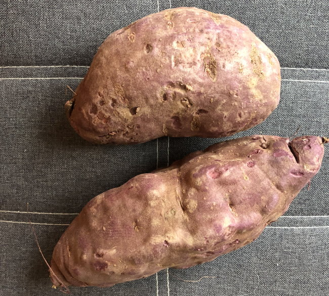

Because I use the 3rd party search tool by Algolia, I get a report on what the readers of this blog are searching for. The top 3 topics consistently have been Pavel Tsatsouline, the Ray Peat Diet, and [Potato Hacking](/tag/potato/).

Since many of those posts are years old, I thought I'd present my 2021 views on these 3 topics.

### Pavel Tsatsouline

Pavel has been an amazing fitness role model for me. Some of his books spoke to me more than others. [Power to People](/2011/03/power-people-10-years/) and his stretching books were my favorites.

In hindsight, I now believe the most important lesson we can learn from Pavel is to increase the rest period between sets. For those of us that aim to be time-efficient in the gym, this can be difficult advice to follow. However, if one does extend the rest time between sets, between workout soreness greatly decreases and recovery improves.

I touch on this point more in the post [Pavel’s Quick & Dead vs HIT](/2020/02/pavels-quick-dead-vs-hit/).

### Ray Peat Diet

I have mixed feelings about the lessons I learned from Ray Peat and his followers. I agree with the foundational argument that one should eliminate as much PUFA from their diet as possible to support metabolism. The primary sources being Omega-6 industrial seed oils.

I took that advice and [increased my body temperature](/2015/07/how-i-raised-my-body-temperature/).

I also agree with a diet that is pro-carbs. However, Peat is anti-starch and pro-sugar, whereas I'm the opposite. From Peat's article [Glycemia, starch, and sugar in context](http://raypeat.com/articles/articles/glycemia.shtml):

> Eating “complex carbohydrates,” rather than sugars, is a reasonable way to promote obesity. Eating starch, by increasing insulin and lowering the blood sugar, stimulates the appetite, causing a person to eat more, so the effect on fat production becomes much larger than when equal amounts of sugar and starch are eaten.

When I followed that advice of embracing sugar, I like many others [gained weight](/2013/09/weight-gain-ray-peat-diet/). When I took the opposite advice and consumed lots of starch, mostly potatoes, and non-gluten grains and rice, I effortlessly lost weight and maintained that weight loss with ease.

Foods with high volume REDUCE appetite. Just looking at the insulin response doesn't tell the full story. Plus there are tricks to reduce the insulin spike of potatoes such as cooling and/or adding a splash of red wine or malt vinegar.

Peat is also anti-fasting and I am aware of both sides to this argument. For me, I often follow which ideas are gaining or losing traction. The health benefits of fasting and time-restricted eating keep [gaining traction](https://hubermanlab.com/effects-of-fasting-and-time-restricted-eating-on-fat-loss-and-health/). I feel a lot better when I keep an eating window of 6-8 hours. I got attacked by the Peat people the last time I gave even a slight defense to fasting. Sorry. You do you.

The Peat forums are full of people that not only can't lose weight but continue gaining more weight. That is no surprise to me. My weight jumped to 220 on a Peat-like diet and I was hungry all the time. _(Read the [comment below by Keturah](/2021/10/pavel-peat-and-potatoes/#comment-27598) for another example.)_

I weigh 180 on my pro-starch, low-sugar diet. My body temperature is still 98.3 F.

I suspect that 90% of the value of the Peat diet is dropping the seed oil. It can take a year or more to see the benefits. So be patient.

### Potatoes

This summer I switched from boiling potatoes to using an Instant Pot. SO MUCH BETTER! Each bite is evenly cooked from the peel to the center. I chop the potatoes into equal-sized pieces and then pressure cook on high for 3 or 4 minutes depending upon the size. More time for larger pieces.

Everyone asks about using sweet potatoes. They don't work as well for weight loss but are valid for maintenance. I actually prefer the purple yams and purple sweet potatoes for non-nightshade options. I often find them more firm than sweet potatoes and I've discovered they suppress appetite almost as well as potatoes. The article [Resistant Starch and the Sweet Potato](https://www.lsuagcenter.com/portals/communications/publications/agmag/archive/2009/spring/resistant-starch-and-the-sweet-potato) says that the white-fleshed sweet potatoes, which would include many purple varietals, have more resistant starch than the classic orange sweet potatoes.

I don't have any weight left to lose, but if you do, and would like to test out a Potato Hack using purple sweet potatoes and yams, give it a go and report back.

_Organic Purple Sweet Potatoes_

---

## Comments

### Simon
*October 13 at 2021 at 9:05 PM*

I was thinking about your earlier Peat posts as I think I must have stumbled on your blog originally from reading about Ray Peat (probably as part of the nutrition space drama that still rages online to this day).
I am beginning to wonder about the Peat stance on PUFA. There seems to be pretty strong evidence that swapping Saturated Fat for PUFA is healthful (although PUFA covers a huge variety of fats) and Peat is a bit of an outlier. Maybe swapping Sat Fat/PUFA for no fat (your peasant diet is low in any fat I would think) could also be helpful?
Also the Danny Roddy chats with Ray on the CIA, the moon landings and what I can only describe as Jew-baiting makes me wonder on how sound any of it is. Or at least makes me regret that the sort of mind that wants to question orthodoxy of any kind also always seems to get dragged down certain unpleasant sewers.

---

### MAS
*October 14 at 2021 at 12:08 AM*

@Simon - When it comes to fringe health opinions, I look for directional accuracy. If the ideas are sound, word spreads, others step up and spread the word. I don't see that with Ray Peat. On Google Trends it looks like it peaked in popularity in 2013 and has been falling since. Maybe it is too difficult for most people to understand or maybe it just fails to deliver?

---

### Geoff
*October 14 at 2021 at 1:11 AM*

Pavel is a great resource. I practice kettlebell work (sorry) and like how he presents the mechanics of the movements and safety (not swinging overhead to start). The “secret Soviet secrets” part of his books is where I think he got “lost in the sauce” but it was a brilliant marketing move.

---

### MAS
*October 14 at 2021 at 5:37 PM*

@Geoff - When I think about long rests between Kettlebell sets, the exercise makes a lot more sense. 

The Soviet secrets stuff did capture my imagination at a time when I needed motivation.

---

### Chris
*October 25 at 2021 at 7:11 PM*

Thanks MÁS good to hear the update.  I’m reading a lot of Peat inspired people at the moment and I’m finding it deeper than PUFAs

---

### Keturah
*January 18 at 2022 at 5:26 PM*

"Maybe it is too difficult for most people to understand or maybe it just fails to deliver?"

Based on my observations the last couple years, I'm going to say that Peat fails to deliver. A few individuals are naturally going to do better on higher carb, higher sugar, low(er) fat diets. But my guess is the vast majority don't do well on this because it simply doesn't work for the vast majority.  Some women in a couple of online groups I belong to have noted client results of a female fitness trainer's group that uses entirely Peat. The majority of the women are gaining vast amounts of weight uncontrollably; they're told it's a good response. Context and nuance is important, but I just cannot agree that this is overall a good thing. 

On a personal note, I spent 2019-2020 eating Peat. I uncontrollably gained weight--roughly 45 lbs. My body also became extremely inflamed and developed major hormonal imbalances. I'm female and ended up being diagnosed with PCOS and high testosterone after the Peat experiment. (One of the top, major causes of increased testosterone in women is insulin and blood sugar issues.)  It's likely I've always had this issue based on things to numerous to list here. However, hormones/PCOS has never affected my weight or health prior to Peat.

I actually learned some good things from it all, but it was painful and expensive in the end. Painful because the weight didn't just fall off as soon as I reversed gears on Peat. (I've spent a year healing and getting my body back on track.) Expensive because it cost over $2,000 in doctor visits, hormone testing, and supplements to get my hormones and insulin happy and healthy again. I missed vegetables. I missed intermittent fasting, stress hormones be darned. I even missed nut butters. 

If I'm honest, I regret going down the Peat road. I definitely learned some things, even some good things. But the price for these lessons feels unjustly high.

---

### MAS
*January 19 at 2022 at 3:19 PM*

@Keturah - Thank you for sharing your experience. I added a direct link to your comment from the post so others can learn what happened to you on a Peat Diet. 

I peeked in on a recent podcast of Danny Roddy and Ray Peat. Bizarre. Lots of conspiracy theory stuff that has nothing to do with nutrition. They could be right, but they no longer sound as credible to me as they once did.

---

### Keturah
*February 12 at 2022 at 12:45 AM*

@MAS that is really nice of you to add the link! Thank you for allowing me to share my experience. Maybe it will help others find their way. Sometimes I feel bad in a way. There are some incredibly kind and giving people in the Peat world that I talked to and even consulted with. Just wish the diet wasn’t so fraught with hormone and weight gain issues. 

Re: Roddy. That does sound bizzare. Though, I find a fair number of podcasters seem to be discussing current events and such, even if it’s off topic for their podcast. So perhaps that’s just the trend?

Sorry I’m just replying. The email alert ended up in spam and just found it. Hate when that happens!

---

### Simon
*March 19 at 2023 at 12:36 AM*

MAS love the blog. Found after doing some googling on the potato diet after having bad attack of gout (from high BP medication used to take) and realising lot of foods currently eating high in purine levels  e.g. meat, beans, cauliflower, and lentils. 

However, one food not: potatoes, and remembered reading Ray Cronise and Teller’s potato diet. Been on for four days - first day was hard as lightheaded, but have been used to that from IF in past - however eating plain potatoes with salt and pepper so easy and bloating reduced and appetite changed after four days.

Using microwave for steaming potatoes - pressure cooker sounds a good option.

How are your urate levels with the sardines and lentils in diet?

Peasant diet you come up with is something I’ve been thinking along lines of - basic, simple and affordable diet that can be kept up long term and should bring down urate levels too and stop gout issues.

---

### MAS
*March 19 at 2023 at 6:15 PM*

@Simon - Thanks for the nice words.

I don't know anything about urate. I just did a brief search. It isn't a concern for me. Seems soda and alcohol are likely the 2 biggest culprits for most people. I consume neither. Maybe the carnivore people might need to be aware of high liver intake, but I doubt that is a concern for most.

---

### Simon
*March 20 at 2023 at 8:48 AM*

I think it’s only really a concern if you’ve been on thiazides as leads to problems - never had before them. Yes soda and more so alcohol much more an issue as increase production of urate, whilst decreasing excretion, so get double-whammy then.  Yes, organ meat only carnivores may also have an issue, but then Inuits don’t suffer from so, maybe only those on western diets have issue.

Have you seen any of Katy Bowman’s natural movement stuff as she’s really good at pointing out how imbalances arise from the non-natural way modern society has us stationary and moving in limited ways? May help with some of the injuries/issues you’ve had.

Originally started following as thought gout was from not moving, but helped a lot - as did yoga.

---

### MAS
*March 20 at 2023 at 11:11 PM*

@Simon - I just added a Katy Bowman 20-min video to my YouTube Watch later list. I'll check it out one morning this week. Thanks.

---

### Simon
*March 21 at 2023 at 11:38 PM*

I’m sure you’ll gain something from it. Her books are really good too.

---

### Michelle
*March 29 at 2025 at 12:11 AM*

Hello-

Just found my way here through a search for Peat and potatoes.  I am not a Peater, but have become interested because of my broken metabolism- I did 7 mos on carnivore and lost 1 lb.  I feel trapped. Low carb for years seems to have ruined my ability to burn sugar properly. I am eager to heal that and have made small forays into peat world, but my limited understanding of Peat principles has me confused and it seems like I’m gaining, or at least not losing. I’m 52, and since menopause I have gained 20lbs!  I had a crash from stress in November and put on 10 of those pounds since then. I do t know who to listen to! Heating that not everyone responds to Peat is a bit terrifying because I think I could balloon more! Egads.

---

### MAS
*March 29 at 2025 at 3:24 PM*

@Michelle - I asked Grok AI to give you advice based on your comment, because I was curious as well. 

Here is the response:  https://grok.com/share/bGVnYWN5_d3e1ac39-6efe-4251-a729-b0cd13a911a1

The great thing about these chat AIs is you can go back and forth with them providing more detail or asking questions. 

Best of luck!

---

