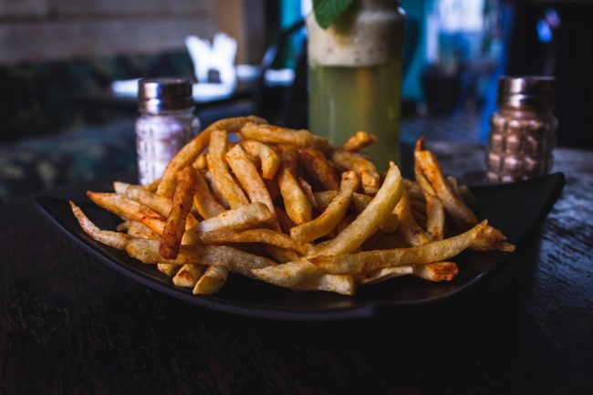

For several years now I have been aware of [Hyperlipid](https://high-fat-nutrition.blogspot.com/). It is a technical nutritional blog that is highly regarded, especially in the low-carb community. I've always felt there was something worth learning, but it was beyond my comprehension level. So I was happy to discover a podcast interview with Peter of Hyperlipid on the Peak Human podcast. [Peak Human #133 Peter from Hyperlipid](https://www.peak-human.com/post/peter-from-hyperlipid-on-are-medical-professionals-giving-the-absolutely-wrong-advice) The podcast was quite approachable to those of us without a biochemistry background. Although I am not low-carb, the information covered on the show further supports the case that linoleic acid in seed oil is the primary driver of obesity. I took some notes of the ideas I found to be the most important. Carbs are not the problem. Although carbs cause the increase of insulin which drives fat into fat cells, Peter points out that the fat signals when this process is to stop. Saturated fat signals for this process to stop once the cell is full, whereas linoleic acid stops the stop signal. This is a breakdown of how the fat cells communicate satiety with the brain. This is problematic in a modern world when so many of our fat calories are coming from seed oils because linoleic acid prevents the satiety signal. We keep eating. This is super interesting. I was already aware of the inflammatory issues and even how high levels of PUFA in our fat cells can reduce our metabolic health and even [mimic hibernation](/2021/04/escaping-pufa-hibernation/). And now satiety itself is negatively impacted. Satiety is a topic of nutrition that has been most important to me, as I used my [potatoes and protein diet](/2018/12/potatoes-and-protein-two-attacks-on-hunger/) to crush my appetite. Not only was my diet working via high volume (boiled potatoes) and high protein but because I also restricted seed oils, I was able to reach satiety sooner. Carbs are intensely fattening in the presence of linoleic acid. Carbs bump up insulin and then the linoleic acid blocks the satiety signal. I loved the show. It is always refreshing to hear a knowledgeable low-carb person that doesn't peddle misinformation about carbohydrates. Peter even briefly mentions how starch-based diets can be effective. The key of course to keep the fat levels very low in the presence of carbs. Peter states to get weight loss quickly, one needs to either remove carbs or linoleic acid. A low-carb diet that avoids higher PUFA sources takes the first path and a low-fat whole foods diet takes the second. I like to cycle between the two approaches. Maybe a low-carb lunch followed by a dinner lower in fat. Low linoleic acid for both. More fat in the winter. More carbs in the summer. See my 2013 post [Approaching Nutrition From an Investor Mindset](/2013/04/approaching-nutrition-from-an-investors-mindset/) for a deeper explanation of how I think about this topic.  _Boiled potatoes are great. French fries are awful. Photo by [Louis Hansel](https://unsplash.com/@louishansel?utm_source=unsplash&utm_medium=referral&utm_content=creditCopyText)._

---

## Comments

### PeterC
*November 9 at 2021 at 3:57 AM*

Check out fireinabottle.net for something in the same vein.

---

### MAS
*November 9 at 2021 at 2:57 PM*

@PeterC - Yeah, in this post I linked to a blog post I did about a FireInABottle post.

https://criticalmas.org/2021/04/escaping-pufa-hibernation/

I see Hyperlipid explaining why we over consume PUFA and Fire explaining how that PUFA once in the fat cells down regulates metabolism.

---

### FireMedicBB
*November 13 at 2021 at 1:31 PM*

I’ve been a student of nutrition for years. I really started down that path after losing a bunch of weight doing a basic low carb diet. After much experimentation and regaining some of the weight I lost, it’s interesting to circle back around on some of the beliefs I previously held regarding carbs. 

I don’t remember what post or when you said it, but I remember reading something you wrote about how people who are obese and coming off of the standard American diet can greatly benefit from a low carb diet to fix initial problems, but long term sustainability just isn’t there. 

Interestingly, since kind of coming around to this mindset, largely from reading your blog, I’ve seen greater success (weight, performance, and general health) keeping PUFA low and not hesitating to fill up on things like potatoes, oats, and lean protein. 

Thanks for the years of interesting posts. I still have yet to read all of them, but the linking within posts always opens up rabbit holes or even more quality content to consume. 

Mas- have you ever done any podcasts or interviews?

---

### MAS
*November 13 at 2021 at 5:48 PM*

@FireMedicBB - I have not done any podcasts. It is probably better to hear directly from those that influenced me the most.

My biggest beef with the low-carb cult is that most are lying about carbs. That is why I enjoyed listening to Peter of Hyperlipid. It was a refreshing to hear some honesty from a low-carb proponent. 

I don't know if I did a post on where I list the reasons I personally reject the low-carb keto approach. Might be worth put that list together.

---

### Marc
*November 28 at 2021 at 2:30 AM*

This was first discussed  to my knowledge in the book Toxic Fat - years ago.

 “So the more arachidonic acid you have in the brain, the more endocannabinoids you have to stimulate hunger.”

— Toxic Fat: When Good Fat Turns Bad by Barry Sears

Btw- Kenneth Jay video on YouTube explains proper cardiovascular conditioning 

https://m.youtube.com/watch?v=rGF6qZbhbkU

Proper diet and cardio leads to good things

---

### MAS
*November 28 at 2021 at 4:31 PM*

@Marc - Thanks for the info and the interview link.

---

### Marc
*November 29 at 2021 at 4:34 AM*

Furthermore, resistance training is beneficial for coronary blood  flow  due to the high pressure left ventricle pumping activity.  The  left ventricle contracts to eject the blood into the systemic circulation at a pressure of around 100-140 mmHg. Therefore, the  left ventricle can be viewed as a high-pressure pump. The resultant high pressure of the blood leaving the left ventricle results in pressurized blood going into the coronary arteries  with more pressure, perhaps even opening up the heart”s  collateral  circulation during resistance training ,, where much higher diastolic blood pressure readings occur. 
Yes this is a much different paradigm  picture drawn than Dr. McGuff presented in his “Cardiac Adaptations” and later adopted by SuperSlow along with Ken Hutchins.

But facts are hard to refute. There will be a lot of intellectual dishonesty about the above.  So be it!

Marc

---

### Marc
*December 5 at 2021 at 12:15 AM*

Coronary blood flow occurs mostly during diastole because the coronary vasculature is compressed by the contracting myocardium such that no flow occurs during systole..

With increased  vascular resistance occurring during  exercises involving large amounts of muscle tissue, the  resultant pressure gradient  will cause increased blood flow into the coronary arteries during diastole. 

In the area  Dr. McGuff was indeed correct and should be commended.  Resistance training is good for coronary blood flow.  However, heart preload is another matter!

---

