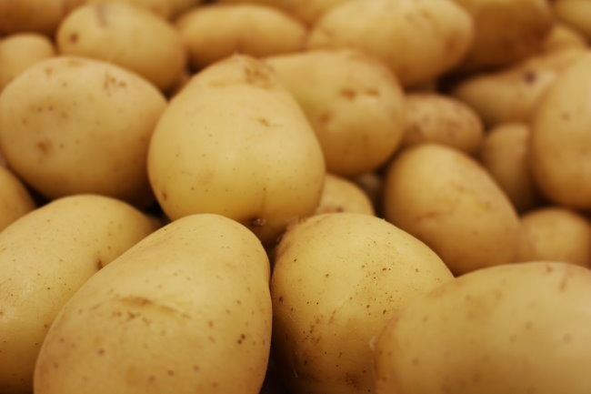

Unlike most bloggers, I run a [broken link checker](https://wordpress.org/plugins/broken-link-checker/) to alert me if any of my links break. Then I can repair the link, so if you as a reader click on a link here, you won't get an error.

A week ago, I started getting reports that Tim Steele's potatohack.com was down. I reached out to him to see what was going on. He informed me that he was no longer going to pay WordPress.com to map the domain to his blog ([potatohack.wordpress.com](https://potatohack.wordpress.com/)). I offered to take the domain and set up a potato hack portal. He accepted. 😁

Yesterday, I got the new domain up and running with a new HTTPS certificate on one of my hosts. Right now, [PotatoHack.com](https://potatohack.com/) is a simple list of links. Getting the page online quickly so inbound links resolved was the most important step.

I'm glad this domain was saved from the [Digital Graveyard](/2017/03/digital-graveyard-health-fitness-mentors/).

_Photo by_ [_Daniel Dan_](https://duckduckgo.com/?q=%40daniel-dan-47825192&atb=v299-1&ia=web)

Now it is time to make the page pretty. This week I will start building out a nicer potato portal. I want to link to Tim's book, blog, and some of my potato posts. What else would you like to see on the PotatoHack page?

---

## Comments

### Simon
*December 14 at 2021 at 12:36 PM*

Well done @MAS on sorting this out - typically proactive of you!
Best wishes, Simon

---

### Marc
*December 16 at 2021 at 2:35 AM*

What else would you like to see on the PotatoHack page?

The many benefits of a high starch diet,

---

### Jim
*December 16 at 2021 at 2:14 PM*

Possible link to add.
In a surprising development, this supplement selling guy did a great job reviewing the potato hack.
https://umzu.com/blogs/health/potato-hack-the-truth-about-this-awesome-and-attractive-diet

---

### Marc
*December 19 at 2021 at 4:46 PM*

Gut biome,  resistance starch,  butyrate

---

