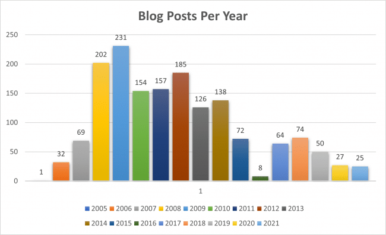

I wrote a SQL query to see how many blog posts I published by year - excluding the current year.

_\* Seven years ago, I [removed around 750 blog posts](/2015/02/my-definition-of-a-good-blog/) that I thought sucked. Mostly from the 2005-2008 era_.

Here is the SQL query, should you want to collect the same data for your WordPress blog.

`SELECT YEAR(post_date), COUNT(*)` `FROM wp_posts` `WHERE post_status = 'publish'` `AND``post_type = 'post'` `GROUP BY YEAR(post_date)` `ORDER BY YEAR(post_date);`

This is the SQL query for the total word count by year.

`SELECT YEAR(post_date),` `SUM(LENGTH('post_content') - LENGTH(REPLACE('post_content', ' ', ''))+1) WC` `FROM wp_posts` `WHERE post_status = 'publish'` `AND post_type = 'post'` `GROUP BY YEAR(post_date)` `ORDER BY YEAR(post_date);`

The chart images were made in Excel.

Let me know if you have any topic requests for 2022.

---

## Comments

### Keturah
*January 18 at 2022 at 5:42 PM*

Thank you for such a great blog. (I've been reading your blog now for 2-3 years I think?) Your posts and experiences always give me so much to think about and use to evaluate my own experiences and experiments. 

I would love to see another update about where you are with your health, diet, and exercise in 2022.

---

### MAS
*January 19 at 2022 at 3:20 PM*

@Keturah - will do. Thanks for the comment.

---

