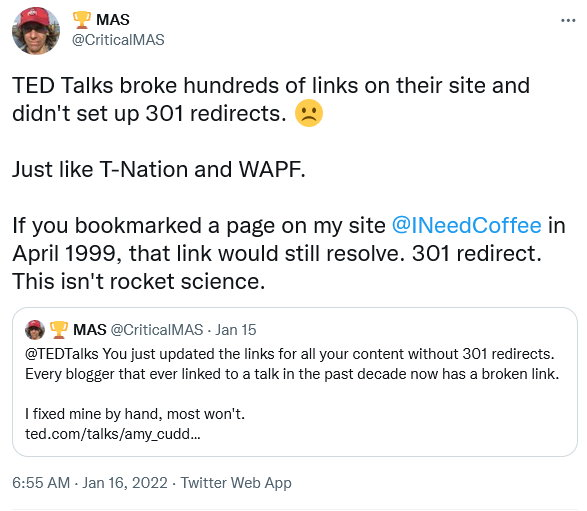

Two years ago, I posted [How Google Helped Kill the Indie Web and How It Can Bring It Back](/2019/06/how-google-helped-kill-the-indie-web-and-how-it-can-bring-it-back/). I outlined in 700 words how Google could restore blogging popularity while taking on the social media giants. I hoped someone at Google would read it and discuss it with co-workers. As an [old-school blogger](/2010/07/my-first-dated-blog-post-was-from-july-1996/) that has seen so many trends and technologies come and go, I felt it was a solid plan.

I now see that I was wrong.

Blogging can't be saved until technology can solve the problem of [link rot](https://en.wikipedia.org/wiki/Link_rot). Too many sites go away or move pages. This results in broken links. From the Wikipedia:

> A 2021 study of external links in 1996-2019 New York Times articles found that 25% of links were inaccessible. In addition, from a sample of 4,500 links still accessible, 13% did not lead to the original content, a phenomenon called content drift.

Links almost always resolve correctly on Day 1. But as the years go on, the likelihood that any given link still works declines.

Social media doesn't have this problem, because they keep attention on the current. The Facebook post, Reddit thread, or Tweet that went out this week is almost always guaranteed to have working links. The reader clicks a link and it resolves as expected.

This is not true with blogs, because our archives tend to be far more accessible than those on social media. I run broken link checkers here and on INeedCoffee to alert me when a link breaks. I then work to resolve that broken link by finding an alternative source or using the [Wayback Machine](https://web.archive.org/) to find an older copy of the article. I would guess fewer than 1% of bloggers take this effort. As a result, over the years, a typical blog will have more and more broken links. I'm certain that search engines see this as a negative quality signal and respond accordingly.

How many blogs have been abandoned? My guess is far more than are still active.

### Ted Talks, NUSI, and 180DegreeHealth

I feel like the link rot problem is getting worse at an accelerated pace.

A few days ago, _Ted Talks_ changed the links on all their content without adding a 301 redirect. I brought this to their attention and was ignored.

Remember [NuSi](https://carbsanity.blogspot.com/2018/03/the-manhattan-project-of-nutrition-that.html)? Gary Taubes and Peter Attia put together a group to study low-carb dieting. I want to link directly to the project, but I can't. They shut down the website after they completed their work.

Two weeks later and the _NuSi_ site is still offline. I don't think it is returning.

One of my favorite health bloggers throughout the years has been Matt Stone of _180DegreeHealth_. For just over a month the site has been offline (403 error). I reached out to Matt on December 22 to inform him the site was down and he responded they were working on it. It is still down. WordPress is a [bloated mess](/2018/06/the-state-of-blogging-in-2018/), but it is not rocket science. If it isn't back up by this weekend, I'll need to go through all my broken links and clean up those posts. It would be tragic if _180DegreeHealth_ ended up in the [Digital Graveyard](/2017/03/digital-graveyard-health-fitness-mentors/).

Why do I take this effort? If I have a blog post that is a response to another blogger's post and that blog disappears or the page has moved, my blog post has reduced value to the reader. Now multiply that experience millions of times and it becomes obvious that blogging was always doomed to fail.

### My Promise

If the day comes that I want to stop blogging or paying for hosting, this site will be made static and archived on a free server somewhere. It will not go away.

UPDATE: I waited until the weekend and 180 is still down. I suspect it isn't coming back. All my links have been updated to the Wayback Machine. It sucks that we lost such a great site. NuSi is still offline also.

---

## Comments

### John
*January 17 at 2022 at 7:20 PM*

"multiple" should be multiply.

I love your sense of practicality in so many things you talk about here. It is truly tragic what you describe. Thank you for caring about these things, and for trying to make other see the ramifications and chaos that can be caused by not thinking things through logically.

---

### MAS
*January 17 at 2022 at 7:27 PM*

@John - Thanks. Made the typo fix.

---

### Dan
*January 17 at 2022 at 9:55 PM*

Thanks for the reminder to re-run a link checker against my website! Of the 15 new broken links that I found, 6 were expired domains, 3 were source files that got moved on GitHub, one was a deleted tweet, and a few more were big companies that ought to know how to use redirects. I'm glad that archive.org exists.

Link rot is a problem, but even if it were solved, it's hard for me to see how blogging would've been able to withstand all the users jumping ship to social media. I tried to find a dentist office's email address last night but ended up on their Facebook page, where their contact info was hidden by a login wall (luckily bypassable with the browser's dev tools). I looked a bit deeper and found that they actually have a (WordPress) website, but it isn't returned by search results because it's been hacked and displays pharmacy spam when visited with a search engine referrer.

---

### JIm
*January 18 at 2022 at 1:08 AM*

@MAS
Sad but true.
Similarly, a lot of great content on YouTube is just posted by random users with small accounts.  Things like TV commercials from the 70's and short tag lines from old sitcoms.  Most of it isn't "important" per se, but still a shame to lose if they lose interest and shut down their account.

---

### MAS
*January 18 at 2022 at 2:31 PM*

@All - Another issue I thought of after the post was when sites use the 301 Redirect for removed pages instead of a 404. Danny Roddy did this years ago. He removed a bunch of articles and then did 301 redirects back to the home page. This is actually worse than a broken link, because link checkers have no way of knowing the content of the linked page to determine if the 301 is valid. Only human eyes can make the call if the 301 is proper. 

I have more work to do.

---

### Alex
*January 21 at 2022 at 6:14 AM*

Hi Michael. 

You linked to Nils Osmar's blog here (about autophagy/apoptosis: https://criticalmas.org/2018/03/fasting-mimicking-diet-more-questions-and-comments/#comment-26081 however they moved this content to a new blog: https://newlifelongevity.com/anti-aging-fasting-and-autophagy-part-1-how-autophagy-works/

Thanks for being one of those rare gems in blog land that continues to improve things and keeping us up to date.

Kind regards,

Alex

---

### MAS
*January 21 at 2022 at 3:29 PM*

@Alex - Thanks. I updated the comment link.

---

