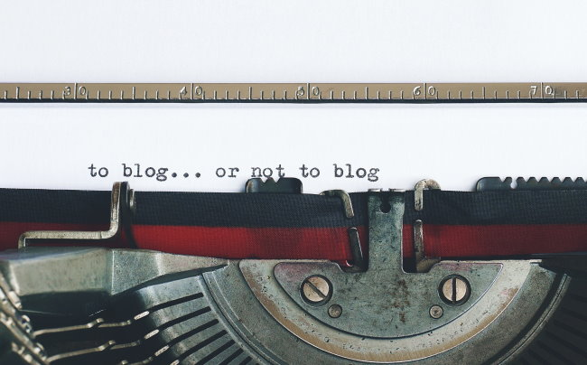

This is a follow-up to my [2019 post](/2019/11/getting-started-in-blogging-in-2019/) on this topic.

Months after that post, I gave advice to two friends that wanted to get started blogging. One friend was successful and one wasn't. I will refer to the two friends as Mary and Wilma.

### Start with a Single Post

Don't worry about domain names, hosting, themes, analytics, monetization, or any of the hundreds of things that will slow you down. Get the first post online.

Over the years, I have known so many people that wanted to get a blog going that never started. They got weighed down with all the decisions around the blog and never wrote the first sentence.

I've also seen cases where after months of picking a domain name, buying hosting, and setting up a WordPress theme, they post a few times and then quit.

Use Medium.com or WordPress.com (the free hosted option) to just get started.

Mary listened to me and created a recipe blog. She posted several recipes on Medium. Her writing and photos improved. Those recipes were shared and she received lots of positive feedback.

Wilma spent months picking out the perfect domain name. Then months picking out a web host. Then after several months of looking for the perfect theme, decided to shelf the project for the future. I suggested just getting a few posts up on Medium. That way she could test her ideas out and then if successful, move the content to her domain later. She disagreed because she wanted to better control branding. A few years and a few hundred dollars later and she still has nothing.

Start with a single post. Unless you are using the free hosted WordPress.com, WordPress is too much for most aspiring bloggers.

### WordPress is Bloat, Medium is Better

In 2018, I called WordPress a [bloated mess](/2018/06/the-state-of-blogging-in-2018/). Nothing has changed there. I still use it here, because I have 15 years of experience and over 1,600 posts, and more than 11,000 comments. If I were starting over, I seriously doubt I would use WordPress.

Setting up a blog on Medium has always been super easy. Unlike WordPress, you don't have to worry about hundreds of decisions. They take care of it for you. The downside was that you couldn't use a custom domain, which kind of sucks if you really do want to build an asset. You don't want to get stuck on a domain outside your control (remember GeoCities, Tripod, and countless others?).

Last year [Medium let members map custom domains](https://blog.medium.com/custom-domains-are-back-2dee29560d59) to their blog. Membership is $50 a year. What a deal! None of the WordPress headaches. They even will manage a newsletter for your blog now.

The path for a beginner seems obvious to me. Get a free blog set up on Medium. Write several posts. See what clicks and if you are interested in continuing. If you do and want to have your own brand, buy a domain, map it to Medium and you're done. If not, the experiment didn't cost you a cent.

And in the future, if Medium turns evil, you can always move your domain to another host. I'm sure there are tools to help you export off your content should the need arise.

### Static Sites - Not Yet For Most

There are now several options for bloggers if they want to build a static website. Static sites fix a lot of the issues with WordPress (speed and security), but they are too complex for the vast majority of people. Plus you'll need to figure out how to integrate search and comments either via 3rd party solution or code your own.

Another issue with static sites is that this technology is changing rapidly. After dumping WordPress for the [Neil Rogers site](https://neilrogers.org/), I initially coded it using Gatsby but had issues with mobile that I could figure out, so coded it all over again [using Svelte and Sapper](/2020/07/rewriting-the-neil-rogers-website-in-svelte/). A year later, Svelte dumped Sapper (the code used for routing). I did an update that broke everything. The new SvelteKit (the replacement for Sapper) was still in alpha or beta, so I decided to go back and start all over again with Gatsby.

With the latest version of Gatsby, I got everything working. Then Gatbsy changed their image code. The old code still worked but was depreciated. Depreciated is code for "it works now, but it likely won't soon". So I spent a few hours last weekend getting the new image libraries and GraphQL queries correct. All this for 7 pages.

There are lots of tutorials online that will walk you through building a blog with NextJS or other static site builders. I've done a few. You'll likely need to learn Markdown. These static sites are really sweet when you have less than 50 posts. How hard will it be to maintain all those files when it grows to 500 or 5000 posts? Need to make a change? Time to update an NPM package! Hope it doesn't break. Be sure to use Git so you can do a rollback. 🤯

Unless you are [a developer that really enjoys messing with their CMS](https://kevq.uk/goodbye-wordpress-switched-to-jekyll/), this is still not an option for most. I'd rather have the developers at Medium or WordPress handle that plumbing while I post blogs. For sites that you KNOW are going to be under say 50 posts, I really like static sites. Beyond that, I don't trust the tools yet.

_Photo by **[Suzy Hazelwood](https://wordmusing.wordpress.com/?ref=pexels)**_

---

## Comments

### Jim
*January 11 at 2022 at 10:22 PM*

Great post MAS.  
I read a lot of folks who also say WordPress is bloated and difficut to deal with with all of the 3rd party add-ons that are typically needed.
Cofounder Matt M. seems like a really sharp guy, so it seems confusing.   
Any thoughts on how WP got this way? Are they just targeting large institutions with large amounts of IT resources?

---

### MAS
*January 12 at 2022 at 1:09 AM*

@Jim - WP is open source. There are talented people that charge money to code and manage WordPress sites. For businesses, it is still a great choice. 

For a blogger that wants to focus on writing and not having to spend time worrying about all the themes and plugins and plumbing it is a mess. But up until recently, it was still the best option. Now the landscape is changing with that move by Medium. There is another site like Medium that caters to developers that I forgot the name of. I'm guessing more will pop up to tackle the problem that I outlined years ago.

---

### Jim
*January 12 at 2022 at 3:07 PM*

Thanks @MAS
Good point.  Going back, I see in his latest post encouraging blogging, MM recommends WP for business, Tumblr for personal blogging, and Day One for private journaling.

---

### MAS
*January 12 at 2022 at 3:51 PM*

@Jim - Thanks for the info. I thought Tumblr was still owned by Yahoo!  Nice to see MM bought the company. I also see they allow custom domains. So I'd put this on the short list of options.

---

