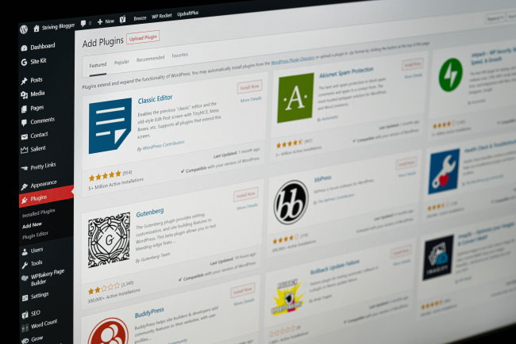

For years I've been saying that WordPress is a [bloated mess](/2018/06/the-state-of-blogging-in-2018/), but I still use it. Why? Each site is different and I'll go through the cases where I dumped WordPress, the cases where I kept it, and the path going forward.

### CoffeeHero.com

I used to have a coffee blog that just focused on Seattle. The project was a flop and I sold the domain in 2012. It appears nothing was ever built using that domain. Any content of value was moved here or to INeedCoffee.

### DigitalColony.com

In 2017, I sold my coding site to a financial firm that has since been renamed to DigitalBridge. Although I mostly want to control my own content on my own domains, I moved all my code to GitHub. It is a much better platform for code than a WordPress blog. A [single static GitPage](https://digitalcolony.github.io/) is enough for me, although I mostly like what [DEV Community](https://dev.to) is doing.

If I had a decent tutorial, I moved it here. An example would be [Seattle Photos Mashed With a Thomas Kinkade Painting](/2012/04/seattle-photos-mashed-with-a-thomas-kinkade-painting/).

I also discovered that many coding blogs become outdated quickly as new versions will often have breaking changes. Then you get comments from desperate coders asking why things aren't working for them.

### NeilRogers.org

I built a WordPress blog for the radio archive project that I manage. It was an interesting setup because I "created" almost 2,000 posts by exporting rows from a Google Spreadsheet to a WordPress database.

I had a partner help me manage the massive number of posts. He was an older man that didn't know WordPress, but I was able to teach him enough to get him proficient quickly. That is the strength of WordPress.

[He died in 2017](https://criticalmas.medium.com/tribute-to-john-baker-neil-rogers-2c9127024b51) and I decided the site in that format was too much to manage by myself.

In 2020, I taught myself enough [Gatsby](https://www.gatsbyjs.com/) to get off WordPress and create a static site with just a handful of pages. Laterm I would [code the site in Svelte](/2020/07/rewriting-the-neil-rogers-website-in-svelte/). Then there were some breaking changes, and the updated version (SvelteKit) was still in Beta, so I returned to the newest version of Gatsby which is what the site is running now.

It was coding this project that made me fall in love with static sites.

_**UPDATE Jan 2025:** I moved to Astro JS after this post and am still using it._

### EcoFriendlyCoffee.org

In 2014, I spun off the agricultural section of INeedCoffee to its own site. This allowed me to set up the author and photographer of that content as co-publisher on that WordPress site.

Having the separation between the sites was not only best for the readers but best for the author, who is a [Ph.D. coffee farmer in India](https://ecofriendlycoffee.org/about/). He can add and edit content without going through me.

He went from having no experience creating content to becoming highly proficient in WordPress. For this site, WordPress is the best tool. His articles can be 7,000 words with multiple photos. I do not see a static site coded in Markdown files as even a possibility for this domain, although it would run faster.

### INeedCoffee.com

This is the next candidate to go static and leave WordPress behind. It gets a lot of traffic, doesn't publish often, and doesn't allow comments. Setting up a static search as I use here with Algolia would not be not hard.

I have been considering if I want to sell the site recently. It will be 23 years old in April. Maybe it needs fresh blood? I've been burned out on the site for a few years.

If I don't sell, INeedCoffee will dump WordPress and go static.

### CriticalMAS.org

The most important thing to me on this site are the comments. If I were to dump WordPress and go static, I'd need to trust a 3rd party not only with new comments but the existing 11,000 ones. Transferring that many comments has a decent chance of not going smoothly.

I don't trust Disqus and although I like the idea of using GitHub for comments; it is still nowhere near as easy as WordPress makes it. WordPress also kicks ass on spam protection.

I do think more static site comment solutions are coming. We might be a few years off. Until then, this blog will remain on WordPress.

_WordPress Admin by [Justin Morgan](https://unsplash.com/@justin_morgan?utm_source=unsplash&utm_medium=referral&utm_content=creditCopyText)_

### Last Words

I may have also had a WordPress site on MichaelAllenSmith.com years ago. I don't recall, and if I did, it was just a few pages. Now that domain is a single-page site that really needs to be rewritten\*. It is basically an ugly version of [my GitPage](https://digitalcolony.github.io/).

Also, when I got the PotatoHack.com domain recently, I didn't think for a single second about using WordPress. [I made the site static](/2021/12/check-out-potatohack-com/). Years ago, I would have reached for WordPress instinctively.

\* UPDATE JAN 29, 2022: MichaelAllenSmith.com has been [rewritten](/2022/01/my-new-portal-page/).

---

## Comments

### Jim
*January 22 at 2022 at 12:58 AM*

@MAS
It was interesting to learn about some of your previous sites.  I don;t recall reading about them.  
As for comments, I see that some  sites, like avc.com, are sending comments to twitter.  But that structure seems better suited to larger discussions of current topics, as opposed to keeping an archive.

---

### MAS
*January 22 at 2022 at 1:44 AM*

@Jim - I agree with you. 

There may be a way to use the Twitter API to build something that works better. One downside is it forces users to have a Twitter account to comment. And then what happens to those comments should Twitter decide to suspend the user? Gone. 

Maybe if this site was talking about the news of the day it might work. Disqus would be better and I'm not a fan off them. 

The comment system might be the best feature of WordPress.

---

