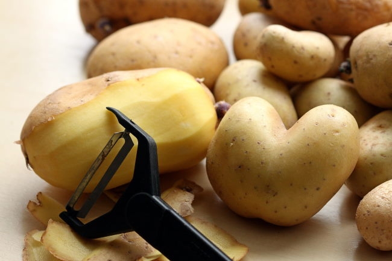

Earlier this month, I posted [In Defense of Low Fat Dieting](/2022/02/in-defense-of-low-fat-dieting/). Low-Fat diets have been slandered too much in recent years by the low-carb crowd. They can absolutely work, but the vast majority of low-fat dieters are doing it all wrong. So then the entire dieting approach gets falsely labeled as ineffective.

I want to cover how I successfully used a low-fat diet to not only lose weight but keep it off for years afterward. This post is just about using a low-fat diet for dropping weight. Once you are weight stable, you might want to increase fat. You decide. Let's lean out first.

Most of the advice below will be obvious to my regular readers, but I wanted to have a post for all readers that the search engines will send here.

### Ignore Labels by Avoiding Foods With Labels

The stereotypical low-fat dieter is reading the labels of the food they go to purchase. If you are doing this, you already lost. The food you will be eating to successfully lose weight without experiencing hunger will not have a label.

Fat isn't the enemy. It is a proxy for calories. By reducing the amount of fat you consume, you are reducing calories. You don't want to replace those calories with processed foods with labels. Eat whole foods such as quinoa, lentils, steel-cut oatmeal, vegetables, tubers, and very lean cuts of meat.

 _Boiled potatoes have the highest score on the Satiety Index List._

### Eat Until Full

Don't walk away from the table hungry. You may lose the weight, but you'll likely gain the weight back. The brain sees hunger as a threat and will ramp up your appetite at some later date.

Building trust with your brain that your diet is not a threat is a topic I covered in the post [Approach Fat Loss Like You Would Approach a Cat](/2018/05/approach-fat-loss-like-you-would-approach-a-cat/).

If you think eating until satiety will not result in fat loss, it can. This brings me to the next tip.

### Reduce Flavor

The classic mistake people make when doing any diet is they eat fewer calories of the same flavorful foods that made them heavy. They chase flavor to make the process more enjoyable. You don't want to chase flavor, you want to chase satiety.

Fill up on foods that taste fine, but not as amazing as before. You are retraining the brain's association with flavor and satiety. When every meal tastes amazing, we overconsume calories. This is in evidence everywhere you look today.

From my post [How to Crush Your Appetite for Permanent Fat Loss](/2019/09/how-to-crush-your-appetite-for-permanent-fat-loss/):

> Eat until you are full. Even if you don’t have much of a calorie deficit at first. You are training your brain to connect satiety with healthy foods that by modern standards are bland. Just keep at it and you’ll find your appetite will down-regulate. Trust the process.

### Thinking About Processed Foods

A framework that I use to think about processed foods is to consider that they are designed to reduce the energy I need to expend to digest the foods. They require less chewing and less digestive energy. If you are underweight, processed foods are a great tool. If you are overweight, they aren't helping.

Let's talk potatoes. We all know we can eat a lot more potato chips calories (even low-fat ones) in one sitting than we could by eating plain boiled potatoes. What about air fryer potatoes that use a tiny amount of fat? You'll eat fewer calories than the potato chips, but more than the boiled potatoes. Cooking is a form of processing. The greater the degree you can reduce the level of processing, the fewer calories you will consume.

I'm sure I would have lost weight air frying potatoes. But would I have lost as much and as quickly as I did with boiling potatoes? Doubtful.

### Don't Drink Calories

Speaking of processed foods, greatly reduce or stop drinking caloric beverages. Swap sodas for La Croix or similar. If you add sugar or milk to your coffee, your coffee probably sucks. Get a lighter roasted single-origin coffee that actually tastes amazing without adding anything to it. See my [coffee roaster mail order spreadsheet](https://docs.google.com/spreadsheets/d/1h-oqlqJ_G3UXuDSkdFHuEaCVuOXQOb68y2sduXQRTn4/edit?usp=sharing) for ideas.

### Don't Snack

If you feel the need to snack, I suspect you didn't eat enough at your last meal. If you really need to snack, some fruit is likely fine.

### Blood Sugar Concerns

Probably the biggest complaint against low-fat dieting is that your blood sugar will spike. We can minimize those concerns. First by eating whole foods and avoiding processed foods. Whole foods with fiber will help stabilize blood sugar. Have potatoes with lentils and veggies. Boiling and cooling potatoes will also reduce the glycemic spike (and the calories too). See the [Potato Hack website](https://potatohack.com/) for guidance.

Walk after every meal. For the last 2 years after every meal, I go for a walk for about 15 minutes. This helps lower blood sugar. Walking after eating has a long history and many health benefits. If you can't get out for a walk, you can do body-weight squats or the [yoga horse pose](https://gethealthyu.com/exercise/horse-pose/) for a few minutes.

Exercise in general is a great tool for stabilizing blood sugar.

There are also supplements you can take prior to eating that will lower your blood sugar. Look into Berberine, Ceylon Cinnamon, and Apple Cider Vinegar. Be careful with these supplements as they can drop your blood sugar too low. I only use them prior to larger meals with a higher glycemic load such as white rice.

Ben Greenfield has an extensive article on this topic: [5 Simple Steps You Can Take To Live Longer, Banish Blood Sugar Swings & Massively Enhance Energy Levels.](https://bengreenfieldfitness.com/article/nutrition-articles/how-to-control-blood-sugar/)

### Food Prep

This is true with any diet, but people tend to run towards prepared food when they don't plan their meals. They run out of time and then make poor decisions.

Get an Instant Pot. Have lots of pantry stable foods such as oats, quinoa, lentils, and legumes (canned too). Make multiple meals at a time. Frozen veggies are great to have on hand.

I am always making brown rice or a quinoa/lentil mix ahead of time. It has become a habit. Every meal I make on my own at home will save me calories. Those calorie deficits add up every week, month, and year. I can maintain a weight 30 pounds lighter now than I did in my 30s. It just requires a little planning and it is a skill you get better at with practice.

In the event, you failed to plan and your choice is between processed low-fat food or higher-fat real food, chose the higher fat meal.

### Soak, Sprout, Ferment

Some people have digestive issues which prevent them from consuming whole grains or legumes. I recall after a few years of not eating legumes that when I returned to them, I would have gut issues.

There are solutions. One is to simply reduce the serving sizes to tiny amounts and then gradually your body may relearn how to process those foods minus the stomach pain.

For me, I started with a tablespoon of cooked lentils. Then moved on to small portions of canned beans. Today I have no issues with having legumes regularly. I also restrict my grains to gluten-free (steel cut oats, quinoa), you may not need to.

The second path is to [soak, sprout, and/or ferment](https://cornersmith.com.au/blogs/recipes/how-to-soak-your-grains). This can really help ease the digestion of these foods. There are tons of resources on this topic, which is a fun hobby if you have the time. Here is my [fermentation page](/tag/fermentation/), which is mostly on vegetable and dairy ferments.

 _The start of a chickpea sprout I used back when I reintroduced legumes to my diet._

### More Tips?

Are there other tips, hacks, or nuggets of wisdom that you would share with someone that is starting a low-fat diet?  Leave a comment.

---

## Comments

### Andy
*February 23 at 2022 at 11:09 PM*

Great resource MAS. No suggestions as such, but are there any differences or caveats between someone losing 20 pounds and someone losing 100 pounds with this protocol? Thanks for all your great info

---

### MAS
*February 23 at 2022 at 11:24 PM*

@Andy - I personally would using more fasting for 100+ pound fat loss to minimize skin fold issues. I cover the reasons in this post:
https://criticalmas.org/2017/08/thoughts-high-volume-high-protein-fat-loss/

---

