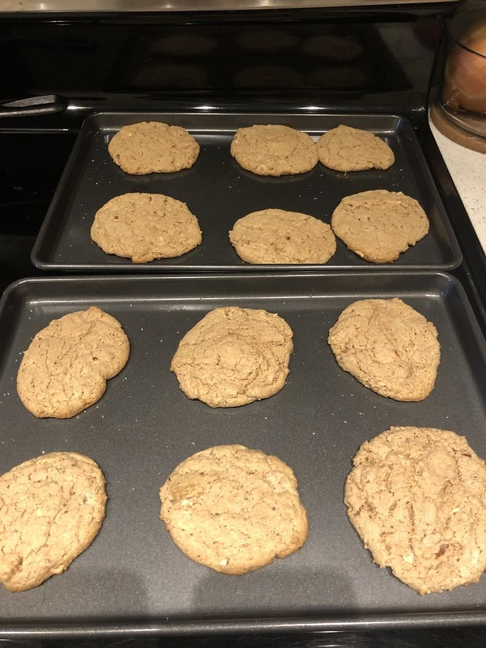

_This recipe was originally published in June 2011. It was updated in March 2022._

Here is my go-to recipe when I want something sweet. It is Almond Butter Cookies made without any grains or dairy.

_Almond butter cookies without grain or dairy_

### Ingredients

1.  1 cup of almond butter
2.  3/4 cup of sugar
3.  1 teaspoon baking powder
4.  1 egg
5.  pinch of sea salt

### Directions

1.  Preheat oven to 350F.
2.  Mix all ingredients.
3.  Form little cookies and place them on the cooking tray.
4.  Once the oven is ready, cook for 12 to 14 minutes. All ovens are different.
5.  Let cookies cool for at least 10 minutes.

That is it. This is a super simple recipe that is hard to screw up. You can add chocolate chips if you like, I found they dominate the almond butter flavor. You can also add cinnamon, but anything more than 1/4 teaspoon will make the cookies taste too much like cinnamon cookies.

The original recipes did not use salt and had less sugar. In baking, I learned that sugar not only provides sweetness but helps baked items retain moisture. The result is the cookies are a little less dry and crumbly now. The salt accents the flavor and is considered an essential tool for baking.

_2022 Almond Butter Cookies_

---

## Comments

### dhammy
*June 20 at 2011 at 5:11 PM*

I like it!  I've always got almond butter from Trader Joes on hand.  Gonna make a batch of these soon.

---

### dhammy
*June 22 at 2011 at 1:05 AM*

Made the cookies tonight and they were a hit with the whole family!  Thanks!

D

---

### GWhitney
*June 22 at 2011 at 5:13 PM*

Have you experimented baking with honey and/or brown rice syrup instead of sugar? I haven't - but it would be nice to think sugar could be avoide altogether...

---

### MAS
*June 22 at 2011 at 5:18 PM*

@GWhitney - Yes. Both honey and rice syrup are noticeably inferior. Raw sugar works best. Brown sugar also works. You may even reduce the recipe to just a 1/2 cup of sugar, but to me that ended up too cake-like.

---

### GWhitney
*June 22 at 2011 at 5:19 PM*

Thanks. How about molasses?

---

### MAS
*June 22 at 2011 at 5:21 PM*

@Whitney - Also inferior. I ended up eating more cookies every time I tried an alternate sugar. It didn't curb my sweet tooth.

---

### Michael
*July 22 at 2011 at 9:42 PM*

YUM!!! I made these with peanut butter and with almond butter and both were delicious

---

### wholistic
*October 19 at 2011 at 12:43 PM*

Love this! I am literally drooling over these pictures. I had just purchased my Almondie's almond butter because I like it raw and pure (and sugar-free!). Will definitely try this recipe! Thanks for sharing!

---

### MAS
*March 16 at 2022 at 12:18 AM*

@All - I recently experimented with this recipe. After 4 batches and some research, I updated the recipe. It was good before. It is better now. Hope you like it.

---

### Jim
*March 16 at 2022 at 1:22 AM*

@MAS
Who knew that after posting on myriad topics you'd get comments with a cookie recipe of all things? :-)  
I do remember back in the day when you were distressed about your  almond butter brand.

---

### Tony
*March 16 at 2022 at 5:34 AM*

Greetings again. These cookies look tasty. I probably would add in chocolate chips if I decide to bake my own cookies using this recipe.

---

### wilberk
*March 20 at 2022 at 6:24 PM*

can you do a review on Black Rifle coffee, thanks.

---

### MAS
*March 20 at 2022 at 6:44 PM*

@wilberk - I only drink high end single-orgin coffee (light roast) these days. If you want to see what roasters I like, check out this spreadsheet.

https://docs.google.com/spreadsheets/d/1h-oqlqJ_G3UXuDSkdFHuEaCVuOXQOb68y2sduXQRTn4/edit?usp=sharing

All the ones with the green check are good. Those with a green check and are in BOLD, I've ordered more than once. These are the best coffee roasters in America. 

For those in Canada, I like Pilot, Bows & Arrows, and Phil & Sebastian.

---

### wilberk
*March 23 at 2022 at 6:45 AM*

thanks for the extensive reply.  looking over the documents now.

---

