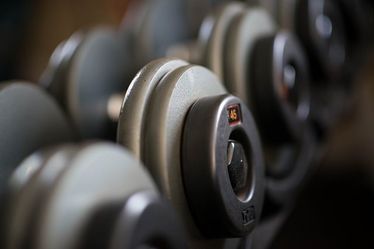

Seattle dropped the indoor mask requirements 9 days ago, so after a very long absence, I am back at my Glitter Gym. 🥳

I estimate that I lost 3-5 pounds of muscle during this period and some strength. I wasn't lazy during this period. I still walked a lot plus did some bodyweight exercises (but not enough). And since late October, yoga every single day.

The plan now is to regain the lost muscle. I also want to strengthen my ankles, knees, hip flexors, and feet. Here is my plan.

### Daily

[10,000 steps walking per day](/2017/08/power-10000-steps-day-charts/). I don't consider this to be "exercise". I view taking several walks a day as sitting interruptions. For a few weeks now, I [walk backward up a hill](/2022/02/muscle-still-interrupted/) every day.

Morning yoga or stretch routine. Between 20-40 minutes. I have found so many classes on Amazon Prime and YouTube.

Evening stretching. 10-15 minutes.

### Strength (3x a week)

I'll be using a few of the mass exercises recommended in Tall Man Training by Alexander Cortes. I was already doing goblet squats with my trusty 35-pound dumbbell, but now that I'm back in the gym, I'll be adding the hack squat and leg press.

For the chest, I'll be using incline presses. Dumbbell and barbell.

I also just started doing inverted rows.

Initially, I won't be going to failure. I'll be leaning towards volume as I get back into shape. I'll be using the HIT principles of slower controlled movements over "going heavy". Safety first.

### Non-Gym Days

I'll be using some of the Knees Over Toes info plus some stuff I found on YouTube to strengthen my knees, ankles, feet, and hip flexors.

From KOT, I am focusing on the Tibialis Raise and the Split Squat initially. Then I'll look at the Reverse Squat.

Last summer, I got a high hamstring tear. It has taken forever to heal. It still acts up if I drive for more than 30 minutes. Initially, I think I made it worse through stretching. Now I believe it was a weak hip flexor that caused the problem, so I'm adding some hip flexor exercises to address that.

I also own an adjustable slant board, which I do bodyweight squats on daily from different angles.

And finally, I'll be working on toe and foot strength exercises to assist with some yoga poses.

### Enough To Get Started

I don't plan to resume Zone 2 cardio at my gym just yet. After a few weeks of getting resettled into the program above, I'll likely do some of my outdoor walks with a weighted vest.

I wonder how long it will take to regain my lost muscle?

---

## Comments

### Tony
*March 23 at 2022 at 12:26 AM*

Hi there again. Seems that I might have similar fitness goals to yours since I also do plenty of walking and some lifting on certain days of the week. I don't know how much muscle I've lost between 2021 and today, but I'm certain that I've lost some since I'm still at around 135 pounds. This, again, comes with being an ectomorph, I suppose. Feel free to post updates, if you wish.

---

### MAS
*March 23 at 2022 at 12:35 AM*

@Tony - The way I determine that I lost is muscle is by using a combination of weight with a tape measure around my waist. It'll roughly let you know if you are gaining/losing muscle or fat. My waist was the same, but my weight was down, so I figured muscle loss. Now the game is to get the weight up without increasing waist size.

---

### Tony
*March 23 at 2022 at 1:13 AM*

So weighing oneself while also measuring the waist? I'll remember that going forward. Thanks again.

I'll also ask if you've incorporated martial arts training as well. I briefly practiced bo staff techniques with detached broomsticks a few times during the pandemic. Laugh if you wish.

---

### MAS
*March 23 at 2022 at 2:54 PM*

@Tony - Here is a post where I explain the tape measure more:
https://criticalmas.org/2019/10/what-happened-after-the-scale-at-my-gym-broke/

No martial arts for me. I have a long history of getting injured by my own hand. I don't need to double that risk.

---

### Tony
*March 23 at 2022 at 6:39 PM*

Hello again, MAS. I just read the article. I have measuring tape at home, so I'll use that. Regarding martial arts training, I admit that I take pleasure in knowing that even someone my size can use force. Of course, other somatotypes can perform Superman punches and tornado kicks with even greater force, too.

---

### Matthew
*March 26 at 2022 at 7:10 AM*

"Initially, I won’t be going to failure." Given the likelihood that muscle damage doesnt promote growth, isnt it counterproductive to go to failure since itll lengthen recovery times?

---

