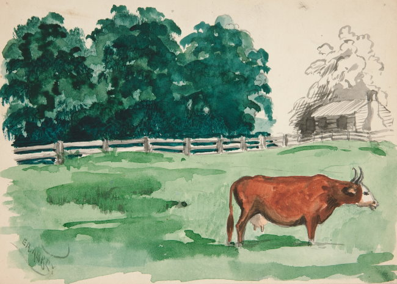

In July 2020, I posted how was able to optimize my Lipid Levels in [Lipid Levels on 2 (mostly) Pesco-Vegan Meals a Day](/2020/07/lipid-levels-on-2-mostly-pesco-vegan-meals-a-day/). You can go to the post for the raw numbers, but the short version is my numbers went from OK to Optimal when I decreased my meat consumption.

I haven't talked about this, but at the beginning of last summer, I did a bunch of Zoomer food sensitivity tests. The results indicated that I had a leaky gut. I had both known food sensitivity issues (gluten) and a few I didn't know about. The ones I didn't know about were not strong signals. I was advised to follow an elimination diet for a few months. Let my gut heal and then slowly introduce the foods (except gluten).

For the last 5 months of 2021, I avoided nightshades, dairy, eggs, soy, most legumes (except lentils), spinach, buckwheat, quinoa, brown rice, peanuts, almonds, walnuts, seaweed, and avocados. Some of these restrictions were specific to the results of my Zoomer tests.

The foods listed above were some of the staples I used to lean out on my [Peasant Diet](/2022/02/food-inflation-is-not-a-concern-on-the-peasant-diet/). No potatoes! 😱

With all these foods removed, I needed a source of calories, so I added more meat. Specifically, I added grass-fed beef. I had some organic chicken, but the majority was beef.

This year, I slowly reintroduced all the foods except gluten, buckwheat, and almonds with no issues. I also got a new Lipid Panel.

###  Let’s See the New Numbers!

Two of the metrics moved in better directions (mildly), while the others got noticeably worse.

#### Total Cholesterol

-   July 2020:  163
-   Feb 2022:  **221** 😮
-   **30% increase**

#### LDL Cholesterol

-   July 2020:  92
-   Feb 2022: **139**
-   **41% increase** 😳

#### HDL Cholesterol (good)

-   July 2020: 57
-   Feb 2022: **66**
-   **15% increase** 😀

#### Triglycerides

-   July 2020: 58
-   Feb 2022: **72**
-   **22% increase** 😐

#### TG: HDL Ratio

-   July 2020: 1.02
-   Feb 2022: **1.09**
-   **7% increase** 🤨

#### Hemoglobin A1c

-   July 2020: 4.9%
-   Feb 2022: **4.8%**
-   **2% decrease** 😀

### 🗣 Discussion

For more than a decade now, I've been a witness to the Lipid debates between the Paleo + Weston Price groups and Mainstream + Vegan advice. And as I've said before, there are very smart people on both sides of the argument. I need to parse out what is best for me and separate the good arguments from the bad.

Here are some arguments I've heard defending a higher meat diet from those proponents and how they relate to me.

##### People that eat a lot of meat also eat a lot of processed foods.

I haven't had any processed foods for years now. No fried foods. No soft drinks or alcohol. No seed oils. I cooked 95% of my meals at home. Very low sugar intake.

##### People that eat meat tend to be heavier and that extra weight causes extra health problems.

I have been weight stable for a few years now at about 15% body fat. My activity level has been consistent as well.

##### Grass-Fed Organic meat doesn't impact lipid panels like conventional meat.

As stated above, I consumed grass-fed organic meat during this period. Because my diet was so restrictive, I cooked almost every meal myself during the meat phase. I used low-temperature cooking too (in liquid or pressure cooker).

I consumed no processed meat and no pork.

##### Lipid Panel numbers are not important. Just look at the TG: HDL Ratio and the Hemoglobin A1c.

If this is true, then I'm in a better position than the top levels numbers look. The Triglyceride count increase is still concerning.

##### It is all genetics.

According to 23 and Me, I am likely to weigh more on a diet high in saturated fat. I'm not sure this is relevant to this discussion though, as my weight was constant on both diets. Also, it doesn't speak directly to heart health.

_by Edwin Austin Abbey_

### 🏃🏼‍♂️ Going Forward

To me, it looks like I did better when I had more legumes than beef. I've already reduced my beef intake by about 70%. I'll continue to add grass-fed organic extra-lean ground beef to my mostly veggie soups.

It is also possible that the numbers that got worse could have been as a result of the removal of healthy foods (legumes, quinoa) and not the addition of more meat. 🤔

Let me know if my interpretation of these numbers is correct. Your feedback is appreciated. I trust the commenters on my blog more than whatever doctor-of-the-month Kaiser has assigned to me.

---

## Comments

### Glenn
*March 27 at 2022 at 9:58 PM*

People often talk about "beef" as if it's just one thing.

There's a huge difference - for example - between a ribeye steak from a corn-fed factory cow, and a tongue of a wild/pastured raised bison...

---

### Keturah
*March 27 at 2022 at 10:22 PM*

No massive comments as I'm not very well read concerning lipids and heart health. There is some fascinating research showing women live longer after age 60 when their cholesterol is higher. The extra cholesterol likely helps with post menopausal hormone production. (Women still produce much lower amounts of sex hormones post menopause.) Higher levels of sex hormones help in older age to protect against the "aging" disease such as heart disease, osteoporosis, and more. 

Nonetheless, bugger that you lost some good progress while working on your gut health. Doesn't sound like it could be avoided though.

---

### Keturah
*March 27 at 2022 at 10:29 PM*

Also laughing at your Kaiser comment. nWe have them and hate it. My one doctor is great. But the rest, as well as the system as a whole, seriously stink. The information sharing they do with other health networks feels like such a privacy violation, despite all their reassurance it's not.

---

### Matt
*March 28 at 2022 at 4:21 PM*

@Glenn -- sure but Michael's numbers got worse even though he was eating the "right" kind of meat.  Maybe his numbers would have been even worse if he ate more factory meat but the fact remains that in this very limited n=1 experiment, he saw negative results even though he only ate grass-fed organic meat.

---

### MAS
*March 28 at 2022 at 4:59 PM*

@All - I received a good comment via email from a smart reader.

He stated to just focus on the TG/HDL ratio, as the other numbers don't have the most predictive quality for heart health and can be misleading. 

He stated my TG/HDL ratio is optimal. 

The other metric that is import is the A1C. That number needs to drop to 4.2% - 4.6% to be optimal. I have some ideas to address that.

---

### Jillian
*March 28 at 2022 at 8:29 PM*

On another note - I watched a YouTube video from 2 doctors saying the food sensitivity tests were fairly useless - they really just show if you've eaten food. I don't know if that is solid or not, but did give me pause to think. Maybe I DON'T have the million issues the test suggests...

https://www.youtube.com/watch?v=1GK4RDxOx-4

---

### MAS
*March 28 at 2022 at 9:28 PM*

@Jillian - OMG! I watched that video and another one. Looks like I got taken for a lot of money for basically gut astrology. Shame on me for not researching these tests earlier. 

I still believe I have a gluten issue, but everything else seems doubtful. Thanks for sharing.

---

### Woojin
*March 28 at 2022 at 10:30 PM*

Interesting, thanks for sharing.

Out of curiosity, what symptoms prompted you to get the food sensitivity tests? Are those symptoms better/resolved with this elimination diet? Overall, the lipid panel doesn't look too concerning beside that 40% jump in LDL. If you feel better, I think that's a good sign. I'm not sure what to make of your TG/HDL going from 1.02 to 1.07, may be due to chance or within standard error. 

I agree with you that typically more weight should be given to TG/HDL over LDL in predicting heart disease risk. But even then, I would personally prefer to have a low LDL as well if reasonably possible. 

Something I may consider is comparing apo B testing. Apo B appears to be superior to LDL in predicting heart disease risk. There are instances where a increase in LDL doesn’t correlate with a increase in apo B. 

Another thing to think about is the effect of carbohydrate intake on LDL. Again, not sure what mechanisms are at play, but people with high LDL who are metabolically fit on a low carb diet seem to reliably decrease LDL by increasing carb intake. By switching out lentils for red meat, I suspect you decreased your carb intake significantly. I wonder if it was a change in your macros that increased your LDL, rather than the removal of “healthy” foods or the addition of potentially “unhealthy” foods. 

What bothers me is that I can't find a good framework for thinking about how diets affect LDL. Observational studies may suggest more red meat increases LDL, but there seems to be a relative consensus that dietary cholesterol doesn't affect serum LDL levels. So why do we think red meat causes increased LDL?

---

### Aaron
*March 29 at 2022 at 5:41 PM*

@Mas

I figure your carb intake went down as Woojin mentioned. I wouldn't worry about your Trigs at all unless they were above 100. Also, I have a sneaking suspicion that your fat intake is too high. I would consider lowering the amount of nuts and olive oil that you might be consuming. Your LDL would go down right away. Also, are you eating within a 10-12 hr period each day? Are you snacking throughout the day. I would assume that 2 meals or 2 meals plus snack spread over 10-12 hours would lead to the best outcome.

---

### MAS
*March 29 at 2022 at 7:20 PM*

@Woojin - Low energy. Some digestive issues. it took a long time to get my results back. By the time I did, my digestive issues had resolved, but not the energy. The Elinination diet did not change anything. The good news is that adding back all the foods did not make anything worse. 

My carb intake was about the same. I ate lots of sweet potatoes, yams, and white rice.

@Aaron - Both before and during the meat phase, I was eating 2 meals a day inside an 8-9 hour eating window. 

It is possible I leaned on the nuts too much, but that didn't change either. I changed from almonds to macademia.

---

### Aaron
*March 29 at 2022 at 10:27 PM*

@ Mas

Two different interesting studies to look at:
https://pubmed.ncbi.nlm.nih.gov/25527748/
https://onlinelibrary.wiley.com/doi/full/10.1002/ejlt.201100187

Palmitoleic acid which is really high in Macademias could be an issue... Also, I'd say that the very-long chain fatty acids in nuts could be a problem.

IMO switching nuts for beans (or another carb) and just trying to get yours fats from a little bit of meat and EVOO would be the best.

Aaron

---

### Markus
*March 30 at 2022 at 12:33 AM*

@Aaron common misconception. Palmitoleic acid is an important biomarker that gets elevated by carbs: https://www.youtube.com/watch?v=5T2TIfYnMe0, especially in people with diabetes. Not from macadamias! Dietary fatty acids are very different from elevated blood levels, just like dietary cholesterol barely increases blood levels.

@Author of the blog here: Don't forget to also check ApoB/LDL-P and oxidized LDL. Those are much more important. I personally have much higher LDL-C levels than you, but also better ratios. I have yet to do any of the advanced lipid tests myself (except for Lp(a)) due to lack of labs in my area, but hopefully will be able to at some point. In general I wouldn't say LDL-C is completely pointless, but certainly the other tests are much more important.

---

### MAS
*March 30 at 2022 at 2:11 AM*

@Aaron - Nuts are just so easy to get calories. I probably do need to cut back, but I'm weight stable and would like to gain a few pounds. I'll have to think of a good easy to grab source of calories. 

@Markus - I will add ApoB test in a few months. Thanks! 
https://www.ultalabtests.com/test/apolipoprotein-b

oxLDL test is a little pricey. I might hold off on that unless the other numbers get worse.  https://www.ultalabtests.com/test/oxldl

---

### ant
*April 17 at 2022 at 9:50 PM*

Was your diet causing you noticeable issues, or was this decision to experiment solely based on the test results? I thought you were thriving on the wfpb pesco-vegetarian diet?

Personally, I've been sticking to my 2MAD "mediterranean keto" plan (with some cheats on weekends that I really need to stop), but in general when I stay consistent I see really great results. However, I'm wary of long-term ketosis, the high amounts of daily animal protein, and the lack of phytonutrients/fibers/etc from plants.  As I cannot seem to tolerate grains/legumes/tubers in large or frequent amounts, I'm going to experiment with a "mediterranean paleo" plan, restricting animal products to fish/egg whites (like Jack Lalanne!) every other day, incorporating a lot more carbs from non-starchy vegetables, fruits, and on the non-animal days I'll rely on very-well prepared (soaked/sprouted/fermented) legumes &amp; nuts.  It'll be similar to a slow-carb diet in that regard, and also conforming to Valter Longo's longevity diet (with a bit higher protein overall though).

---

### MAS
*April 17 at 2022 at 9:58 PM*

@ant - I had low energy. Digestion was fine. I'm back to my original diet now. I do think I'll add more meat in the winter as a hedge, but keep it mostly pesco/veggie the rest of the year.

---

### ant
*November 1 at 2022 at 4:28 PM*

Another important question, how have you been preparing your legumes, nuts/seeds, &amp; grains? If not soaked/sprouted/fermented and cooked really well (like in a pressure cooker) then over time I'd suspect that may be a cause of some of the problems.

---

### MAS
*November 1 at 2022 at 4:33 PM*

@ant - I soak all my legumes and buckwheat. I use a pressure cooker for cooking almost everything. But I don't see how that is a variable. The amount of plant based food that I consume decreased during this N=1 test. 

5 months after this post, I got more blood work done. With more plant-based food, my blood work improved.

---

### ant
*November 1 at 2022 at 10:26 PM*

@MAS

 I meant improperly prepared plant foods may have contributed to the initial leaky gut symptoms which instigated this n=1 beef experiment. Nice to hear of the improvements!

---

### MAS
*November 2 at 2022 at 2:18 PM*

@ant - Gotcha. I'll keep monitoring my numbers. I do increase my meat intake a little in the winter months.

---

