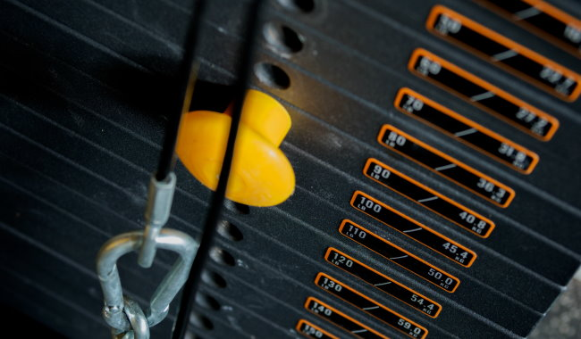

Three years ago I posted [Millennials Have Killed the Glitter Gym](/2019/04/millennials-have-killed-the-glitter-gym/).

> People are staring at their phones between exercises. Between sets. Sometimes during the set itself. They are looking at their screens as they walk through the gym. They are taking their $800 smartphones into the saunas.

l go on to say:

> In the title, I blamed Millenials not smartphones. That is because the vast majority of offenders are of that generation. I’m sure all of us Gen X and Baby Boomers have smartphones, but we aren’t glued to them during our workouts. Although I do have a concern that this new behavior will continue to spread and become the new norm for all patrons.

The first [comment by Derek](/2019/04/millennials-have-killed-the-glitter-gym/#comment-26663) predicted what was coming my way.

> This phone-obsession phenomenon is definitely not exclusive to millennials–they are just more obvious. I’ve seen 60 year olds terrified to set their phone down for 10 minutes for fear of missing ‘something’.

Well, it happened. I am now the last person left in my gym that keeps their phone in their pocket and is not wearing headphones.

In what other ways has my gym changed since that post?

### The Silver Sneakers Are Gone

One of the things I loved about my gym was seeing and chatting with the older members. These Silver Sneakers are primarily from the [Silent Generation](https://en.wikipedia.org/wiki/Silent_Generation). They were a joy to be around. They are now gone. COVID fear - even with Omicron - has kept this group from returning to my gym.

I ran into one of my favorite Silver Sneakers at the grocery store. She loved going to the gym every day. She was a big Alabama fan and we used to have friendly banter on college football. Her husband passed away and now she is too afraid to return to the gym.

### Gen X Has Left the Weight Room

I see some of my fellow Gen X on cardio machines, but I am now the old man in the free weight room. I expected this would happen. Seattle is a young city and I see lifters taking far too much risk with their exercise selection as they get older. **The exercises that build you up when you are young are the same ones that break you when you age.**

Lifters don't want to hear this message. I have more than a decade of posts and comments on this very topic. I [stopped barbell back squatting](/2012/06/i-no-longer-give-a-squat-about-the-squat/) and most benches. I survived.

Those that kept slamming the Big-3 lifts past 40 stopped coming to the gym. Young lifters think their life priorities changed. I know that isn't true. People that spent two decades developing the discipline to lift don't walk away from weight training unless they are in pain. Some might, but not the majority.

_Photo by [Brett Jordan](https://unsplash.com/@brett_jordan?utm_source=unsplash&utm_medium=referral&utm_content=creditCopyText)_

### The Gym is Quiet

Now that everyone - except me - comes to the gym with their own headphones and smartphone, my gym has turned the music down extremely low. Combine that with the fact there is almost zero socialization since the Silver Sneakers left and you end up with an eerily quiet gym.

My neighborhood library branch is now louder than my gym.

I actually don't mind the silence. I've never worn headphones in the free weight room. Cardio machines, sure, but not around the weights. I've seen too many [crazy things in the free weight room](https://criticalmas.org/best-of/tales-from-the-glitter-gym/). I want to be present and alert to my surroundings. Plus I'm OK with listening to my own thoughts. I don't need to inflict hearing damage to muster up the motivation to knock out one more rep.

I'm the old-timer that goes into the free weight room to lift, not to tweak a Spotify playlist. 👴🏼

### Masks and Mouth Breathing

There are a few healthy young people in my gym still wearing masks. I'm not going to say much on this except that if the mask is forcing you to mouth breath instead of nasal breath then you are a fool.

### How About Your Gym?

I sometimes miss the pre-smartphone days, but I'm OK with the current situation. I have the discipline to keep showing up and the knowledge not to hurt myself. My younger self would likely not have been as motivated in today's modern gym.

Has your gym turned into a zombie iPhone dance?

---

## Comments

### Essleyfit
*May 13 at 2022 at 9:52 PM*

I only work out from home, so I can't comment on gym culture, but it does seem sad that only younger people are going to your gym now. Your posts on survivorship bias and injuries should be required reading. As I reach mid-forties, I can attest to the fact that I can't recover as quickly from minor injuries/aches despite being more active than ever before. 

Have you seen the NASM's OPT model? They have their program phases listed as:
• Phase 1 Stabilization Endurance Training
• Phase 2 Strength Endurance Training
• Phase 3 Hypertrophy Training
• Phase 4 Maximal Strength Training
• Phase 5 Power Training

The fact that I skipped Phase 1 and 2 and went straight for Hypertrophy Training may have contributed to some of my injuries (well, that and probably an old sagging futon). I wasn't even lifting heavy weights! I suspect I'm not the only one. A referral for PT is in the works, but in the meantime I'm taking page from your book and doing some yoga. It occured to me that yoga is great for stabilization, and that has been an undervalued allocation in my portfolio. Also, Coach Viva has an excellent YouTube video, "The Daily Workout that Changed My Life" that shows examples of Stabilization Endurance Training and Strength Endurance Training. I wish I had seen that video at the beginning of my exercise journey so I can better align my exercise program with my life goals.

P.S. - I never commented on your My Grass-Fed Beef Lipid Level Experiment (n=1) post, but I figured once you add back in legumes and grains that you'd have more data points to work with. 

P.P.S. - My 11 year old has been making your almond butter cookie recipe with good results, so thank you.

---

### Harold
*May 14 at 2022 at 8:44 PM*

I've noticed that since the gyms were shut down in my area some quasi-regulars who would previously go to the gym 2-3 times per week have stopped going altogether.  These were the silver sneakers as you say and also the Gen Xr's. I believe part of it is they got so out of shape that they dread the time it will take to get back into shape.   

The other possibility is that they have substituted other habits and behaviors that replaced going to the gym.  Some positive (like outdoor walking, exercises, etc..) and some not so positive like binge-watching shows and movies.

It is very sad that I see many people still living in fear and isolating themselves socially.  Living in fear is like being constantly in a state of stress. I do wonder how this will affect our society moving forward.

---

### Alex
*May 15 at 2022 at 1:39 PM*

I wish my Glitter Gym would turn the radio off. 
I wear noise canceling earbuds and it’s still loud.
I asked them since everyone wears earbuds why the loud club music??
They said so people hear it when they arrive.

---

