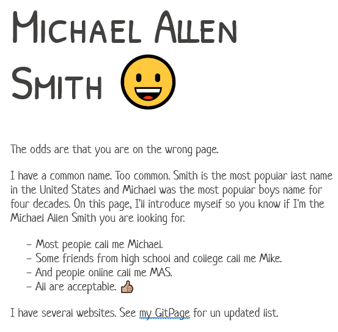

Eventually, I'll get around to putting out some new blogs. In the meantime, here are a few web projects I've been tinkering with. I added PaperCSS to [my portal page](https://michaelallensmith.com/). I like these style sheet libraries that can take a simple website and make it look decent with one line of code. 😍  [My GitHub profile page](https://github.com/digitalcolony) now has some bling. Using a GitHub workflow recipe, it can pull in a list of my latest blogs. ✍🏼 The page I have been working on the most is my [Coffee Roaster Map](https://coffee-roaster-map.netlify.app/). My quest is to order good coffee from every state. I'm on target to finish by this fall. I'm also teaching myself React, which I am using for the site. By the way, I consider good coffee to be lightly roasted single origin. If you do as well, click through to my spreadsheet for the list of roasters that I've ordered from. ☕ I created a coffee website portal for myself using React and Robohash. Why do I need a portal? Because it turns out I now have 5 coffee websites. 6 if you count the portal itself. 😂 Also, I had this extra domain I wasn't using. _UPDATE Feb 2024: I got rid of my coffee portal. One fewer site to renew annually._ Another thing I am working on is cleaning up every single article on [INeedCoffee](https://ineedcoffee.com/). 23 years of posts. There are so many grammatical mistakes on the site, especially in the early years. Using the Grammarly browser extension, I can now quickly find and replace these errors. I started on April 1999 and am now up to July 2008. This will take a while. 😯 I also fixed the navigation problem with this WordPress theme after the developer ignored my bug report. I posted the [fix on GitHub](https://github.com/digitalcolony/rams-theme-wordpress-fix).

---

## Comments

### Hs
*July 6 at 2022 at 1:39 AM*

Do you make significant income from your online websites or is this more of a side hustle?

I’ve dabbled with websites and I’ve considered various ways of turning profits, But not enough to know if it’s a likely way to escape the rat race. As it is I’m a working stiff.

---

### MAS
*March 25 at 2024 at 8:24 PM*

@Hs - I'm not sure how I missed this comment. 

For many years, I made a good side income with INeedCoffee. Not anymore. A few sites have gamed the search engines by writing click-bait articles. Often the articles are stolen. One site that is now popular than INeedCoffee was stealing images from me. Fighting them was a never-ending battle. 

These days I have websites as a fun hobby. Like the olden days. I can make more money at my day job. Passive income is never passive for long. It almost always requires a lot of follow-up work.

---

