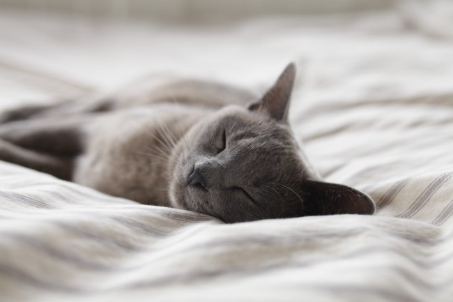

Long-time readers of this blog might recall how I was an early enthusiast of the quantified self movement. I wanted to believe that I was capable of hacking myself to a better health outcome by running experiments and tracking variables in a spreadsheet. I ultimately rejected quantified self. You can read about that journey on my [Quantified Self page](https://criticalmas.org/best-of/quantified-self/). On that page, I talked briefly about the future.

> I do think there can be tremendous value and insight into collecting and analyzing health data. That collection would need to be passive and the analysis done by someone else.

I wrote that in 2014. Fast forward to 2019 and I am seeing several interesting fitness wearables on the market. This got my attention because the data collection would now be passive and that data could be run through an algorithm to provide me with actionable analysis. The 3 wearables I purchased were the Oura Ring, Apollo Neuro, and the Muse 2. I also have a first-generation Apple Watch that was gifted to me. The Muse 2 was supposed to help me become better at meditation. It failed. I trashed the device in the post [The Muse 2 is Stressing Me Out](/2021/02/the-muse-2-is-stressing-me-out/). The Apollo Neuro was supposed to push me into different states and moods quicker via vibrations. I used it for several months and [didn't notice any benefit](/2021/02/the-apollo-neuro-is-a-maybe-for-me/). I wasn't sure it was helping me, so I stopped using it and saw no change. As for the Oura Ring, my relationship was more complicated. In 2020, I didn't like the Oura. In 2021, I liked it. By 2022, I hated the Oura. Initially, I believed that the Oura was helping me resolve my insomnia. The thing is, I never had insomnia until I got an Oura. It was only after I started checking my sleep score daily did these sleep issues surface. A core lesson of overcoming insomnia is accepting the fact that one can't control sleep. Did you know that most insomniacs have perfect sleep hygiene? It is a form of control. Sleep comes when the conscious mind surrenders to the unconscious mind. Having the Oura track and grade me every minute was not helpful. Once I removed the Oura, my sleep got much better. I boxed my wearables up and gave them to a friend to sell.  _Photo by [Alexander Possingham](https://unsplash.com/@allexx54?utm_source=unsplash&utm_medium=referral&utm_content=creditCopyText)_

### Patterns in Hindsight

Looking back I can now see that all the reviewers and podcasters that discussed these wearables (and a few others) were either investors in the company or (more commonly) receiving an affiliate commission for each sale. Positive reviews outnumber negative reviews by far because there is no financial incentive to post a negative review.

### Work on Intuition...for now

It is my opinion that wearables need to get a lot better before I would consider making another purchase. They will, but we are a long way off. In the meantime, you don't need a wearable to tell you if you slept well or if you are too tired to work out. Build your intuition and follow common sense. Alcohol, caffeine, a warm bedroom, and eating right before bed are the things that are most likely to cause your sleep to suffer. You don't need a $300 ring to tell you that.

---

## Comments

### Christian
*July 22 at 2022 at 6:25 AM*

I was so bummed after I saw a fellow programmer whip up this automated dashboard to track all the things in a beautiful way: https://howisfelix.today/

... And at the very bottom, it says: "When I first started building this project 3 years ago, I expected to learn way more surprising and interesting facts. There were some, and it’s super interesting to look through those graphs, however retrospectively, it did not justify the hundreds of hours I invested in this project."

There's just not that much the data we can chase after can tell us.

---

### Peter
*July 23 at 2022 at 3:26 AM*

Your experience is your experience, but I don’t agree. I had an Apple Watch 1 that eventually died last year. This year I got a 7. Man it has come a long way,  The gamification works for me. Knowing I haven’t closed my rings forces me to get in one last 3 mile walk the way nothing else has. 

Over the time since I’ve had the new watch my RHR baseline has come down 8 points and my HRV has improved a lot, along with a few other numbers. 

Insomnia might be that way for you but my insomnia has gotten better with Watch sleep tracking. 

When you can’t lie to yourself about how much sleeping you’re getting, you can improve it, just the way you can with exercise tracking.

---

### MAS
*July 23 at 2022 at 1:45 PM*

@Peter - I am interested in HRV, so I'm keeping an eye on the latest Apple Watch. I was unaware that the HRV metrics were accurate. 

My phone tracks my steps, so I guess that is technically a wearable that I like. I used to look at the Apple Watch to see the rings, but I find the screen and buttons too small.

Even if the latest Apple Watch tracks sleep better than the Oura, I don't know what I could do to improve a score on those nights when I've done everything I can think of.

---

### Peter
*July 25 at 2022 at 2:45 PM*

The new Apple Watch screen is giant! And the screen is completely customizable now. You would have no problem reading it. I think it's a bit odd to reject something based on its 2015 model.

Sure, phones track steps, but we don't have them with us at every moment.

---

### MAS
*July 25 at 2022 at 3:18 PM*

@Christian - That page is beautiful. Very impressive. 

@Keturah S. - I don't know what happened to your comment. Did you delete it? I hope my comment system is not acting up. Thanks for the HRV info. 

@Peter - I carry my phone with me for 95% of my steps. That is good enough.

---

### thezenhobbit
*November 1 at 2022 at 6:00 PM*

I was gifted an Apple Watch that I mainly use for step-counting. I tried using the Pacer App on my phone but I don't carry my phone on me all the time, and sometimes I like to take walks outside without it. The other thing I found it useful for was timing rest periods between sets, and for making sure I stretch for a certain amount of time.

---

