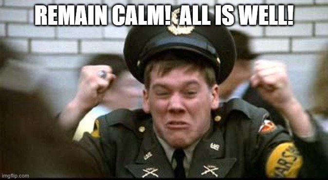
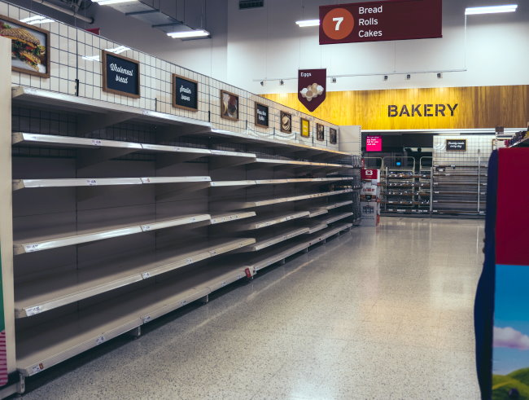

Since the interests of this blog involve food and risk, I thought I'd address a topic that isn't getting serious attention from major news outlets. That is the possibility that food shortages are coming. If you search Twitter you will find several accounts that are predicting that massive disruptions in our food supply are coming soon. They cite various reasons including supply change issues, fertilizer restrictions, and the war in Ukraine.

There are two reasons that I can think of why this isn't a larger story. The first is that the evidence is weak and therefore extremely unlikely to happen. The second reason is the evidence has some merit and reporting on it would lead to hoarding and shortages.

Which is the truth? After doing a bit of reading on both sides, I'm assigning a 5% probability that the US would experience any food shortages in the next year. Other countries, depending on their own food security level, could have a higher risk.

### 5% Is Not Zero

In my opinion, not preparing for a 5% risk is unacceptable. I've already begun to stockpile bags of rice, dried legumes, and canned food. If I had an extra freezer, it would be full of grass-fed meat.

Did you know that a 5-pound jar of peanut butter has 13,490 calories in it, is shelf stable for 2 years, and sells for less than $11 on Amazon?

I also have an Instant Pot and I know how to cook. It is shameful that we live in an era with so much access to cooking knowledge that younger adults are clueless when it comes to food preparation. Relying on an app and a delivery driver for your very survival is a terrible strategy.

### Lessons From 2008

Really longtime readers of this blog might recall how I called the real estate and stock market collapse in 2008. At one point, I felt there was a risk that the banking system could freeze up. A very small risk, but one I was uncomfortable with.

From the September 2008 post [Watching Wall Street and Waiting](/2008/09/watching-wall-street-and-waiting/):

> We may or may not have an Argentina style banking crisis, but ignoring the possibility isn’t wise. Bad unexpected things can happen. And they can happen very quickly. After I woke up from my bad night of sleep, I asked myself what I would do if I knew a hurricane or fire could hit me in the next week or so. Here is what I did today:
> 
> -   Pulled $500 out of an ATM. Will do this every day this week. In a crisis, you can’t be certain your credit or debit cards will work or be accepted. Cash is accepted everywhere – for now.
> -   Made sure my car had a full tank. Oil has since spiked by $25/barrel.
> -   Loaded up the refrigerator. Bought lots of canned tuna, dry beans, and bottled water.
> 
> Do I think something bad is going to happen? No, but if it does, I want to be prepared. Once I feel the crisis has passed, I’ll start spending the cash or re-deposit it in the bank. The food and water will be consumed. No loss. Just greater peace of mind and hopefully a better night of sleep tonight.

We didn't get the crisis, but a few months later, Seattle got hammered with a [generational snow storm](/2008/12/seattle-snow-continues/) that shut down the city for a week. Many stores and restaurants were closed. I had a full pantry of food. 😎

### What We Learned From Cat Food

I don't have a cat, but I learned this from a few cat owners during the lockdowns. Certain types of cat food became scarce due to supply chain issues.

Cats are often picky eaters and will only eat a specific brand. When owners started seeing that they were unable to get their brand of cat food, they went from a shopper mentality to a hoarder mentality. Instead of buying what they needed, they would buy months of cat food as soon as they could. This caused other cat owners to see empty shelves and hoard themselves at the first opportunity.

What if cat food and the baby formula shortages are just the first act of a deeper crisis?

Can you imagine what grocery store shopping would look like if these whispers of food shortages got louder? It would be like the panic shopping you see days before a hurricane is predicted to hit a coastal city. Only it would be everywhere and at the same time.

It is an unlikely situation, but if it happens, I'll be safe at home with a bowl of rice and beans and not in a fist fight at Trader Joe's.

_Photo by [Sandie Clarke](https://unsplash.com/@honeypoppet?utm_source=unsplash&utm_medium=referral&utm_content=creditCopyText)_

Where are you located and where do you place the odds of food shortages in the next year? And what steps are you taking, if any, to prepare?

---

## Comments

### Derek
*July 26 at 2022 at 6:27 PM*

.05 percent would be closer to the truth.  The only context I've heard people casting doubt on the food supply are those brain-dead cult members gobbling up right wing propaganda.  They also think Biden is in the streets murdering babies.  So take their opinions as next to worthless.

---

### Geoff
*July 26 at 2022 at 10:10 PM*

Interesting post. Thank you. Did you deploy a similar strategy as you did in 2008 to the early stages of the COVID pandemic? I started stockpiling non-perishables slowly in late January 2020 but never got more than would have lasted a month or so if we had had a major food disruption.

With a supply of flour (gluten free if needed), salt, clean water and that big jar of peanut butter you could hold out a long time eating peanut butter sandwiches.

---

### MAS
*July 26 at 2022 at 11:11 PM*

@Geoff - Actually no. I didn't consider supply chain issues then. I was too focused on what vitamins to take. 

On a whim, I just did a search for peanut butter rice. Lots of recipes. That would be an interesting way to get calories without baking.

---

### Jim
*July 27 at 2022 at 2:08 PM*

@MAS -- nice post.
Re: rice, beans and folks not knowing how to cook.
I recently read an article that said a single mom was skipping meals so that she could afford to feed her kids with the currenty higher food prices.  While I sympathize with her situation, I couldn't help but think that she might be able to afford some rice and beans to eat instead of entirely slipping meals?

---

### Derek
*July 27 at 2022 at 3:00 PM*

https://www.youtube.com/watch?v=TA1DrzsXZUQ&amp;ab_channel=LivingOnADimeToGrowRich

---

### Jim
*July 27 at 2022 at 3:09 PM*

@MAS -- The 10 minute comment edit function seems to work well.  The timer even persists if you leave the site and then return within the edit time window.

---

### MAS
*July 27 at 2022 at 3:16 PM*

@Derek - 16 minutes. How about a summary? 

My 5% number not only includes real shortages, but perceived shortages that cause consumers to behave in panic shopping that *could* trigger real short term shortages.

After 9/11, I bought a bunch of N95 masks in the event of another terrorist attack. Of course, I didn't need them, because nothing happened. Then in 2003, San Diego wildfires hit and my neighborhood was evacuated. Smoke filled the air for days. I was the neighbor with the masks. 

I see no downside to buying large amounts of non-perishable foods that are already part of my diet and I will consume eventually anyway.

---

### Derek
*July 27 at 2022 at 4:11 PM*

Summary: Worrying about a food shortage in the United States is like the folks in Saudi Arabia worrying about a crude oil shortage.

I have googled and found precisely zero fact-based arguments of a possible food shortage in the United States.

It's an interesting thought experiment.  And it's healthy to be skeptical.  And it costs very little to buy some extra beans and rice and throw them in your basement.  

But the evidence that food-shortages are something fact-based and REAL to worry about does not exist at this time.

---

### MAS
*July 27 at 2022 at 4:21 PM*

@Derek - Thanks. That sounds correct to me. 

Maybe the most likely bad scenario - which would still be a low probability - is that a country without food security has a crisis and then the fear spreads to America, which leads to panic buying. Unlikely, but an interesting thought experiment.

---

### Geoff
*July 27 at 2022 at 5:23 PM*

@Derek and @MAS. Thanks for this dialogue. It’s informative and helpful.  A panic prompted by the appearance or fear of shortages does seem most likely to me. However, to me it seems that failures in distribution (not production) could also create shortages - especially in urban or remote areas that are already “food deserts”. The likelihood of a prolonged distribution disruption is certainly low, but not zero, either. Buying a reasonable amount of non-perishables I will ultimately use, as you suggest, seems like an easy way to hedge against that (low) risk.

---

### Grubby
*July 28 at 2022 at 12:31 PM*

hello from east TX. I've been slowly stockpiling and "prepping" since the beginning of covid. In this age of extreme weather and increasing natural disasters (and now a war in Europe) it seems prudent to have the ability to shelter in place for several weeks and to be able to "bug out" for several weeks with little notice. (I'm not prepping for the end of life as we know it, just for extended emergencies). If done it gradually it cost very little - I see no down side to it at all.

---

