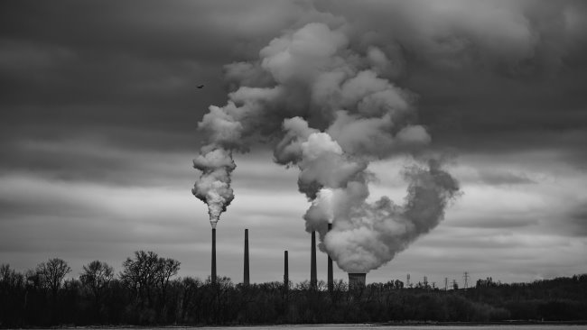

In my last post [Seed Oils, Blood Donations, and Body Temperature](/2022/07/seed-oils-blood-donations-and-body-temperature/), I shared new research that my frequent blood donations reduced the level of "forever toxins" in my body and could have raised my metabolic level. Did this help me go from 222 to 182 pounds? And whereas most dieters regain some of their lost weight, I've been able to stay lean for years now without effort. I was primed to learn more about the role pollution is having on obesity when Slime Mold Time Mold posted a link to this study: [The Effect of Air Pollution on Body Weight and Obesity: Evidence from China](https://web.archive.org/web/20230315015006/https://www.econstor.eu/bitstream/10419/196794/1/dp12296.pdf) (61-page PDF) The study does show an increase in obesity levels with increased pollution levels.

> ...we find significant positive effects of air pollution, instrumented by thermal inversions, on body mass index (BMI). Specifically, a 1 μg/m3 (1.59%) increase in average PM2.5 concentrations in the past 12 months increases BMI by 0.31%, and further increases the overweight and obesity rates by 0.89 and 0.19 percentage points, respectively.

The study is just 12 months. Now just extrapolate that across an entire population year after year, decade after decade. The part of the paper I found most interesting was the description of the 4 ways air pollution can increase obesity. I summarized them.

1.  **Metabolic disorder:** Oxidative stress, adipose tissue inflammation, and negative effect on glucose metabolism.
2.  **Increasing the risk of other chronic diseases:** Cardiovascular and respiratory diseases, heart diseases, and some cancers.
3.  **Sleep disorders:** This could lead to decreased leptin, thyroid-stimulating hormone secretion, and glucose tolerance, as well as increased ghrelin levels.
4.  **Reduced physical activity:** Air pollution causes people to stay indoors more which reduces physical activities and increases sedentary behaviors such as sitting, reclining, and lying.

You can read the paper for all the citations. I am fortunate that I live far away from freeways and factories. I'm now driving fewer than 200 miles a month, and those are on city streets. I replaced the air cabin filter on my VW with a HEPA one. For many people, their highest level of pollution exposure will be when driving on a freeway.  _Photo by [Mike Marrah](https://unsplash.com/@mikemarrah?utm_source=unsplash&utm_medium=referral&utm_content=creditCopyText)_

### Less Meat, More Lentils

Now for the part that will upset a few people. Animals are [bio-accumulators of environmental toxins](/2018/04/toxic-load-and-low-carb-dieting/). When you eat their fat, you consume the environmental toxins they could not excrete via digestion. Even if every bite of meat is grass-fed pasture-raised, which is a great idea, are these animals breathing clean air and drinking clean water? Beats me. I don't know, but it is a question worth studying. We live in a toxic world. Everywhere we look we see people in declining health. We may be extending life spans via pharmaceuticals and increased safety protocols, but health spans (the period of our lives where we are in good health) look depressing to me. I still consume a small amount of super clean (and lean) meat when I'm at home. Maybe 1-2 pounds a month. I'm happy with lentils.

---

## Comments

### S
*August 2 at 2022 at 8:47 PM*

Presumably fatty fish would suffer same issues (i.e. mercury)?  Would low fat animal products avoid this issue do you think?
Regards, Simon

---

### MAS
*August 2 at 2022 at 9:00 PM*

@Simon - Fatty fish have their own issues with heavy metals. Conventional advice is to favor smaller fish over tuna and swordfish. I've made cilantro a staple in my diet since my arsenic test. I also supplement with chorella for extra insurance.

Low fat animals would be superior, because they have less fat, which is where the toxins are trapped. 

I don't the balance between the benefits of animal protein vs the risk. For myself, I'm favoring less animal protein. I think we will learn more in the coming years on how to better assess this risk.

---

