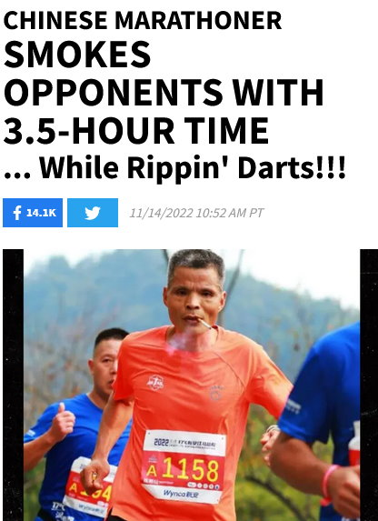

I have 3 short fitness stories for you today.

### Army Basic Training (1987)

When I got off the bus at Fort Benning, Georgia, after some yelling, the drill sergeants told us that we would all gain muscle. Then they looked at a young recruit from American Samoa. He was jacked. Imagine a young version of The Rock. The drill sergeant amended his sentence and said "Except you. You'll probably lose some muscle."

When it came time to take the PT test, there was a problem. He had so much muscle that when he tried to make his upper arms parallel to the ground, his chest would touch the ground, which meant it wasn't an Army-valid push-up.

The testers solved this problem by digging a little trench so that he could do push-ups over it. This allowed him to go low enough without his chest touching the ground. After the first rep, he asked if he was good. The grader said yes and proceeded to get a perfect score without breaking a sweat.

### Smoking and Running (1995, 2022)

One of my favorite stories on this blog has to be [The Legend of Marlboro Marc](/2012/03/the-legend-of-marlboro-marc/). The post is a decade old, but the story goes back to 1995. Please read the entire post if you have the time. Here is the short version:

> Marc decided to mix his two hobbies. He would run and smoke at the same time. And this wasn’t a cold Ohio morning, this was during the mid-afternoon heat in South Florida. He would jog and smoke through South St. Pete while getting incredulous looks from neighbors. During one run, Marc came up with a brilliant idea. **He would run an entire marathon chain smoking cigarettes.**
> 
> To make it worth his effort he would seek out sponsorship.

That story is real, but also incredibly unbelievable. Until this week.

From [Chinese Marathoner Smokes Opponents With 3.5-Hour Time ... While Rippin' Darts!!!](https://www.tmz.com/2022/11/14/chain-smoking-chinese-man-runs-marathon-3-5-hours/) 

> Chen -- who crossed the finish line with an impressive 3:28 time -- finished 574th overall out of nearly 1500 runners who competed ... despite taking heaters to the face throughout the race.

I don't recall Marlboro Marc's exact marathon time. I do remember my 2 times (3:33:51 and 3:41:56) were faster than his. But Chen was 5-minutes faster than my smoke-free lungs. Unbelievable.

### My Brief Chat With Pavel (2004)

In 2004, I met Pavel Tsatsouline at the Arnold Expo in Columbus, Ohio. I had a few of his books.

I mentioned to him that it would be nice to have posters of the exercises he used in his two stretching books. I told him how I had to photocopy all the pages, cut them out, and then assemble them on a poster to display in my home gym because flipping the pages and holding the books in place was annoying.

He liked the idea and said other people had the same suggestion. To my knowledge, no posters were ever produced.

This was before YouTube and smartphones. If I were chatting with Pavel today, I'd suggest a mobile app called Pocket Pavel. All the workouts from all his books. Pin the workouts you are interested in doing. Launch quick instructional videos for each movement. Built-in timers. Save workouts. Review history. Wouldn't that be nice?

---

## Comments

### Thomas
*November 18 at 2022 at 10:19 PM*

Thanks for sharing your stories. 
Thé smoking marathoner one is pretty crazy. 
Regarding the last one, Strongfirst sells an app with some of Pavel’s program now.

---

### MAS
*November 18 at 2022 at 10:29 PM*

@Thomas - Thanks for the info. I found the link. $20/month. Yikes. 
https://www.strongfirst.com/shop/strongfirst-training-app/strongfirst-training-app/

I did see in the Apple store that someone created a "simple and sinister" app. It is basic, but free.

---

### Alex
*November 19 at 2022 at 2:07 PM*

Great stories Mas. 
What do you think about the Hit inroad concept—The reason for going to failure?

---

### MAS
*November 19 at 2022 at 2:15 PM*

@Alex - I actually never heard the term "inroad" until your comment. 

Drew Baye has this article on the topic.
https://baye.com/qa-fatigue-inroad-intensity/

He's smart. I'm giving it a read  now.

---

### Jim
*November 20 at 2022 at 1:44 AM*

It's amazing to think that before Pavel came to the US, nobody here had even heard of kettle bells.

---

### Stuart
*November 27 at 2022 at 8:54 AM*

Speaking of the smoking runner it reminds me of my years playing soccer for a local team. I’ve always been into my fitness training and running in particular has been something I’ve done in varying amounts over the years, and at my best ( a 34 and a half minute 10K pb) I was slightly above average in ability.
  Yet during fitness training for this team I had a team mate who didn’t train ( other than football) and smoked quite heavily, but yet would beat me at fitness tests, which was frustrating to say the least.
It was one of my earlier lessons in how much our genetics influence our fitness results, despite our best efforts in training.
Ultimately, relax (unless you are getting paid for your efforts) and enjoy the process and let what will be…be. Actually being average is good enough.

---

### Essleyfit
*December 5 at 2022 at 1:30 AM*

Genetics and sex definitely have a hand. My husband can bust out 10 pull-ups and he doesn't exercise. Meanwhile I've been working out for two years and only recently got my first pull-up. 

Btw, Mas. I found where the Silver Sneakers are in my community. They go to the local YMCA. I've seen them in the gym there, while I'm walking the indoor track. They use the machines (safer for them). There's no loud music and very few bros. The Silver Sneakers socialize...a lot. My friend who goes to the Y says the most dangerous part about lifting there are the seniors who hover around and try to  talk to him while he's squatting. Cracks me up.

---

### MAS
*December 5 at 2022 at 10:37 PM*

@Essleyfit - congrats on your first pull-up. 

I found that stepping up to the top and then just doing holds and slow negatives gave me the strength to improve my pull-ups. Assisted machines are good as well, provided the movement is slow. I see many people "bouncing" on those machines. 

When I weighed 210, I was stronger than I am today at 180. Yet, I can crank out more pull-ups now. Being lighter gives one such an edge on that exercise.

---

