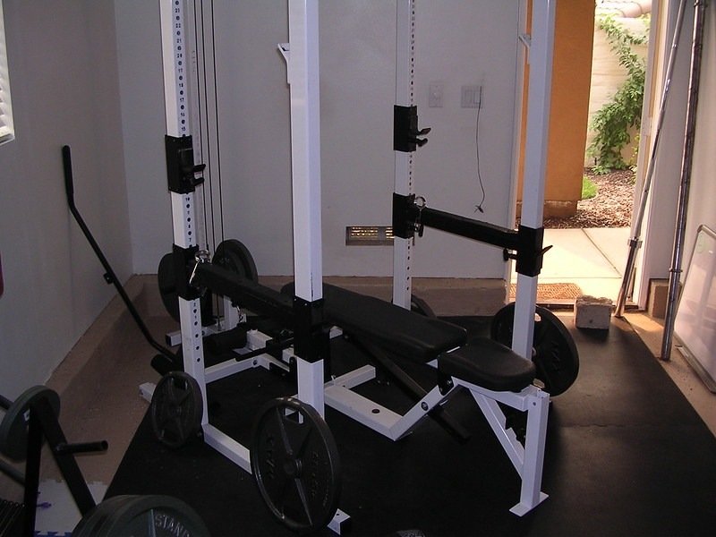

Twenty years ago, I was living in a gated community near San Diego. One of the homeowners on my block was named Mike. He was about 20 years older than me. One day we were having a brief conversation by the mailbox. He made a comment about my weightlifting. I had converted my single-car garage into a free weight gym and a few times a week, one could hear [Marilyn Manson](/2008/04/mascene-20-the-marilyn-manson-workout-mix/) playing over the sound of weights clanging. Mike wasn't shaped like the other homeowners. He was stocky and although overweight looked to have some muscle.  _Part of my home gym._ I asked Mike if he lifted weights. He told me that he didn't, but did in college when he wrestled. He told me that lifting weights makes him too heavy. I've thought about this brief conversation at least 500 times over the past 20 years and my interpretation has changed as I've gotten older. My initial response was how misguided he was. Muscle is awesome. Mike had a natural foundation. He could regain his college muscle quickly and be jacked. The found muscle would help him burn more calories and trim him down a bit. Even if his weight went up a bit, his body fat percentage would certainly drop as he would see a rise in lean body mass. In 2018, I posted [My Wrong Advice For the Big Guys](/2018/09/my-wrong-advice-for-the-big-guys/). For many years, I believed big guys were at a natural advantage for getting jacked and that getting jacked would be an easier path to getting lean. I was wrong.

> Unknown to me, the bodybuilding trainers discovered through observation and experimentation that it was actually much harder to build muscle on a body with extra weight. When given the task of training a big guy, they would direct them to cardio and fixing their diet until enough progress was made before hitting the iron.

Even if I still believed that big guys have an advantage, now that I'm the same approximate age that Mike was during the conversation, I can now see he was directional accurate. Being lighter as we age just feels better.

### Accidental Understanding

I'm going to do a follow-up post on the history of my weight and the lessons learned along the way, but I wanted to share my conversation with Mike first. When we had the mailbox chat, I weighed 205 and I was on a quest to get to 225. I was chasing the physiques of [Evander Holyfield and Laird Hamilton](/2007/03/fitness-role-models/). 205 felt fine to me. It was what I knew. Then starting in late 2013, I began experiencing knee pain. My activity level collapsed. My appetite didn't and my weight gradually increased to 222. When you are 6' 2, adding 20 pounds is not as noticeable as would be on a shorter individual. But weighing an extra 20 pounds didn't feel comfortable. A few years later, I jumped on the [potato hack](https://potatohack.com/) with the goal of getting back to 200. I blew past 200 and landed at 180, which was not planned, but turned out to be ideal for me. This is where I've been for a few years now. Being 180 feels great. I move better and even though I had some injuries this year, I would not have wanted to experience them at a weight of 20 or 40 pounds heavier. At 200+ pounds, I never stuck to a yoga practice for more than a week. At 180, I haven't missed a single morning in 424 days. Movement feels better. Mike's concern about not getting heavier was valid. He probably knew from his prior experiences that once he starts slamming the weights, his appetite would rise, and although his biceps would be popping out of his shirt, he may have needed to get pants a little bigger. His life experience, which I did not appreciate at the time, was more concerned with the downside of being heavier at his age and not the upside valued by the younger man. I understand now.

---

## Comments

### MAS
*December 22 at 2022 at 11:07 PM*

@All - I have a story about Mailbox Mike unrelated to the topic of this post that I'll share in this comment. 

One weekend he and his wife got in an heated argument. He was so upset that he went into town and bought a motorcycle without telling her. Instead of telling his wife about the bike and having a 2nd fight, he convinced a neighbor to hide his new motorcycle in their garage until he found the right time to break the news to her. I think he hid it from her for a week or two.

---

### Andy
*December 23 at 2022 at 7:52 AM*

Cool piece MAS, as always. Ego is a powerful thing. I wish someone had drummed it into me as a young fella that general physical capability is so much more important than getting as much muscle as possible. Merry Christmas mate

---

### Alex
*December 23 at 2022 at 1:17 PM*

I’m 5’10” and fell great at 160lbs. 
Every now and then I’ll think I need to add “10lbs of muscle” and end up feeling heavy and come back to 160.

---

### Stuart
*December 23 at 2022 at 3:09 PM*

In his book “Exercised”, Daniel Lieberman states that although weight training is important for health and quality of life, especially as we age, there is no reason to do a great deal of it beyond a minimum. From the anthropological viewpoint that he looks at the issue from, he says that it would have been undesirable for our ancestors to have been too heavy, even with muscle, as muscle is metabolically costly, restricts movement and takes too many calories to sustain, a problem when food was, at times, hard to come by.
The romantic paleo notion that our caveman ancestors were somehow muscular supermen and women is most likely false, and they were more like the thinner hunter gatherers that we see today, who are highly active, with lots of low level cardio type activity, with just a sprinkling of higher intensity activity now and then, where speed and strength might be required.
Putting the drugs issue to one side, it has been theorised that the spate of early deaths among bodybuilders due to heart complications, may also have something to do with their large sizes. Excess weight places a strain on the heart, whether that excess weight is fat, or muscle. It is a load with each step that the heart has to deal with. Although sarcopenia has been linked with mortality, it appears that a large increase in muscle size is not needed for healthy ageing. Just enough to  ensure good movement quality and metabolic health. Not jacked athlete / bodybuilder amounts. Besides recent research has pointed towards strength rather than hypertrophy being a more important factor in terms of healthy ageing. This may be an important factor in determining correct training for general health. General strength levels can be built and maintained with a lot less volume ( single sets) than hypertrophy can, according to recent research. Good news for those of us who struggle to put on muscle regardless and also don’t have a heck of a lot of time to devote to the gym.

---

### MAS
*December 23 at 2022 at 4:52 PM*

@Stuart - Great info. Thanks for sharing.

---

### Al
*December 23 at 2022 at 5:59 PM*

Excellent post! If you don't mind, can you elaborate on the "I haven’t missed a single morning in 424 days" line? I'm just curious about how/why you track that and whether you track all of your workouts.

I tend to obsess about these things and alternate between free-wheeling/logging nothing, then back to designing elaborate systems  to compile minutia which seems silly.

 After all I am 66 next month, and my workouts consist of a 90/10 split (over time) of stretch/strength for an average of 20m a day.. Do I really need to know more than "I did it"?

---

### MAS
*December 23 at 2022 at 6:06 PM*

@Al - I don't write down or track my workouts. I may elaborate more in a future post. For yoga, I made a decision to make it a daily habit. I already had a morning routine and so I just stacked it after I did my Duolingo lesson (current daily streak is 2568). 

By taking the decision out of the process - like I do for cold showers - I don't waste time and effort negotiating with myself. For yoga, I just remember the date October 24, 2021. Then I used a day calculator to arrive at the number for this post.

---

### Alex
*December 23 at 2022 at 6:51 PM*

I don’t track either. A future post about tracking would be appreciated.

---

### MAS
*December 23 at 2022 at 11:47 PM*

@Alex - I found this tracking post from 10 years ago. It holds up and still matches my opinion.
https://criticalmas.org/2012/08/why-i-dont-measure-my-workouts/

I do have a new take on tracking that I will add to an upcoming post.

---

### Alex
*December 24 at 2022 at 12:07 AM*

@mas. Thanks for the link. I feel the same way about data. I used to track. Now I don’t and like it better.

---

### Stuart
*December 24 at 2022 at 7:48 AM*

MAS,
Here is a link to that research by Brad Schoenfeld that I referred to.
Three sessions per week of one set per exercise saw equivalent strength and endurance gains to three sessions per week where three and five sets per exercise were used. The higher volume groups only saw significant better results in terms of hypertrophy, even though the low volume group saw some hypertrophy increases.
So if increased size and weight gain isn’t a priority, or something that you know won’t happen to a great extent, regardless of what you do, strength and fitness gains can be had in a fraction of the time.
https://pubmed.ncbi.nlm.nih.gov/30153194/

---

### Stuart
*December 24 at 2022 at 8:03 AM*

MAS,
Even Brad Schoenfeld, the cheerleader for higher volume in strength training has admitted in podcasts that a lower volume approach is feasible for the vast majority of us who are looking for general improvements. He stated that the majority (Pareto 80/20 rule?) of results can be achieved with lower volumes. The higher volume is, in his opinion, only needed by those wanting to “maximise” those “gainz” and wrong out those last drops.
Here is the research with recommendations for those who don’t want to live in the gym and aren’t concerned with every percentage of improvements.
https://link.springer.com/article/10.1007/s40[phone removed]0-1

---

### Stuart
*December 24 at 2022 at 8:13 AM*

An article about the views of Lieberman 
https://somaticmovementcenter.com/exercised-daniel-lieberman/?locale=en

---

### Al
*December 24 at 2022 at 11:00 AM*

@stuart Exercised is on my TBR list.

---

### Stuart
*December 24 at 2022 at 7:58 PM*

Al,
    It’s a good read. It’s up there with another great book on generic issues to do with sport and physical activity…”The Sports Gene” by David Epstein

---

### Essleyfit
*December 25 at 2022 at 12:45 AM*

Good post. I'm in my mid-40s and lost ~10 lbs over the last two years (I'm only 5'). I agree with your sentiment: being lighter is much better at this age; I look, feel and move better.

Stuart's anthropological viewpoint is interesting, I'm going to add "Exercised" to my reading list. Many bodybuilders can't understand why some women prefer the Brad Pitt Fight Club/Bruce Lee look (I've heard it called "ottermode"), but I think it has to do with the perception that too much muscle tips the balance against speed, endurance, and agility--all of which are necessary for a hunter-gatherer life. A few people who talk about the Ottermode physiqe are Rusty Moore of Visual Impact Fitness (he calls it Yacht Bod/cologne model), Jump Rope Dudes video "How to Get a Body Like Brad Pitt" and Bioneer's video "Hidden Power: How to get strong without getting big."

Also, a lot of women don't want to pursue muscle hypertrophy because they don't want to get "bulky".  If they express this viewpoint (i.e. "I just want to get lean and toned"), they get tons of flak from the fitness community. There are countless articles arguing why females can't get bulky, but they still turn to yoga, pilates and barre. Not everyone wants to have the maximum amount of muscle for their body, and I find it amusing when people try so hard to tell women what they want.

---

### Stuart
*December 25 at 2022 at 9:01 AM*

Essleyfit,
                 You sound like my wife. She doesnt like men that are too skinny, but she certainly doesn’t like men with too much muscle either.
I’ve read elsewhere that most bodybuilders don’t build the muscle to impress women ( even if they say they do) but instead they do so in order to impress/ intimidate other men and raise their standing within their male social groups.
As for myself I’d rather have the appreciation of women and remain a beta male

---

### MAS
*December 25 at 2022 at 4:13 PM*

@Essleyfit - I'm trying to find the quote by Art De Vany on guys that develop large biceps. The short version is he agrees with you with an evolutionary reason.

---

### Stuart
*December 27 at 2022 at 1:24 PM*

MAS, 
         I don’t know whether or not I’ve missed the specifics from your previous articles, but you mentioned getting injured a few times in recent months.
Would you care to elaborate? What injuries and how did they happen? We’re any directly  / indirectly from your training or physical activity? If it’s too personal a question then I do apologise and feel free not to answer.

---

### MAS
*December 27 at 2022 at 3:25 PM*

@Stuart - That is a good idea for a post. Maybe a year-in-review?

---

### Al
*February 12 at 2023 at 1:20 PM*

Specifics aside, I like Max's  free and easy state of mind regarding tracking training.  Goal, Action Plan, then just do it (apologies to Nike).  Honestly that is my main gripe about tracking. *My* specific compulsions drive me nuts, nothing to do with logging per se.

I once read a book ( a novel, nothing to do with fitness), and the lead character had a mantra that went "idea, plan, stick, stick stick" (as in stick with it). This was back before I retired, and my co-worker that I trained with sometimes thought It was hilarious that I said that sometimes lol. I'm trying to embrace that again.

I thought of this thread this morning as I looked over my Feb training log AGAIN today.

https://maxshank.com/habits/why-i-dont-keep-a-training-log/

---

