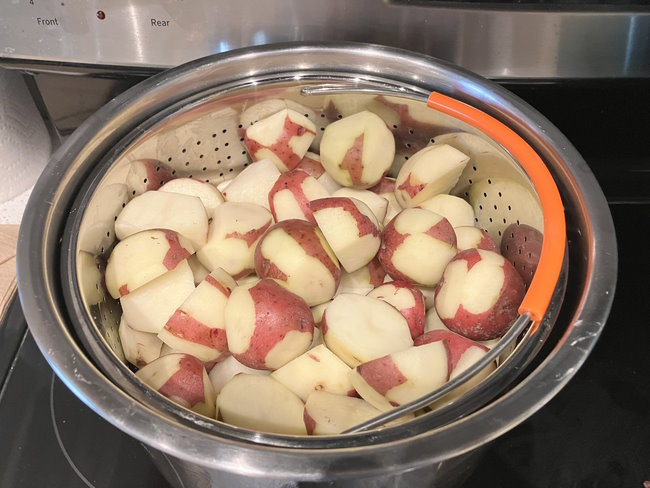

I posted [Mostly Weight Stable Regardless of Diet Part 2](/2023/01/mostly-weight-stable-regardless-of-diet-part-2/) this weekend. I wanted to show others that I was able to drop 40 pounds and keep it off for 4 years using both the [Potato Hack](https://potatohack.com/) and my own [Potatoes and Protein Diet](/2018/12/potatoes-and-protein-a-no-hunger-template-for-fat-loss/). Long-term success on the potato diet is absolutely possible.

A few days ago, Slime Mold Time Mold posted [SMTM Potato Diet Community Trial: 6 Month Followup](https://slimemoldtimemold.com/2023/01/26/smtm-potato-diet-community-trial-6-month-followup/). Although I applaud SMTM for spreading the word about the Potato Diet, I had trouble reconciling their analysis with my own experience and understanding of the diet.

In their post, they share the results of their study participants. Most did not maintain their fat loss after they resumed their "normal" diet. They conclude:

> The first thing we see is that most people gain back the weight they lost over time, and on average, it looks like they are back close to their original weight about six months later.

More from their conclusion:

> Still, the potato diet is a relatively successful weight loss intervention, since one month of dieting gives consistent results that tend to stick around for about six months. And given the significant individual differences we see, it seems that for some people the effects are more lasting. While we don’t know why this happens for some people and not for others, there’s a small chance that you’ll end up being one of these outliers, and you’ll keep losing weight after the potato diet is over.

I know why it happens. Those that regained weight increased their calories. As much as I revere the potato on this site, it is not magical. It just happens to be the food with the highest satiety score. If you trade high-satiety foods with low-satiety foods, you will increase your calories. Maybe not immediately, but eventually.

The final sentence was too much for me and is the reason for this post.

> But in general, it seems like the conclusion is that 4 weeks of potato diet will make you lose weight, and six months later most people will be back around baseline.

That doesn't need to be true. I'm going to tell you how to have long-term success on the potato diet.

_These days I use an Instant Pot with a liner to prepare my potatoes._

### Understand Satiety

**A potato is just a tool for achieving satiety with fewer calories.** There are other foods that also work well, but the boiled-and-cooled potato just happens to be the best.

I've shared this image numerous times. Understanding this graphic is the key to understanding satiety and how to reach satiety with fewer calories. The people in that study that failed traded the stomach on the right which was full of potatoes for one of the two on the left. This resulted in more hunger, which resulted in them consuming more calories to achieve satiety.

### Understand Flavor

People eat more calories from foods with higher flavor. If you would like a detailed scientific explanation, please read [The Hungry Brain](https://www.stephanguyenet.com/thehungrybrain/) by Stephan J. Guyenet, Ph.D. That book goes deep into systems in the brain that regulate our appetite. There is even an explanation given in the book on why the Potato Diet is effective for fat loss.

Boiled and cooled potatoes have a neutral flavor. When you are eating plain boiled potatoes, you stop eating once you are full. You don't keep reaching for more potatoes. This is not true for other foods in modern society. When you get full eating pizza, there always seems to be room to eat one more slice or some ice cream.

From [How To Successfully Use a Low-Fat Diet](/2022/02/how-to-successfully-use-a-low-fat-diet/):

> The classic mistake people make when doing any diet is they eat fewer calories of the same flavorful foods that made them heavy. They chase flavor to make the process more enjoyable. You don’t want to chase flavor, you want to chase satiety.
> 
> Fill up on foods that taste fine, but not as amazing as before. You are retraining the brain’s association with flavor and satiety. When every meal tastes amazing, we overconsume calories. This is in evidence everywhere you look today.

Potato hacking is a way of reducing flavor to reach satiety with fewer calories. You are retraining your brain. You are breaking the association between highly flavorful meals and satiety. When you do this successfully, your appetite will decrease. When your appetite decreases, you will consume fewer calories, and this leads to fat loss.

### Dealing With Cravings

I developed a technique to help me deal with calorie-dense food cravings that I found helpful, especially in the early days. I call it the "BUT FIRST" method, which I detailed in [How I Beat Food Cravings on the Peasant Diet](/2017/09/beat-food-cravings-peasant-diet/).

### Track Your Weight and Inches

It is common knowledge that weighing oneself regularly is beneficial to holding oneself accountable to a diet. I weigh myself 2-3 times a week, but I discovered taking a [tape measure around the widest section of my waist to be a better metric](/2019/10/what-happened-after-the-scale-at-my-gym-broke/).

> I decided to use the tape measure daily instead of just 1-2 times a week. Within a few days, I could guess my size within 1/4 of an inch at a glance. I discovered the daily feedback loop of the tape measure was more powerful than I expected.

We may be able to rationalize a few pounds of weight gain on a scale but seeing your waist expand by 1/4 or 1/2 an inch will have you running to the kitchen to boil potatoes.

### Gradually Increase Protein

If you have a lot of weight to lose, focus on the potatoes. As you get within striking distance of your ideal weight, start increasing protein. Protein defends against muscle loss when dieting. Protecting muscle protects metabolism. As one gets leaner that defense requires more protein. I explain the P-Ratio in [High Volume or High Protein Foods For Fat Loss](/2017/08/high-volume-high-protein-foods-fat-loss/).

### Potato Hacking FTW!

If you do a potato hack and follow the guidance on the post, you will not only lose weight, but you'll maintain the fat loss without experiencing hunger.

---

## Comments

### seantheaussie
*January 31 at 2023 at 12:02 AM*

You are a better man than I if you can measure your waist with repeatability. I have to struggle FIERCELY to relax my abs and get a useful reading. Fortunately a large drink upon waking, then peeing and weighing myself before breakfast works for me.

I don't know how anybody thinks they can restrict fat gain without constant measurement, and having, "diet days" whenever they have gained, "x" until they have lost it again.

---

### MAS
*January 31 at 2023 at 12:10 AM*

@seantheaussie - I don't actually own a scale and when I couldn't go to the gym for 2 years, I reached for the tape measure. You get really good at predicting really fast.

---

### Marc
*February 3 at 2023 at 9:48 PM*

@ MAS

Do you have any thoughts on carb cycling in relationship to the potato diet.

Thanks in advance 

Marc

---

### MAS
*February 3 at 2023 at 10:19 PM*

@Marc - I haven't thought about it, but in general, I favor very low exercise when potating hacking. The potatoes are there to shutdown hunger. If one exercises a lot, then hunger will increase. Conflicting goals. I'd drop the weight and gradually add in exercise as one nears their target weight.

---

### Rachel
*February 8 at 2023 at 5:53 AM*

I am so glad the potato us still serving you, and I agree that they are a tool to eat less calories without suffering from constant hunger. I have found another food that is even more filling (to me) and lower calories, and with this food I feel totally satisfied. It is the pumpkin. My obsession for pumpkin knows no boundaries

---

### MAS
*February 8 at 2023 at 5:10 PM*

@Rachel - Are you using canned pumpkin? I

---

### Rachel
*February 8 at 2023 at 5:41 PM*

No, I buy whole kabocha squash and make air fried wedges or steamed pumpkin. But I am addicted to the wedges that I dip in a mixture of Greek yogurt and pb2 powder

---

