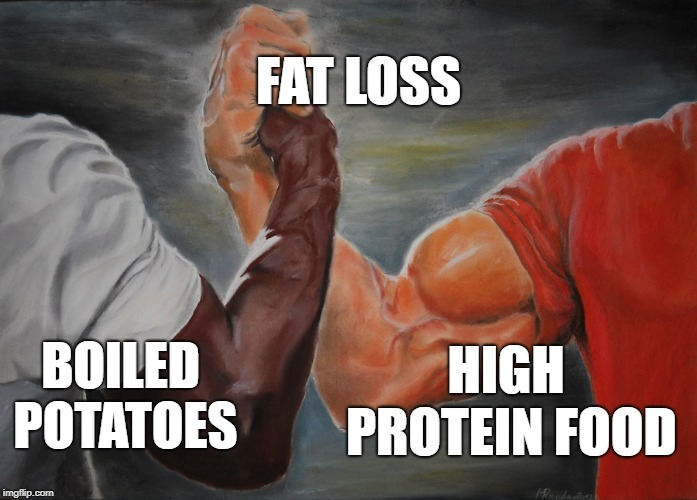

In August 2017, I posted [Mostly Weight Stable Regardless of Diet](/2017/08/mostly-weight-stable-regardless-diet/) where I did a deep analysis of how much I weighed going back to the start of the century. And I shared a quote from an earlier blog:

> I see that I was weight stable within 10% and usually 5% despite following wildly different diets.

My conclusion showed that each time I pivoted to a new nutritional philosophy, the changes were minor or temporary.

> So even though I had a dip for a few years, you can see that I have been mostly weight-stable. During this entire time period, I never counted calories and my activity level and diet varied a lot.

That was August 2017. I had just dropped from my peak of 222 to 200 following a Potato Hack. I even state in that post that I considered my ideal weight range to be 190-200. _(Height: 6' 2.5)_ What happened next? I gradually lost another 20 pounds over the next 18 months following variations of the Potato Hack. As I got leaner, I increased my protein intake to defend against muscle loss. Potatoes and Protein!  [Potatoes and Protein – A No Hunger Template For Fat Loss](/2018/12/potatoes-and-protein-a-no-hunger-template-for-fat-loss/)

### The New Normal

I love weighing 180 pounds. I never thought I'd say that. I clearly had body image issues. Since I was a teenager, I wanted to be big. I didn't want to be a [Stick Boy](/2008/09/the-stick-boy-explained/). In a [2008 post](/2008/08/i-dont-want-to-ride-a-donkey-down-the-grand-canyon/), I feared dropping below 200 pounds.

> Today I weighed exactly 200 pounds. Uh oh! Even though I’m clearly leaner than I’ve ever been, it is a bit scary to drop 5% of my weight in such a short time, considering how long it took to gain that weight.

Years later, I would freak out at the 190 mark after a few people started telling me that I looked too thin. I now know that I wasn't too thin. At the time I didn't. From the post [You Look Too Thin](/2020/01/you-look-too-thin/):

> When you lose weight, your clothes get loose. And if you aren’t sure you can maintain your new lower weight or you don’t want to buy new clothes or both, you don’t look your best. Being lean in baggy clothes provides the appearance of being too thin. Being athletic in baggy clothes provides the appearance of being weak. You can look sickly, which can be concerning to those that care about you.

Whenever I had these bouts of fear that I was losing muscle, I would sabotage my leanness and start eating more to get my "gains" back. The last few years have been a teacher for me. I finally accepted that I was carrying more weight than I needed. I detailed that realization in the post [Body Weight Wisdom I Heard 20 Years Ago](/2022/12/body-weight-wisdom-i-heard-20-years-ago/). Check out the post if you haven't already. I consider it one of the most important posts on this site.

### Last Words

Once again I am weight stable, but now at a lower weight. Potatoes taught me about food volume and satiety. Combining them with lean proteins keeps me lean without feeling hungry.

---

## Comments

### Alex
*January 29 at 2023 at 3:28 PM*

I do potatoes only Thursday and Friday with a muscle milk first thing on the morning. Great weight mgmt tool. Thanks Mas.

---

### Grubby
*January 30 at 2023 at 12:45 PM*

now that your weight has stabilized have you kept your protein high or have you returned to your pre-weight loss levels?

---

### MAS
*January 30 at 2023 at 3:22 PM*

@Grubby - I've kept my protein levels higher.

---

