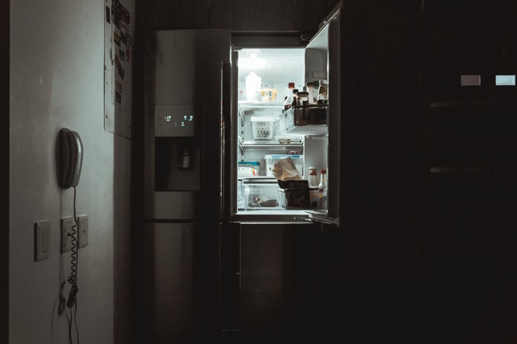

I recently received a comment on my 2011 post [High Satiety Paleo Friendly Foods?](/2011/10/high-satiety-paleo-friendly-foods/#comments) from Dawn:

> Did you ever break the code on night eating? I also need food before bed and will still sometimes wind up eating cashew butter at 2am. Would really love to stop this.

I was reminded how I needed to eat right up until I went to sleep for most of my adult life. If I didn't, I would wake up hungry or sometimes have trouble falling asleep.

I did crack the code for myself. It was a 3-step process.

### Step 1 - Go For Protein

The first step was recognizing how different foods shut down hunger and for how long. I discovered high volume foods were best for quieting hunger while eating and that higher protein foods kept me full for longer periods between meals.

I got this idea in 2018, which I shared in the post [Potatoes and Protein – Two Attacks on Hunger](/2018/12/potatoes-and-protein-two-attacks-on-hunger/). Having a meal with a decent amount of protein increased the odds that I would not wake up hungry.

This is what works for me. For others, it might be carbs, fat, and/or fiber. During the daytime, find what foods keep you full the longest and then eat them for dinner.

### Step 2 - Gradually Eat Sooner

One day it hit me that my belief that I couldn't get to sleep unless I ate right before bed was likely as flawed as my 2007 belief that I had to eat first thing in the morning.

When I first started intermittent fasting, I had conditioned my body to eat something every 3-4 waking hours. _Thank you Zone Diet!_ 🤦🏻‍♂️ I gradually began eating my first meal later and later each day. After a few months, my morning hunger was tamed. I could skip breakfast completely with no effort.

I applied the same strategy to the end of the day. I gradually kept moving my last bite up earlier and earlier from my bedtime. A few minutes early each day. Instead of eating 15 minutes before bed, I now have a 2-3 hour gap.

### Step 3 - Ignoring the Hunger

If you start to feel a little hungry in bed, recognize the hunger and don't indulge it. And then repeat that process again and again. Over time, those nighttime hunger signals will quiet.

My mistake for many years was rewarding those hunger signals, which only guaranteed they would return night after night.

_Photo by_ [_nrd_](https://unsplash.com/@nicotitto?utm_source=unsplash&utm_medium=referral&utm_content=creditCopyText)

### Last Words

In recent years, there have been more health recommendations to avoid eating right before bed. Doing this can result in worse sleep. Learning how to build that gap is a skill worth developing. I'm glad I did.

---

## Comments

### seantheaussie
*February 27 at 2023 at 10:34 AM*

"rewarding those hunger signals"

Always a mistake IMHO. Over my 25? years of weight control I have come to the conclusion that the majority of times, hunger pains are due to habit, or a missed habitual feeding time to be precise.

---

### glenn
*February 27 at 2023 at 8:42 PM*

This is where some paleo principles might be useful.

Until 200 or 300 years ago, most humans would have been eating the "catch of the day" by the fire, maybe around 3 or 4 hours before going to sleep.

The catch of the day would typically have been high protein meat, and if they're luck with some fat.

---

### Dawn
*February 28 at 2023 at 4:38 PM*

I really appreciate the response and strategies detailed above. I probably need to just get on my big kid pants and stop giving in. Added protein seems to help.

Also want to mention that I just discovered your blog about a month ago and have been working through the archives on diet and exercise. Potatoes and Protein is catchy. There's a book out there called The Boring Diet with a similar thesis of low-reward foods when working to lose fat. 

I'm still trying to come up with a  story worthy name for my approach, but am leaning towards Spartan Diet, due to the little s "spartan" nature of low-reward foods and the Spartan imagery of strength and health. 

I like to make up a big pot of plain mashed potatoes or barley and then mix in either shredded chicken or lean ground beef along with some vegetables. I freeze this mixture in pre-portioned silicone molds called Souper Cubes and treat them as homemade microwave meals. 

Thanks again!

---

### MAS
*February 28 at 2023 at 6:45 PM*

@Dawn - I was unaware of the Boring Diet. That is a book I want to read.

---

### Marc
*February 28 at 2023 at 8:58 PM*

I am using exercise successfully to thwart hunger. Regular daily exercise curtails hunger in my experiences. Both types of exercise ,  aerobic and resistance training, curb appetite  if not taken to extremes of effort.  I have found out that such extremes types of exercise cause hunger.  Therefore, the 2 H’s (HiT, HiIT),  don’t seem to work long-term to lose fat.

I am also concerned with  protein in the diet. Although protein may somewhat satisfy the satiety mechanism, protein may contribute to loose skin of almost all affected obese individuals. Plants generally contain more than enough adequate protein, as there is zero need to mix two different vegetables to ensure an adequate supply of essential amino acids. The intestines are continually reprocessing amino acids, including any necessary essential amino acids. Eat meat because you enjoy such, much like I do on a regular basis. 

However, I am coming around to see MAS’s view of eating for sustenance, instead of joy or flavor.  I like lentils soaked and cooked , as I have found this to be  my appetite killer.

Marc

---

### Dawn
*March 1 at 2023 at 12:34 PM*

@MAS 

The Boring Diet is pretty short. The author bills it as an actionable approach to follow the science in The Hungry Brain. There's also an emphasis on eating basically the same thing every day until dinner. Other terms I've heard for this are Robot Diet or Groundhog Day Diet. 

For me, this has cleared up a lot of mental space due to less decision making. I'm doing a whey shake&gt;smaller Spartan meal&gt;smaller Spartan meal&gt;dinner with family.

---

### MAS
*March 1 at 2023 at 6:11 PM*

@Dawn - I loved the Hungry Brain. I just finished the audiobook.

---

