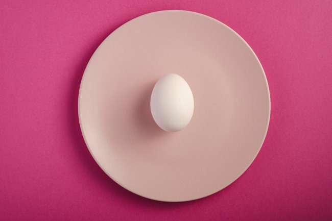

The latest trend I've been following with interest is the push for higher protein levels and the growing rejection of intermittent fasting. The lead character in this chapter on nutrition is Dr. Peter Attia, who just published a longevity book titled Outlive, which I just finished reading.

Attia was a huge proponent of fasting for many years for benefits including longevity. When protein is restricted, the body begins a healing process called [autophagy](/2009/04/autophagy-and-loading-trucks-for-ups/). Fasting creates these windows of restricted protein which helps trigger this process.

Now Attia believes that the best lever for longevity is exercise and that we need to defend against muscle loss. And to accomplish this we need more protein. Specifically, 2 grams of protein per kilogram of body weight. Getting these higher levels of protein necessitate a wider eating window and fewer hours of fasting.

The logic makes sense, but I still have questions. On the [Tim Ferriss Show #661](https://tim.blog/2023/03/17/peter-attia-outlive-transcript/), Attia first described his extreme levels of fasting.

> I had really kind of taken fasting to a pretty extreme place doing up to 10 days of water only, and routinely just busting out seven-day water-only fasts, certainly doing three days every month would be something I would do without hesitation.

Then he mentioned that according to a DEXA scan after he stopped his extreme fasting and spiked his protein, he gained _"13 or 14 pounds of lean mass in about 12 months"_. 🤔

During both phases, he was highly active and exercised a lot. During the post-fasting, high-protein phase Attia increased his lean mass.

My questions and comments:

-   For more than a decade now, I have been reading about how fasting doesn't cause muscle loss. Had that not been true, how could we have gotten this far? Or is the more likely explanation that Attia fasted way too much?
-   Attia has a very high level of activity. More than even the average fit individual. Would a normal fit person with their activity levels have the same protein needs as Attia? I would say that I'm fitter than 90% of people my age, yet I would guess my exercise volume is probably 10% that of Attia, who is about my age. Would our protein requirements be the same?
-   Did Attia gain or regain 13 pounds of muscle in his late 40s? Regain for sure. Would Attia have regained the 13 pounds of muscle had he just used a more reasonable level of fasting and protein? I think so. We know lost muscle is the easiest to regain. See my [Tim Ferriss Hoax](/2011/01/how-tim-ferriss-really-gained-34-pounds-of-muscle-in-28-days/) post. Also, the number one thing the body needs to gain muscle is calories, be they protein or whatever, which Attia lacked in his extreme fasting period.

Attia has a long history of bouncing from one extreme to another when it comes to fitness and nutrition. Is protein his latest shiny toy? I don't know.

If it were just Attia, I would probably ignore the message and just chalk it up to another post-keto health influencer looking for attention. But I'm seeing more voices promoting protein and rejecting intermittent fasting.

I recently watched a 6-minute video by Dr. Brad Stanfield titled [Why Everyone Is Abandoning Intermittent Fasting](https://www.youtube.com/watch?v=q65HcQ7DGTA), which cites the latest research on fasting and protein. The video's conclusion is that intermittent fasting is no better than calorie restriction for weight loss and is a suboptimal dietary approach for maintaining muscle.

_Photo by_ [_Rodion Kutsaiev_](https://unsplash.com/@frostroomhead?utm_source=unsplash&utm_medium=referral&utm_content=creditCopyText)

But what about longevity and autophagy? Attia makes the case in his book that 16 hours without food is not enough to trigger autophagy or inhibit mTOR elevation. The other problem cited with cramming all your calories into a tight eating window is that it gets harder to meet the protein levels Attia and others are now recommending. And even if you could, many claim that spreading out protein intake across the day yields better results than consuming massive amounts at once.

That is a brief overview of the recent protein and fasting debate. In my [next post](/2023/04/more-protein-and-the-fasting-backlash-part-2/), I'll cover my current thoughts and if I plan to make any dietary changes. How about you? What do you think of the latest push for more protein?

---

## Comments

### Jim
*April 23 at 2023 at 1:47 AM*

Interesting post MAS.
Attia and Huberman are very charismatic, but I think it's mostly info-tainment at this point.  
As for the "narrow" 8-hour feeding window, I spent my whole childhood eating breakfast at 7:30AM, lunch at noon, and dinner at 5PM, which is about a 9.5 hour feeding window. So I never understood why the 8 hour window was considered such a big deal.

---

### CrispyB
*April 23 at 2023 at 12:37 PM*

As someone in the same age group, lean muscle mass is becoming more important in my mind.  My thinking now is, gain muscle while I can, then lose weight when I have even less T.  
Not sure if that is legit, but the way I am thinking now.
Therefore, more protein is what I am leaning towards.
Even watched the "monster mash" by Stan Efferding youtube video after listening to a ben greenfield podcast with a doctor stillman who says he gained a large amount of muscle mass by only changing his protein intake.

---

### Joanna
*April 23 at 2023 at 1:55 PM*

I am interested in increasing protein as a way to stave off age-related muscle loss now that I am in my 50s. I have been intermittant fasting for years, eating between roughly 3-8pm as I just am not hungry until afternoon. At 52 kg, I can easily eat 100 g of protein in that window, but I haven't yet found enough reliable evidence to gauge whether that works, or whether spreading out the protein makes it more bioavailable (or whaterver the term is). Seems there are smart people on both sides of that argument.

---

### Michael
*April 23 at 2023 at 8:36 PM*

Interesting stuff. 

I’ve been trying to lose weight, doing so via low carb and skipping breakfast (so TRE). Has worked fine, though I haven’t pushed either element too hard and know I’ll have to in order to lose the rest to reach my goal. 

As an aside, I’ve always thought the same as Jim - that an 8hour eating window doesn’t seem extraordinary, though maybe it is for someone grazing in front of the tv until bedtime.

If I get any autophagy from the TRE then great, but if not then that’s fine as it’s not been my goal.

Jason Fung makes the point that our bodies surely don’t store fat for barren days only to then burn muscle on those barren days. Of course, just because something sounds sensible/correct doesn’t mean it is.

I am increasingly interested in longevity so thinking about my next steps. I have Outlive to read and must admit you’ve put me off a little! I can’t imagine I’d really need ~200g protein, but at lower levels I would hope I could eat enough easily, even if I continue to not eat until noon.

---

### Stuart
*April 24 at 2023 at 6:10 PM*

I always thought that I was an over thinker, but Attia takes that to new levels.
One of the common denominators for longevity seems to be a lack of stress, something that Attia seems to struggle with as he greatly over exercises and over thinks things.
I wonder how much protein the longest living people in the world’s blue zones eat? I suspect ( as many of the blue zones are in Asia) not so much.

---

### Stuart
*April 25 at 2023 at 5:36 AM*

Despite being the current champion for longevity, Attia is a performance athlete at heart. He initially cut back his exercise levels when the evidence available pointed to the prospect that too much cardio exercise ( frequency, intensity and duration) could be harmful.  He then jumped on the zone 2 bandwagon, initially doing about 45 minutes on his bike four times a week. The last I read he had decided that there was no U shaped curve or upper limit of effectiveness/ harm and he was currently spending over 90 minutes on week days on his bike at zone 2 and several hours on a weekend.
To me, that screams exercise addiction, which runs counter to his attempts at longevity as exercise is a stressor, and large amounts of stress and longevity don’t tend to mix.
I’d take his advice with a slight pinch of salt.

---

### MAS
*April 27 at 2023 at 3:11 PM*

@All - Part 2 is up. 
https://criticalmas.org/2023/04/more-protein-and-the-fasting-backlash-part-2/

---

### Woojin
*April 28 at 2023 at 10:54 PM*

tbh, I'm not sure what to think of all the advice for high protein yet. I know personally, I won't hit the 2gm /kg protein goal / day without intentionally trying. I'd have to force myself to eat despite not being hungry. Typically, doing something against how the body "feels" is counterproductive. 

I think the average american has inadequate protein intake, and would benefit from more. I think the messaging can be helpful if it helps people stop fearing animal protein. And help people realize that plant protein is not equivalent to animal protein. 

But I'd be hesitant to provide a strong recommendation to prioritize 2gm/kg protein for most people, including myself. And definitely not with protein powder and supplements. 

Excited to hear about your results.

---

### Nick
*May 2 at 2023 at 9:29 AM*

Brad Pilon has sustained an intermittent fasting lifestyle for over a decade. He's now mid forties, vegan, eating moderate protein (aims for 100 g/day) and isn't seemingly suffering from major muscle loss (or he hasn't reported it).

The counter example is Charles Poliquin, who advised against intermittent fasting all along. He promoted regular eating and a high protein low carb diet. His followers also had success.

I think that Attia is an extremist, and these swings from extreme to extreme aren't healthy over time compared for finding a sustainable approach that suits your lifestyle and philosophy.

---

### MAS
*May 2 at 2023 at 5:07 PM*

@Nick - I suspect you are correct.

Attia likely fasted a lot more than Pilon, which lead to muscle loss. What I would be interested in knowing is if Attia dialed back his fasting and protein intake to Pilon's levels, would be have regained his "12-13 pounds"? I'm guessing yes, but I'm not certain. Maybe it would have taken longer?

---

