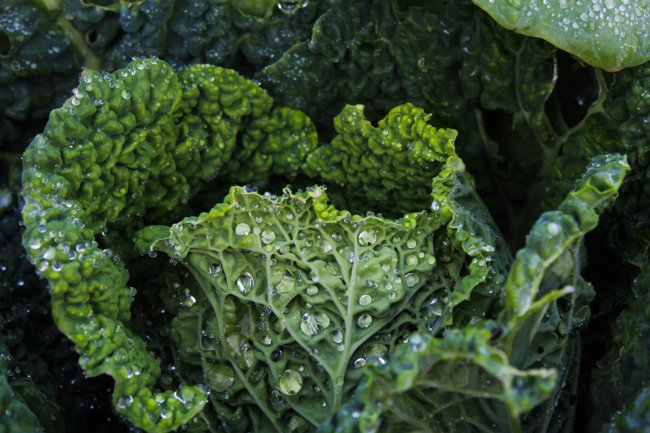

More than a decade ago, I posted [Not a PubMed Warrior](/2012/11/not-a-pubmed-warrior/). I outlined several reasons why I didn't use PubMed as a tool for this blog.

> To start, I am not qualified to read a nutritional study. I’ve never received training, nor do I care enough to pursue that knowledge.

I also referenced an article stating that 90% of landmark cancer studies could not be replicated. I still feel the same as I did back then. Only now it should be more obvious to others. The last few years have shown us that very few people are qualified to not only read a study but also know the quality of the study. They would also need to know the landscape of similar studies in that domain. Is the study confirming a body of knowledge or contradicting it? Who financed the study? This is hard stuff. To become qualified or decent at this skill requires both a high intellect and lots of practice. We recently had a study on time-restricted feeding that received a lot of press. The paid science writers for different news outlets, whose job it is to read and report on health studies, each read the study differently and came to different conclusions.

### Keep Researching Until...

On a podcast recently, the host said something so wise. People keep researching until they find a study that agrees with their opinion. You see it everywhere. Are you vegan? Carnivore? Love or hate masks? You can find a study that supports your position. Once you find what you went looking for, you can stop researching and feel great that you were right. Will you know if it is a good study? Will you know the landscape of other studies on the topic? Almost certainly not.

### Remember the Kale Incident?

This happened a decade ago. Health blogger Melissa McEwen of the now offline blog HuntGatherLove did an epic nutritional prank. Months prior to the prank, she mentioned she would use nutritional studies in a misleading way to demonize a food commonly considered to be healthy. I still remember when [Just Kale Me: How your Kale habit is slowly destroying your health and the world](https://web.archive.org/web/20130901203318/http://huntgatherlove.com/content/just-kale-me-how-your-kale-habit-slowly-destroying-your-health-and-world) was published. Everyone who didn't like kale was quick to share the link - including some smart people with massive numbers of followers in the Paleo community. Later the "Just kidding" section was added after it blew up in popularity.

> ...people took it very very seriously, I guess they forgot I had put up a poll some time ago asking what food should be my victim to demonstrate you can demonize anything with Pubmed.

 _Kale by_ [_kiona_](https://unsplash.com/@kiona20?utm_source=unsplash&utm_medium=referral&utm_content=creditCopyText)

### Directionally Accurate

Years ago, I began thinking about nutritional truths as being more or less directionally accurate. From my 2017 post [Directionally Accurate and Metabolic Unicorns](/2017/08/directionally-accurate-metabolic-unicorns/):

> One of the guiding principles I have used for many years is paying attention to what is becoming more or less popular as a way to measure how true it might be. Health and fitness trends come and go. The best ideas will stick around longer. The worst ones will be forgotten. An optimal strategy would be to avoid the new fads until they have been around for a while. Give the critics time to respond. Let more and more people go before you. If more people are getting great results then they will tell more people. Keep watching. Solid ideas will stand up to criticism. And the marketplace of individuals will, in the long run, figure out what is directionally accurate. This won’t always be the truth, but close enough in many cases.

In a recent post, [The Seed Oil Debate Revisited](/2022/09/the-seed-oil-debate-revisited/), I outlined how 2 of the 4 reasons to avoid seed oils have become less directionally accurate. They could still be true, but the direction of evidence is not mounting.

### Collect Smart People and Discard Team Players

If I can't trust myself or the health writers, who can I trust? Doctors know medicine but might be ignorant of the statistical skills needed to know the quality of a study. They might have other biases as well. I collect smart people that can explain studies that are not on a team. This means that although I could learn from smart vegans or paleo people, I know they get their income from representing their customers, who want to hear the team's message. I hesitate to name names, as my list will likely change over time. **It can be challenging to hear a persuasive voice who says the things we want to hear and then seek out the counterargument.** But I've been fooled by so many hucksters in the nutritional space, that I need to have my guard up. I can [still be fooled](/2022/03/the-environmental-contaminant-theory-of-obesity/), but I like to think that the period of time that I am fooled has been greatly reduced.

---

## Comments

### Andy
*July 3 at 2023 at 4:52 AM*

If a seemingly very intelligent and analytical fella such as yourself needs to be on guard, what chance do regular folks have of interpreting data?! Keep fighting the good fight MAS

---

### MAS
*July 4 at 2023 at 3:55 PM*

@Andy - Thanks. I don't consider myself that analytical. For me, I approach fitness and nutrition like an investor would. Incomplete knowledge. Assign a probability instead of certainty.  And then reassess and challenge those decisions periodically.

---

### Jim
*July 9 at 2023 at 7:43 PM*

It all seems to go in circles.  A few years ago I noticed some young guys on Twitter promoting a hardcore carnivore only diet.  I was thinkinbg, oh yeah, that's where I was at in 2007, I bet I know where you'll be going next.  Then a year later, they're saying, actually, it's good to add a bit of carbs to the diet.  Another guy was telling us about the evils of toxic night shades.  I was thinking, "I know, I know. Been there and done that in 2008."  :-)

---

### MAS
*July 9 at 2023 at 9:07 PM*

@Jim - I think its funny that many of the keto bros are now jumping ship. Si$$on and Attia are all about the protein now. Mercola is now in the high-carb camp. 

I dismissed keto from the start. Sending a chronic starvation signal to the body never sounded wise. Cyclical keto like the old-school bodybuilders used is fine. Chronic? Not for me.

---

### Jim
*July 9 at 2023 at 11:14 PM*

@MAS I think Richard Nikoley back in the day was right when he said Keto was a non-natural hack for those leading 100% sedentary lives.  Better to address the problem upstream and actually get some acitivity in.

---

### MAS
*July 10 at 2023 at 2:39 PM*

@Jim - RN even created a Facebook group to mock the Keto people. I think it is gone now.

---

### Stuart
*July 22 at 2023 at 6:14 AM*

There are SOME good studies that appear on PubMed ( and also in other locations) where it is hard to determine where the conflict of interest might come from…
Take this recent one for instance…
https://pubmed.ncbi.nlm.nih.gov/36881712/

---

### zenhobbit
*August 4 at 2023 at 5:40 PM*

So true Mas, it takes a certain amount of time hanging around fitness-related content to recognize when a trend is coming in an out. "Not my first rodeo," as they say. That's why I keep reading your blog.

---

