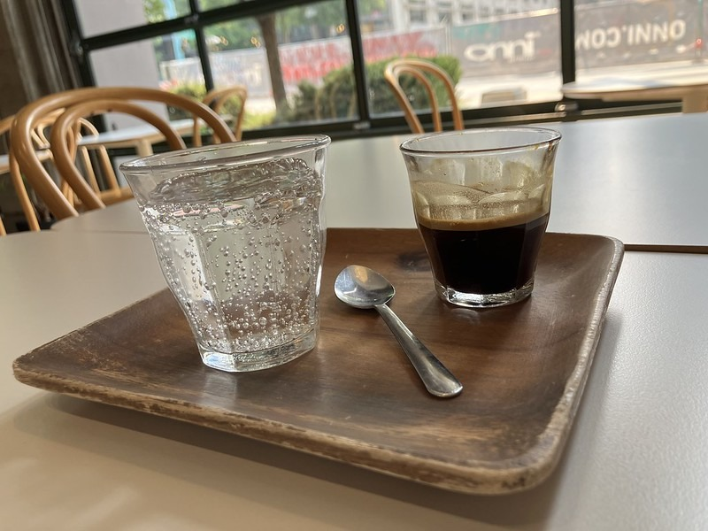

There persists this belief that coming off caffeine will result in headaches for a few days. I hear it frequently on health podcasts as if it were accepted gospel. Even Michael Pollan, who wrote extensively about caffeine in his book _This Is Your Mind on Plants,_ said this about caffeine withdrawal:

> "a miracle anyone ever manages this mental feat"

This doesn't have to be true. When I take breaks from caffeine, I do not experience any headaches or difficulty concentrating. It just requires patience and some planning.

Two summers ago, I went 3 weeks without caffeine. A month prior to my detox, I was consuming about 3 or 4 mugs\* of coffee a day. To prepare for my caffeine detox, I did a fade strategy.

_\* I use 10-ounce mugs_

Reduce your daily intake of caffeine by 50%. For me, I went to 2 mugs a day. Your energy levels will likely be lower, but you probably won't have a headache. Maintain this level until it becomes the new normal. This might be a few days or a week.

Then do it again. Cut 50% again. Now I am down to 1 mug a day. For me, I split this into two ½  mugs. Like before, maintain this level until your energy level is normal.

Repeat until your caffeine levels are very low. For me, I got down to ¼ of a mug of coffee for a few days.

At that point, go without caffeine. No headaches. No lack of focus. No inability to concentrate. My detox wasn't hell. It was pleasant.

I've done the cold turkey caffeine detox before. I recall going 100 hours in 1997. It was hell. My head hurt. I couldn't focus and I spent every hour thinking about coffee. When I ended the detox, my caffeine level was back to pre-detox levels in less than a week. I never really detoxed. I just put myself through misery for nothing.

Compare that to the 3 weeks I did in 2021. When that detox ended, I resumed coffee consumption with just ½ a mug for many days afterward. It took months to get back to pre-detox levels. Had it not been for the rainy and dreary late fall months of Seattle, I would have maintained lower levels for longer.

Another benefit to the fade method is that in the event the detox fails, you've still received the benefits of lowering your caffeine levels.

I am not a smoker or drinker, but if I were and I wanted to kick those habits, I would use the same strategy. Keep making your addiction 50% weaker until you can walk away from it completely. It just takes patience and planning.

---

## Comments

### Jim
*September 3 at 2023 at 4:40 PM*

Why do you take breaks from caffeine?

---

### MAS
*September 3 at 2023 at 4:58 PM*

@Jim - Mostly it is about reducing tolerance. I know that I will increase my coffee intake in the late fall and winter months here in Seattle. I like to use the summer as a chance to either take a break or greatly reduce levels before heading into October. If I don't, my levels will keep climbing. 

I once worked with a fellow coffee fan in San Diego. (We both home roasted coffee at the time). He was probably 60 or so. He had a rule of not drinking coffee between Memorial Day and Thanksgiving that he stuck to every year. I doubt I could ever be that extreme, but his story has stuck with me.

---

### Jim
*September 3 at 2023 at 10:44 PM*

@MAS Understood. LOL Memorial day to Thanksgiving does sound extreme.  I once took a year off from caffeine (except for three or four decaf coffees which I assume had some).  All I remember is on January 1st of the next year, I started drinking coffee again and I felt like I got more done that day than I did in the previous 12 months.  :-)

Also, I noticed no benefits during the caffeine free year.  Just lower perceived energy levels.  My coffee set point was reset though.

---

### Hs
*September 6 at 2023 at 3:15 AM*

Nice I’ve done this many times myself as well. I will cut down on coffee, then will switch to black tea, then green tea. It’s usually pretty painless.

---

