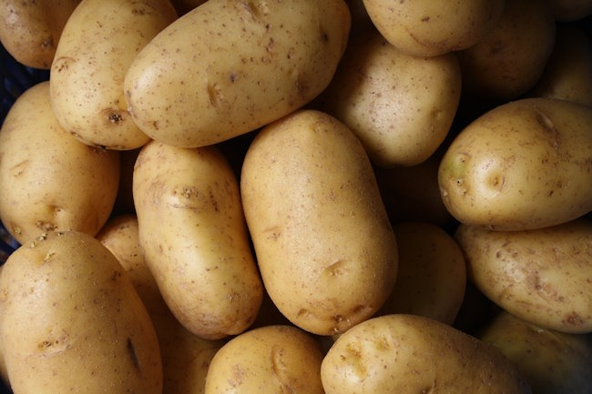

More than a decade ago, I saw the Paleo movement get hijacked by the low-carb zealots. Initially, I fell for some of the lies about carbs, but well before keto and later carnivore came around, I had already dismissed them. Carbs are awesome.

I could easily do an [entire post on why I dislike the keto and carnivore diets](/2023/11/keto-and-carnivore-diets-were-always-a-no-for-me/) if there is interest. But for this post, I'm going to check in with a few of those influencers who made both diets so popular.

### Peter Attia and Gary Taubes

Remember how Attia and Taubes teamed up to form NuSI which was going to show the world that carbs were the bad guys?

From the Wired article _The Struggles of a $40 Million Nutrition Science Crusade_:

> At the heart of their mission was the decades-old question of whether all calories are, in fact, created equal. The mainstream view is that it’s simply an excess of calories that makes people fat—no matter whether those calories come from a bagel or a steak or a bowl of broccoli. Taubes and Attia subscribe to a growing minority stance, dubbed the carbohydrate/insulin or C/I hypothesis, that contends obesity is caused by an excess of insulin driving energy into fat stores. In other words, _carbs_ make people fat.

How did that work out? NuSI failed to prove its thesis and the organization dissolved. Attia shifted his nutritional advice to protein and stopped talking about carbs. It's all about energy balance now.

Taubes is still pimping the low-carb gospel and was never able (or willing) to keep the NuSI site online after [I called them out on Twitter](/2022/01/blogging-was-doomed-to-fail/).

### Dr. Mercola

Mercola went from writing books and doing podcasts supporting the keto diet to completely [rejecting keto and embracing carbohydrates](https://www.youtube.com/watch?v=flbgJBP7sko). He was persuaded by a study stating low-carb diets increase all-cause mortality. I don't follow Mercola a lot, however, I recently listened to an interview with him and he sounds like he is in the [Ray Peat](/2012/11/the-peatarian-diet-for-those-of-us-with-average-iqs/) camp now.

### Jimmy Moore

Jimmy Moore has been well-known in the Paleo and low-carb communities for over a decade. Through books and podcasts, Jimmy reached many people with keto propaganda.

What is _Living La Vida Low Carb_ Jimmy doing these days? 20 years in prison for the sexual abuse of a 13-year-old girl. I doubt he is still keto.

### Paul Saladino

The Carnivore MD says he was wrong about carbs. Check out his interview [5 Things Paul Saladino Changed his Mind on After Quitting Carnivore](https://youtu.be/RRdkm6-eg-g?si=G97oUB18sjpiXPjQ) with Thomas DeLauer. From the AI summary:

> Paul Saladino discusses how his views on carbohydrates and insulin have changed since his carnivore diet days. He admits that he used to believe insulin and carbohydrates were all bad all the time, but now recognizes the importance of carbohydrates for various aspects of health, such as hormone production, brain function, glutathione production, and mineral absorption. He also highlights the role of carbohydrates in improving athletic performance, testosterone levels, recovery, and sleep.

If you are keto, carb-phobic, and open-minded, check out the first half of that interview when he discusses carbs, insulin, and fasting.

_Potatoes by [Lars Blankers](https://unsplash.com/@lmablankers?utm_content=creditCopyText&utm_medium=referral&utm_source=unsplash)_

### Last Words

There are more examples of health influencers abandoning keto and carnivore, but this post is long enough. The trend is towards healthy carbs. I called it more than a decade ago. It was always nonsense to demonize carbs when there are examples of lean healthy indigenous populations that thrived on starchy tubers, legumes, fruits, and vegetables.

For the upset low-carber, this post is not anti-keto. This post is pro-carbs.

---

## Comments

### Jim
*October 29 at 2023 at 10:09 PM*

@MAS -  Great post.  
1. I think it's great that some of these guys changed their positions with over time.  Good for them!
2. Jimmy Moore shows what happens when someone builds a business around a certain diet mode.  His progress on keto had obviously stalled out for a few years, but he couldn't revise his teachings because he had built up a large low carb business that he was relying on.

---

### MAS
*October 29 at 2023 at 10:36 PM*

@Jim - Carbsane wrote about how Jimmy made the most progress when he did a classic Atkins Diet with higher protein. This was before he started eating sticks of butter.  

https://carbsanity.blogspot.com/2014/04/jimmy-moore-low-carb-asset-or-liability.html

---

### Andy
*October 30 at 2023 at 5:39 AM*

I still get a chuckle out of Nikoleys back catalogue around the time of "ketotard", the comment sections alone are comedy gold. Jimmy will emerge ripped and selling prison workouts. MAS I would love it if you could write up your thoughts and dislikes of keto and carnivore, would be great mate

---

### MAS
*October 30 at 2023 at 1:39 PM*

@Andy - I agree that was some of RN's best work. I will start work on that post this week.

---

### MAS
*November 7 at 2023 at 4:41 PM*

@All - I posted Keto and Carnivore Diets Were Always a No For Me.
https://criticalmas.org/2023/11/keto-and-carnivore-diets-were-always-a-no-for-me/

---

### exfatloss
*November 10 at 2023 at 7:56 PM*

I've come around as well. The stubborn closed-mindedness of some low-carb/keto (and high-protein TBH) people is just a turnoff. How am I supposed to believe you when you ignore evidence to the contrary?

I've moved pretty much entirely to seed oils and protein restriction. Plenty of people having success with high-carb diets in a seed oil-free and low-protein context.

That said, I'll continue doing keto - I love it, it's always worked the best for me, and I have a medical condition that requires it. Unless sufficient PUFA avoidance makes that go away too, like it did sunburn and bleeding gums and vision issues and digestion issues and acid reflux and..

---

### MAS
*November 10 at 2023 at 8:20 PM*

@exfatloss - I'm not asking you to believe me. I'm just sharing my journey and opinions. You do what works best for you.

---

