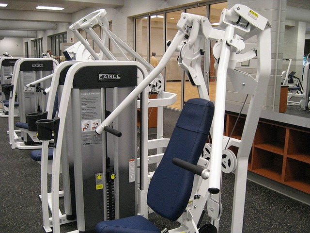

I mentioned in an earlier post that [I got a hernia](/2023/08/i-got-a-hernia/) in July. Between that time and my surgery on September 20th, I didn't feel comfortable exercising. Not pain. Just discomfort. Some men are easily able to work around their hernias and continue exercising at the same level. I wasn't. Although I tried to push my hernia back in, it would just pop back out. This wasn't sustainable. I had to get a surgery. While waiting for my surgery, I continued to go to the gym. I reduced the weight, the intensity, and the volume. But instead of going 3x a week, I increased it 4x a week. My workouts were often less than 10 minutes. I referred to my workout as the "Slow Grandma". This meant I would use machines, but [unlike the Silver Sneakers](/2014/04/silversneakers-young-trainers-teaching-old-timers-bad-lifting-form/), I would slowly control the negative and not let the weight drop. Think of the slow protocol explained in Body By Science dialed back in weight and intensity.  This was an interesting experiment because most lifters are using either high weight, high volume, or high intensity. I was doing none of those. But I was showing up 4x a week and I was still doing [25 pushups daily](/2023/09/on-pushups/). My workouts were the equivalent of taking the car out of the garage and driving it around the block a few times. No long drives or getting on the freeway. Just circle the neighborhood and come home. Then the unexpected happened. Other than the hernia, I never looked or felt better. That was a pleasant surprise. Had I continued the "Slow Grandma" for months or years, would I see a dropoff? Probably, but I am not certain. A younger me would have taken a "why bother" attitude and stayed away from the gym while waiting for the surgery. I'm glad I didn't. Right now I am thinking back to all my lifting injuries I got before discovering [HIT](/2017/10/high-intensity-training-7-years-later/) and proper exercise selection. The months I waited on the couch for an injury to heal. What if I had done some version of the "Slow Grandma" back then? Chalk this up to another lesson I wish I had learned earlier.

---

## Comments

### Glenn
*October 3 at 2023 at 9:08 PM*

I have been experiencing similar results with a similar exercise regime. Less is more. What works best for me is only one heavy weight high intensity workout out every 3 to 4 weeks.

I have the feeling a lot of people use these 4-5 times per week high intensity workouts in order to manage stress. Meditation is usually safer and more effective for that.

---

### MAS
*October 3 at 2023 at 10:58 PM*

@Glenn - That sounds like a wise interval.

---

### Øyvind
*October 4 at 2023 at 7:05 AM*

Interesting! I started doing something similar the other day, when I was craving movement, but didn't want challenge my recovery too much, either.

I went with pretty moderate load, and just continued doing reps as long as they felt smooth and pleasant. I estimate this was around 60% RM or so, could be higher, could be lower. Did a circuit of 3-4 exercises, felt good, and did it again. Really enjoyed it!

Very encouraging that you both felt and looked better using your "Slow Grandma"-protocol, as I was preparing to do some heavier stuff again (but not really feeling it). I think I'll continue experimenting with this. I just need a catchy name for it.

---

### Stuart
*October 18 at 2023 at 7:27 AM*

I tend to do what you are doing, but in the same session as my higher intensity resistance training. There are some exercises that I do not wish to push to harder levels. Crunches and abdominal work for one ( see Bill DeSimone’s views on this and spinal laxity). Another exercise is dumbbell deadlifts/ squats. I do them as a warm up, not pushing big weights, but rather as a “practice” of the hip hinge motion. There are a few others that I sprinkle in around my harder effort work.

---

### exfatloss
*November 10 at 2023 at 7:51 PM*

Why not get a DEXA more often?

---

### MAS
*November 10 at 2023 at 8:12 PM*

@exfatloss - There is a cost with DEXA. If my weight and tape measurements are constant, I don't think my DEXA score would vary much.

---

