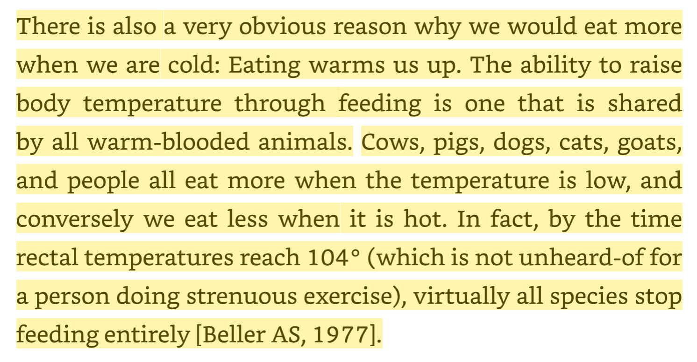
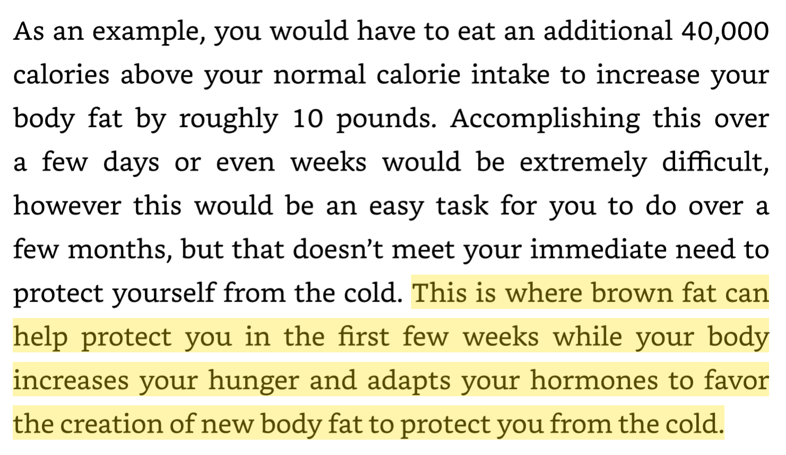

I recently read _The Book on Heat: The Science of Heat for Weight Loss, Performance and Health_ by Brad Pilon. It altered a view of mine that I've held for decades related to diet and exercise. My seasonal view was that during the spring and summer, I was outside more. I was more active. That activity supported a leaner body. Then when colder weather hit, I would be indoors more. A combination of inactivity paired with the increased calories I was consuming during the warmer active months would result in a fat gain. In my model, body composition gains from exercise happen in the short term, but eventually, the body increases appetite to match the increased energy demands. Then winter arrives, we head inside, and activity drops, but our appetite stays elevated long enough to reverse our summer physique gains. I now think I was wrong. The Book on Heat makes the case that warmer temperatures reduce appetite. So summer leanness is primarily a result of heat, not activity. This makes sense. I've been in hot muggy environments before and I don't feel like eating much. Plus the foods I gravitate towards, tend to be lighter with fewer calories. What about exercise? What if the leanness from exercise is more a result of the ambient temperature than the workload itself?  By sending signals that the environment is warm, the brain begins to recognize the expensive energic cost of carrying excess fat, and appetite is reduced. Cold is doing the opposite. It increases appetite.  The book goes much deeper into the relationship between temperature and appetite with references to decades of studies supporting the thesis. Some other interesting items from the book:

-   Insulin sensitivity and our ability to store fat improves in colder weather. Warmer temperatures have the opposite effect.
-   Colder temperatures stimulate appetite not only due to the thermic effects of eating more but also the insulation benefits body fat provides. Protection against the elements and heat loss.
-   When adjusted for subcutaneous fat levels, women have a greater surface area than men, and thus feel colder at the same temperature. They require higher body fat levels to feel comfortable in the same environment.

What about cold exposure? I have lots of posts on this site related to cold exposure and the benefits I've experienced. And although initially, I thought cold exposure would benefit fat loss, I became a skeptic, but I didn't know the reasons. From my 2018 post [Fat Loss Cheatsheet: What Works and What Doesn’t (for me)](/2018/02/fat-loss-cheatsheet-works-doesnt/):

> Sorry, Ray Cronise, but my experience is that cold exposure is almost worthless for fat loss. I am still a fan of cold exposure for building resiliency, but not for leaning out. As others have pointed out, cold exposure makes you hungry. Indirectly, however, if cold exposure toughens you up to the point you are more comfortable with hunger then it could help. I remain unconvinced it would have anything but a minor role in fat loss.

Thanks to The Book on Heat, I now know why. In addition to everything mentioned above, I learned that using cold exposure to build BAT (brown adipose tissue) to generate heat and help you get lean may be a shortsighted strategy.  There it is. Cold triggers BAT. BAT generates heat to protect the lean body in the short term. The body responds to the BAT as a signal to spike your appetite. I still plan to take cold showers as this exposure is too short to matter. However, I will think twice before spending hours outside in cold weather without a jacket. How can cold be a factor in the obesity crisis? Pilon defines "cold" based on his research as "cold to the naked body". This would mean offices and other air-conditioned environments are appetite-stimulating. Living most of our lives inside in comfortable/cool temperatures is slowly making us heavy. Pilon advises:

> ...it would be highly advantageous to stay warm when you are dieting, as dieting and cold are both signals to eat more.

This also explains why I find longer fasts of 3-5 days easier in the middle of the summer and nearly impossible during the winter. Visit [TheBookOnHeat.com](https://thebookonheat.com/) for more info. The book is also available on Amazon.

### Connecting the Dots

In 2018, I mentioned that [my advice for big guys](/2018/09/my-wrong-advice-for-the-big-guys/) to just lift and forget cardio was wrong. My thinking then was that the cardio would spike their appetite and although they'd see progress initially, eventually the initial losses would be replaced with extra hunger and weight regain. But, what I learned from trainers is that the big guys respond well to cardio. Now in light of Pilon's book, I see cardio as a thermal stress that will downregulate appetite. This wasn't my experience when I was a runner, but I was also lean, lanky, and outdoors. I was able to diffuse body heat from exercise easily. If I had weight to lose, I'd be testing longer durations of "cardio" that caused me to get warm. Frequent brisk walks in the sun as opposed to biking for 20 minutes in an air-conditioned gym.

### Last Words

I can probably think of 10 stories from my own life that seem clearer now in the light of what I learned in The Book on Heat, but since this post is getting long, I'll just share this one. When I worked an office job in San Diego many years ago, I recall a female manager who always complained that the office was too cold. She wore sweaters or jackets. She was lean. Then she kept making trips to the front desk where there was a huge bowl of M&M candies. She probably gained 30 pounds in a year. Was she unconsciously eating to stay warm? Until I read this book, I didn't think about this story. She stopped eating M&Ms after the weight gain. She also stopped complaining about the cold office.

---

## Comments

### Jim
*October 5 at 2023 at 8:18 PM*

@ MAS -- Interesting post.
1.  I'm glad to hear Brad has another book out.  I always thought it was a shame that he likely didn't make much money from Eat Stop Eat.  Providing great info doesn't pay well.  It seems like you basically have to sell supplements to make money in online fitness.
2. I've always found I get too cold when trying to cut weight in the winter. 
3. Covert Baily of "Fit or Fat" fame back in the '80's and '90's said that swimmers he trained, while lean, always retained a relatively large amount of subcutaneous  fat.  His theory was that it was a response to training in the relatively cool water, which tended to drain body heat.  
4. While you mention the trend of ice baths, cold showers, etc., I wonder if anyone has studied appetite with regard to that other current trend, saunas?

---

### Joanna
*October 6 at 2023 at 12:56 PM*

I am one of those lean women who is always cold in the office and keeps a shawl in my desk drawer (we don't have bowls of M&amp;Ms, so luckily no weight gain). When our new office building aligned with "eco" temperature controls, all the women got cold. Surprise, surprise, yet another "standardisation" based on the male template for comfort... Having lived overseas in hot climates, I know that I always lose weight even though I walk around less. My appetite just vanishes.

---

### MAS
*October 6 at 2023 at 2:45 PM*

@Jim - I think the sauna would help. In the winter of 2018-2019, I leaned out an additional 10 pounds. During that time, I had a 2nd gym membership was gong to the sauna 5x a week. 

@Joanna - I've had this office idea for a decade: provide heated chairs. Then men and women could both be comfortable.

---

### Chris
*November 26 at 2023 at 7:29 PM*

Brad is doing a while series on Instagram at the moment explaining these ideas further. Really interesting stuff.

---

### Chris
*November 26 at 2023 at 7:40 PM*

The other thing that this makes me think about is the idea of the Mediterranean Diet.  Perhaps the healthy lean people of the Med are that way simply due to living in a warm environment, nothing to do with the diet.

---

### MAS
*November 26 at 2023 at 8:28 PM*

@Chris - Thanks. I'll follow Brad.

---

