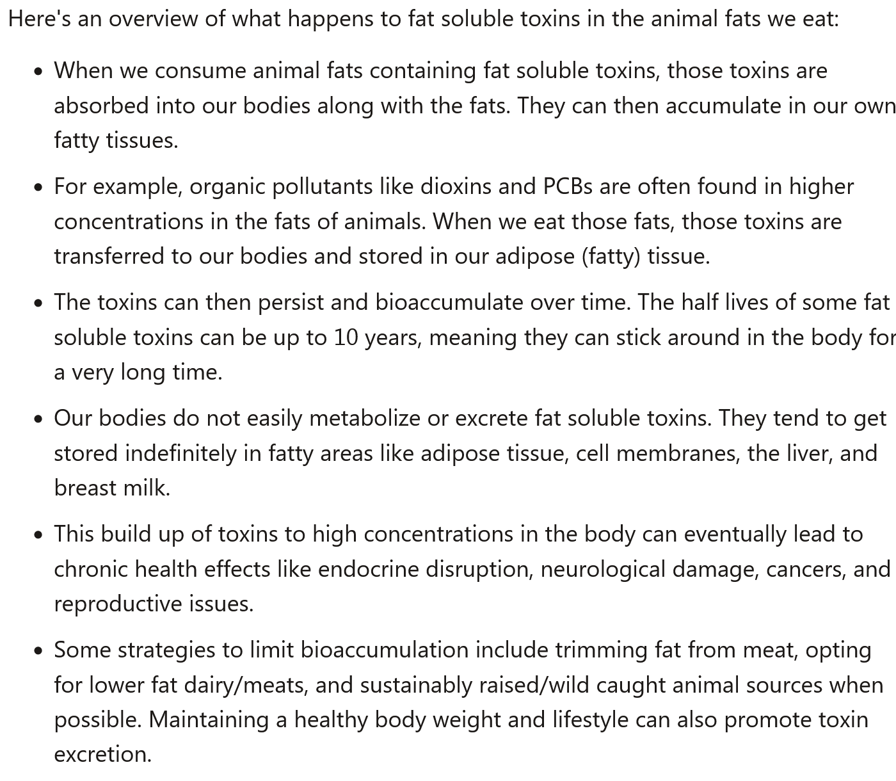

In my previous post [Checking in on the Carb Haters](/2023/10/checking-in-on-the-carb-haters/), I dunked on a few of the keto and carnivore zealots for coming around to the opinion that I had a decade ago.

Note that I am fine with cycling in and out of ketosis via fasting or shorter low-carb dieting. My concerns are with staying in ketosis for months or years. I also have concerns with restricting a diet to mostly meat.

Here are the reasons I never considered either of these diets for myself.

### #1 They lie about carbs

The core belief I see with most of the ketogenic movement is the belief that all carbs are bad and need to be avoided. This is total nonsense. In their world, there is no difference between whole-food complex carbs and highly processed carbs. It's all sugar to them.

In other words, Quinoa = Mountain Dew in their view. Traditional cultures for thousands of years thrived on and continue to thrive on diets rich in carbohydrates.

By spreading lies about carbs, the keto influencers never had credibility to me. There are examples, such as [Hyperlipid](/2021/11/hyperlipid-for-dummies/), that speak honestly about carbs, but they are a rarity.

### #2 Chronic starvation signals

With a Paleo background behind me, I started thinking about how stressful living in an environment absent of carbs would be. Would the body know that the food environment was safe based on calorie intake alone? Or would the body sense the chronic lack of carbs as threatening to its survival? I didn't know and I didn't want to take that risk.

It is often said that "optimal health" and reproductive health go hand in hand. What impact would chronic ketosis have on reproductive health and hormones? How about the thyroid? I didn't know, but I suspected it would be bad.

I'm going to explore this topic more in an upcoming post.

### #3 Environmental toxins

This is a topic that very few people are talking about.

Although there are some very creative vegetarians and vegans out there in ketosis, the vast majority of keto and all carnivore dieters are consuming a lot of animal fat. In a polluted planet, how toxic is animal fat? I don't know, but I'm concerned, so I minimize the amount I consume.

See my post [Toxic Load and Low-Carb Dieting](/2018/04/toxic-load-and-low-carb-dieting/) for some of my thoughts.

Even if the carnivore dieter only sourced the cleanest animals on the planet, those animals are still part of a post-industrial world with numerous chemicals in the environment, which may or may not be a problem.

I asked Claude AI to explain this issue:

### #4 PUFA and saturated fat

Some people are concerned about PUFA for metabolic health and inflammation ([The Seed Oil Debate Revisited](/2022/09/the-seed-oil-debate-revisited/)) and some are concerned about saturated fat for heart health. These groups love to attack each other.

Instead of taking a side, what if they are both right?

A diet high in fat will either be higher in PUFA or higher in saturated fat. Or likely both. Since I don't see an upside to having high levels of PUFA or saturated fat, I restrict both. Pass the lentils.

### #5 Expensive

Meat is more expensive than legumes, tubers, and whole grains. I'm the guy who created the [Modern Peasant Diet](/2016/11/designing-modern-peasant-diet/). That was back in 2016. Food prices have spiked since then.

Imagine how expensive a high-quality carnivore diet is today versus when it first became popular. Meanwhile, [my diet](/2023/09/what-i-eat-and-what-i-dont-eat-2023-edition/) is still affordable.

### #6 You go first

Keto and carnivore diets could have turned out to be great ideas. We didn't know because there were no populations with long-term data showing the safety or superiority of these diets.

For the reasons listed above, I didn't try the diet. I wanted others to go first. Let's see how they respond. Let's see where they are in a few years. I can wait.

Well, I waited. No sale.

### On the Other Hand

After telling you why I have a low opinion of keto and carnivore, here are three cases where I would consider the diet.

1.  It is the ONLY diet you can stick to that gets you the results you want.
2.  Gut issues that make digesting any food other than meat impossible.
3.  Severe mental health issues as described on the [Tim Ferriss #633 episode with Chris Palmer](https://tim.blog/2022/11/12/chris-palmer-transcript/).

### Last Words

Although some individuals had success with these diets, I could tell immediately it wasn't a match for me. Now, I see health influencers moving on to the next shiny object to market - protein. I think this is a step in the right direction. Not demonizing carbs would be ideal, but that is an idea too hard to sell at this time to the keto cult.

---

## Comments

### Andy
*November 8 at 2023 at 7:39 AM*

Excellent mate. Looking forward to more of your thoughts re the starvation signals and thyroid health etc. There's a real temptation to simplify everything, I'm guilty of it too, so it's cool you explore all sides

---

### exfatloss
*November 10 at 2023 at 8:08 PM*

My thoughts

1. They lie about carbs, but so do you (pro carb people). Yes, all complex carbs eventually turn into sugars through digestion. I guess a bit of the fiber is turned into SFAs by the gut bacteria. But "all carbs is sugar" is largely true.

Now, is that bad? Different debate.

But "Haha you're saying potatoes are Mountain Dew!" is silly and dishonest.

2. Chronic starvation signals

I've never had a starvation signal in 8 years on keto. My thyroid is fine. My body temp is fine. There might be people who get these issues on keto, but I know plenty of people in real life who've been doing keto for close to a decade and are perfectly fine. Never better.

There's zero science behind this, just a few anecdotes by people like Saladino.

I'm hesitant to say "you were doing something wrong." Maybe some people are just not genetically made for keto.

3. Plants contain way more toxins than meat, that's easy to test. In fact, one of the reasons carnivore fixes so many people's digestion issues might be the lack of glyphosate in their diet.

5. My diet costs about $5 per day for 2,300kcal or so.  

https://exfatloss.substack.com/p/eating-2294kcal-for-520day-on-the

Fat is extremely cheap. Sure, protein is more expensive, but too much protein is bad for you anyway. I think white rice is slightly cheaper than heavy cream on a calorie basis, but not much.

6. There are medical conditions that keto and carnivore just solve, no question about it. I have one of them. For me, keto is basically non-negotiable. For other people with e.g. digestive issues, maybe they could find and experiment and tailor some other diet that worked around their specific issues.

Say you're allergic to nightshades, you might not need carnivore - but it does work.

So it's a bit like saying "All these people are taking antibiotics, I'll wait!" Well, do you have a bacterial infection?

I will agree that keto and carnivore have "failed" for fat loss and metabolic syndrome, although they do work better than any other mainstream diet out there. I'd intuitively say the "huge success!" rate is about 30% with them, which most diets can't say.

Still, not good enough.

---

### MAS
*November 12 at 2023 at 4:22 PM*

@exfatloss - Your comment was flagged as SPAM. I fixed it. Sorry about that. Unlike Slime Mold Time Mold, I do not censor comments that disagree with me.

1- I've been at this discussion for 15 years now. I absolutely have heard that argument. Multiple times. 

2- I was raising a concern and not stating a fact. I will be doing a future post on this point. Low carb diets do have a history of lower thyroid in many individuals. 

3- Nonsense. Humans don't eat all plants. We eat a small minority. We sprout, ferment, and cook to make those plants beneficial. 

6- I'd love to see a study showing Keto has a 30% LONG TERM success rate. Like other low-carb approaches, I see a lot of amazing short term results that are ultimately not sustainable.

---

### MAS
*November 12 at 2023 at 4:40 PM*

@exfatloss - 3 - I'm impressed how cheap you are eating.

---

### Chris
*November 20 at 2023 at 2:40 PM*

@MAS   the @exfatloss diet will be fairly cheap but I don't think it would be attractive to most or many people.   Heavy cream, a little ground beef and some tomato sauce if I recall.

---

### MAS
*November 20 at 2023 at 3:47 PM*

@Chris - The Potato Diet isn't attactive to most people. Still works. I'm not defending the ExFatLoss diet, except that it solves one of the issues (cost) that I raised in this post.

---

