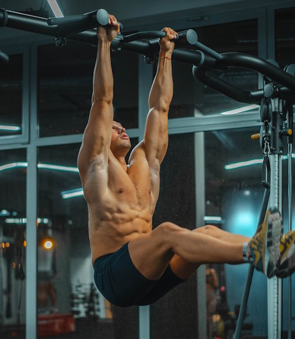

Last year, I discussed how I fixed my dysfunctional relationship with [pushups](/2023/09/on-pushups/). Now, I want to talk about ab exercises. I have never liked training my abs. Just like with the pushup, my introduction to ab exercises came in Army basic training. There you needed to knock out a bunch of sit-ups in under 2 minutes. You quickly learn how to use momentum to pass the Army Physical Fitness Test. I didn't like the pushup, but I never questioned that it wasn't a quality exercise. With the sit-up, I wasn't sure how valuable it was. Then came all the conflicting information from muscle magazines and online articles. There were four messages that I recall regularly seeing regarding ab training.

1.  The ab exercise you are doing is wrong. You could hurt your neck or you aren't engaging the ab correctly. One article would tell you to do one exercise. The next one would say that the exercise was ineffective and tell you to do a different one.
2.  If you do compound lifts you are engaging your core and you don't need to do direct ab work.
3.  Unless you are quite lean, doing ab work would do nothing to improve the look of your abs. Time spent doing crunches would be better spent lifting something heavy.
4.  Ab training got little respect in the exercise hierarchy. Tier 1 was legs, chest, and back. They were required. Tier 2 was arms and shoulders. They were advised. Tier 3 was abs and calves. They were optional.

Like I said in the [(Still) Not a PubMed Warrior](/2023/07/still-not-a-pubmed-warrior/) post, people keep researching until they find a view that supports what they already believe or want to believe. I didn't like ab training and now I had reasons to skip ab training. So, I did very little ab work. I now believe that was a mistake. When I was doing classic weight training, I would often get lower back pain. Up until recently, I associated my lower back pain with the squat and deadlift. Although they likely had a role, I now can see how I never really learned how to consistently do a proper abdominal brace. As I increased the weight, my abs got stronger, but I still spent most of my day either at a desk or commuting where my abs were disengaged. Then 2 or 3 times a week, I'd put on my [Marilyn Manson mix](/2008/04/mascene-20-the-marilyn-manson-workout-mix/) and slam weights. Cycles of progress mixed with cycles of pain. Later I would learn about the role stress had on back pain. I have an [entire section](https://criticalmas.org/best-of/back-pain/) on that topic. While I still believe all that to be true, I can now see that wasn't the complete reason for all my back pain. Around 2011, I abandoned classic weight training for a machine-based HIT workout mostly built around the Big 5 exercises in the book Body By Science.

1.  Leg Press
2.  Bench Press
3.  Pull down
4.  Overhead Press
5.  Seated Row

The pain that I frequently got from barbell lifts went away. Maybe I did something wrong, but I don't feel the time-efficient HIT exercises - except for the [Hillfit](/2012/01/hillfit-strength-is-not-just-for-hikers/) plank - did much to increase my ab strength. At the same time I was being exposed to HIT, I no longer had a San Diego desk job with a long commute. I was in Seattle working from home, walking a lot, and driving very little. My abs were weak compared to my higher levels of strength with other body parts, yet I didn't realize it at the time. I was pain-free and all was well. In June 2022, I had the best sports massage of my life. During that massage, I was told I had "surprisingly weak" ab muscles. That was a wake-up call to me. I'm sure some of it was from not exercising enough during the COVID period, but at that moment I knew that all the strength training I had done (both classic and HIT) had not been enough to build my core. I began adding some ab exercises into my morning yoga routine. I believe I was making progress. Then the [hernia hit last summer](/2023/08/i-got-a-hernia/). In that post, I list the reasons that I think led up to my hernia. I did not include weak abs. In hindsight, I would add that to the list. If my abs were twice as strong, would that twisting upward dog yoga pose have been safer?  _Photo by_ [_Karolis Milišauskas_](https://unsplash.com/@karolismili?utm_content=creditCopyText&utm_medium=referral&utm_source=unsplash)

### Questions and Going Forward

Is it possible to have strong abs without direct ab training? If it is possible, would it require compound lifts? Do machine-based lifting programs like SuperSlow engage the abs enough? Does sitting and driving a lot increase the need for core exercises? Does height matter? I could see a taller person might have a greater need than a shorter person. The hernia recovery took longer than expected. During the recovery, my abs got much weaker. I have no plans to give up on machine-based HIT and go back to bro-lifts, so I have added ab work back to my morning routine. I'm still experimenting with finding the best exercises. Let me know your thoughts. UPDATE: By "ab" training, I am including all core exercises.

---

## Comments

### exfatloss
*February 1 at 2024 at 11:35 PM*

I've never done machines, but I think that classic powerlifting exercises definitely engage the abs to some degree. Is it enough to have Man's World cover level shredded abs? Maybe not. But squat, deadlift, and pressing movements definitely seem to engage my abs.

---

### Øyvind
*February 2 at 2024 at 1:13 PM*

I'm also a member of the "Weaker Abs than Expected"-club. 

Like you, I always figured that the compunds would take care of business, and to some extent they did. I had bouts of back pain, but I thought that was just par for the course. Also, my wife, who HAVE done her ab training, have always been stronger than me in exercises that require leg lifts etc. Rather humbling.

Recently, I got back into kickboxing, and I do very little heavier weight training. May or may not be smart for a fifty year old to do martial arts, but the point is that we do a lot of ab work. Sure, some of it is momentum based, but quite a lot isn't. Less back pain, better mobility, and a firmer belly? I'll keep hitting the abs.

---

### Geoff
*February 2 at 2024 at 1:15 PM*

My fitness goals are different from yours, but I found great benefit from dedicating 10 minutes a day to  ab training. Low intensity with consistent, daily volume helped me in my running and daily life.  It doesn’t  adversely impact my other training and is easy to fit in at lunch or before bed. Nothing fancy - just plank variations, leg raises, Russian twists,  etc. It doesn’t take much time for me to get a notable benefit.

---

### Mike
*February 2 at 2024 at 5:06 PM*

When I do my kbell routines (I favor Geoff Neupert's programs) I always have to consciously pause to breathe, clench, and tighten my core to protect my back during swings, get-ups, etc.  

Neupert's sore joint recovery program also targets the side and obliques for several movements (ie, 4 sets of dead bugs).  I fell off the training wagon for a while (don't we all) and find I can't do some of those movements for as easy or as long as I did 4 years ago. 

I valued my kbell training the day I had to wrestle a steel filing cabinet on a handtruck down a staircase and out to the street. Pausing, breathing, and clenching my core, my lats, my glutes to provide a solid column of strength and stability I think helped me get through that exercise without hurting my lower back.

---

### Jim
*February 3 at 2024 at 6:35 AM*

Hi! Long time reader, first time commenter. My personal experience after many years of weight lifting and thinking I had ok abs, is that when I started doing more body weight training in the hollow body position, there was a significant difference both visually and how stable I felt. What specifically made the most difference was the parallettes 1 program from GMB (which I believe is no longer offered). Best of luck!

---

### MAS
*February 4 at 2024 at 10:16 PM*

@All - Like Geoff I will proceed with a 10 minute daily commitment to core work each morning. 

He mentioned running, which got me thinking that my issues with weak abs proceed my barbell lifting and go back to my running days. Between and after my 2 marathons I had back and hip pain. In hindsight, I can see how my core was weak then, which lead to the injuries and pain that pushed me away from running in the first place.

---

### Geoff
*February 4 at 2024 at 10:46 PM*

@MAS, that’s a big part of it. I have been running for over 40 years with (so far) few injuries to show for it. I noticed  lower back pain in the later stages of my long runs. After too long of kidding myself that it was my shoes (because, of course, I’m a runner), stride, leg strength, flexibility, or something else I found it was harder for me to really improve those factors. I wasn’t getting more flexible for my stretching, for instance. So I gave in and started ab training reluctantly. It was the key to fix my pain but as those changes happened, positive changes in the other things I’d tried before ab training. Even my shoes transitioned to a more minimalist design. All this has really helped extend my training and keep me injury free.

---

### Dan
*February 5 at 2024 at 9:57 PM*

When barbell wight training I did no core work outside of the main barbell exercises.  I started doing some core work whilst getting some physiotherapy for an injured shoulder.  I have kept with it - birddogs, side planks, dead bugs etc and I have noticed real benefit in both judo training but also everyday living, and the shoulder pain has cleared up.  In fact I no longer do the barbell work at all.

---

### MAS
*February 7 at 2024 at 5:14 PM*

@Dan - Sounds good. I've been doing birddog and dead bugs as well.

---

### Chris
*March 14 at 2024 at 8:55 PM*

A strange question perhaps, but do you have visible abs/a six pack?   I can’t remember you ever mentioning it. You are lean but abs?   At 56 I’m pretty lean sometimes with abs but when I get lean enough for abs the loose skin around my belly button becomes an issue.

---

### MAS
*March 14 at 2024 at 9:27 PM*

@Chris - I'm close, but after hernia surgery and winter, I would need to lean out more. I'm lean enough for now. My focus is regaining lost strength first.

---

