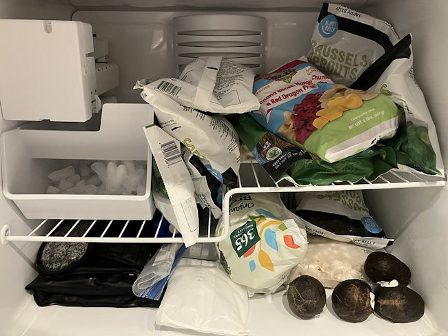

I posted [What I Eat and What I Don't Eat - 2023 Edition](/2023/09/what-i-eat-and-what-i-dont-eat-2023-edition/) six months ago. I plan to add a new edition later this year or next. In the meantime, I thought I'd do a show-and-tell with my pantry. These are the foods that keep me lean. They also happen to be inexpensive compared to the foods that are making so many people overweight.

I primarily cook with an Instant Pot. I also use an Air Fryer and a rice cooker.

### Pantry

Top shelf: various beans and lentils, dehydrated veggies, popcorn

2nd shelf: dried GF noodles, tomatoes, tomato paste, coconut milk, falafel mix, salsa, pasta sauce, GF pasta, sardines, dried kelp

3rd shelf: nutritional yeast, buckwheat, broccoli sprouts, seaweed, chia seeds, textured vegetable protein, steel-cut oats, quinoa, more buckwheat groats, onions, potatoes, purple yam

4th shelf (not in photo): vegetable broth, various hot sauces, spices, soy curls

floor (not in photo): cases of carbonated canned water (various brands)

Cabinet (no photo): white rice, brown rice, wild rice, more black lentils

### Fridge

Top shelf: cold brew coffee, lime juice, corn tortillas, Fat-Free Greek yogurt, peeled garlic, spicy jam (meh)

2nd shelf: prepacked power greens, tofu, sweet peppers, a jar of flaxseeds, Korean tofu soup leftovers, rice leftovers, cherry tomatoes, more yogurt

Top crisper: green onions, cilantro

3rd shelf: cooked potatoes, steel-cut oatmeal leftovers, prunes, more tofu, olives, more tomatoes, strawberries

Bottom left crisper: carrots, cabbage, green peppers

Bottom right crisper: apples, oranges, sumo mandarin tangerines

### Fridge Inside Door

Top left: natto

Top right: fish sauce, tamari, various hot sauces, cold brew coffee

Middle shelf: various sauces

Bottom shelf: kimchi, canned flavored water

### Freezer

Brussels sprouts, broccoli, hominy, Korean rice cakes, fruit mix, avocados\*

_\* The avocados were going bad, so I am testing freezing them._

### Freezer Inside Door

Top shelf: natto, Brussels sprouts, Korean rice cakes

Bottom shelf: squash, tofu, wild blueberries, corn

_UPDATE March 25, 2024: I forgot to include [Broccoli Sprouts](/2022/02/food-inflation-is-not-a-concern-on-the-peasant-diet/), which were growing by my window._

### Notes

The dehydrated veggies are non-perishable food in case of emergency or if I need a pinch of veggies for soup and I don't feel like chopping up something fresh.

I stopped buying meat and most dairy. I'm experimenting with a more plant-based diet. I'm only a few months into my "almost" pesco-vegan diet experiment. I'll let you know how it goes later this year or early next year.

Interestingly, a YouTube channel I follow called Conquer Aging Or Die Trying! did a video recently showing the diet he has used to [reduce his biological age by 19.5 years](https://www.youtube.com/watch?v=mUEGbBEPzgo). Our diets have a lot of overlap. He appears to be a pesco-vegan. When I ran my 2022 numbers through the formula, my biological age was 17 years younger. Peasant diet for the win!

---

## Comments

### M*
*March 24 at 2024 at 6:54 PM*

What is your living situation?  Family, partner, etc?

---

### MAS
*March 24 at 2024 at 10:53 PM*

@M* - Just me.

---

### Aaron
*March 25 at 2024 at 3:23 AM*

There are so many food items in your cabinet that would give me endless headaches. You must have a strong constitution.

---

### MAS
*March 25 at 2024 at 11:57 AM*

@Aaron - I am fully stocked now, which is why I took the photo. 

Most of my meals are mixing a grain with a legume. Add veggies and hot sauce.

---

### Joep
*March 25 at 2024 at 1:20 PM*

This is helpful! also find my diet moving in this direction. Less to no meat and more legumes and fish. Satiating, cheap and healthy. I am still having dairy (low fat yoghurt) with my oats. Mainly to get quite a bit of protein without a lot of calories. Curious to know how you approach dairy in your diet.

---

### MAS
*March 25 at 2024 at 1:23 PM*

@Joep - The only dairy I am buying is fat-free Greek yogurt. Although I rarely eat out, I won't stress if there is dairy in a dish.

---

### Joep
*March 26 at 2024 at 5:11 AM*

@MAS Thanks!

---

### S
*March 31 at 2024 at 10:49 PM*

Hi MAS, re: Conquer Aging Or Die Trying!, I notice he regularly eats sardines (100g per day). Do you know if he has ever addressed the heavy metal issue that I'm sure you blogged about in the past?  You used Chorella I think for chelation?

---

### MAS
*March 31 at 2024 at 11:12 PM*

@S C MELVILLE - I noticed that as well. I'm newish to his channel, so I don't know the answer. Yes, I supplement with Chlorella, Spirulina, and eat a fair amount of cilantro. 

I love what Conquer Aging is doing. I expect to learn a lot from him.

---

### Jim
*April 5 at 2024 at 2:11 AM*

@MAS Wow, you stock a lot of food.  When I lived alone, I had a loaf of bread, a jar of peanut butter, and a container of Folgers.  :-)

---

### MAS
*April 5 at 2024 at 11:28 PM*

@Jim - Ha! I didn't show you my coffee section. I have a photo gallery for that.
https://flic.kr/s/aHsmSwiVts

---

### Chris
*April 9 at 2024 at 9:22 AM*

This is a really helpful post. Good to see the practical/ physical outcome of your diet.

---

### Julia
*May 29 at 2024 at 5:31 PM*

oh my gosh, I would starve. Not that I dislike a lot of this food, it's just high carb. I've started a new nutrition program @AutumnBates on youtube, I've had a lot of success. Her website is called Autumn Elle Nutrition; it's using science to become metabolically healthy. Her nutrition plan of eating protein, fat, and fiber helps treat my insulin resistance (aka, sugar sensitivity). I buy all of my proteins at 30% - 50% off (aka, I just buy what's on sale at the store) and then freeze it. It's not that expensive compared to what I was spending before. Lots of delicious meals, which is important. 

I've lost about 14.5 - 16 pounds since April. 

I've taken a bit of a "deep dive" into Big Food, currently reading "Salt, Sugar, Fat: how the food giants hooked us" by Michael Moss. I gave away all of my seed oil foods, and added sugar foods.

---

### MAS
*May 29 at 2024 at 10:39 PM*

@Julia - Great to hear from you. Congrats on your weight loss. 

I'm never hungry, because my carbs are unprocessed with fiber. I also make sure to get a decent amount of protein. 

Salt, Sugar, Fat is a good book. You probably would like the Dorito Effect as well. 
https://www.markschatzker.com/doritoeffect-home-page/

---

### Julia
*June 22 at 2024 at 11:24 PM*

oh my gosh, thanks for the book recommendation! The public library near me has 4 copies, so I will def read this book (although I have like 7 books checked out already), plus he wrote another one I'm interesting in, "The End of Craving." All good stuff!! 

Oh, btw, I'm down 17 pounds now! Whoohoo! 

But I read on Zoe Harcombe's website (British obesity researcher) that only 2% of people maintain a weight loss of 20 pounds. Wow. You're in the 2% with your 40 pound weight loss! 

Zoe Harcombe is a complete meat-eater though. I enjoy reading her blog.

---

### MAS
*June 23 at 2024 at 12:24 AM*

@Julia - I really liked The End of Craving as well. I plan to post on it, but I need to post a few things first.

Congrats on the 17.

---

