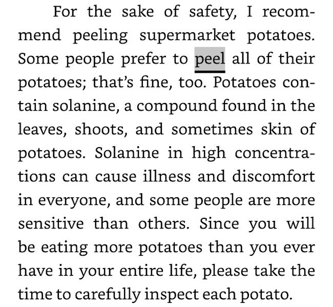

It has been several years since I did a strict [Potato Hack](https://potatohack.com/). Despite the nonsense you might read on SlimeMoldTimeMold, there is a proper method to performing a potato hack as spelled out in the book [The Potato Hack: Weight Loss Simplified](https://potatohack.com/#book) by Tim Steele.

-   Cook 3-5 pounds of peeled potatoes. Boil, steam, or pressure cook. Red or yellow potatoes work best. A sweet potato is not a potato.
-   Cool the potatoes overnight. This develops resistant starch which lowers the glycemic response. It will also reduce the calories of the potatoes by 17%.
-   Eat the potatoes plain. Eat until full. No salt.

The hack works on two levels. You get full while in a large calorie deficit, which triggers fat loss. And you reset the brain's connection with satiety and highly flavorful food. This allows you to emerge from the hack appreciating the basic flavors of whole unprocessed foods much better. This reduces the odds you will regain the lost weight. Most diets fail because they restrict the portions of the same flavorful foods which causes the individual to gain weight. The brain remembers the restriction and regain is almost guaranteed.

The potato hack is perfect, yet people bargain for ways to cheat. Then they cheat and the results are unwhelming and say the diet doesn't work for them. With humility, I decided to improve upon perfection.

### Adding Cabbage

The average American only consumes 10-15 grams of dietary fiber daily. A pound of potatoes will yield 4-5 grams of fiber (if peeled) and 8-10 grams (with the skins). If one eats 3-5 pounds of peeled potatoes, the fiber content will increase slightly during the hack. That is for most Americans.

Although I am not a vegan, my diet macros most closely match the whole-food plant-based vegans. This group gets between 40-60 grams of fiber a day. Some quick math puts me in this group.

Someone consuming high fiber that does a potato hack will see a big drop in fiber intake while the body is burning fat and releasing fat-soluble toxins. Just as increasing fiber intake too fast can cause diarrhea, decreasing too fast can cause constipation. You want to eliminate these toxins after they are liberated. Keep the pipes moving.

Cabbage is low in flavor and calories, but high in fiber. Perfect.

See the post [Dieting and Detoxification](/2018/04/dieting-and-detoxification/) for a deeper discussion.

### Potato Peels

Why not just leave the peels on and get the higher fiber content? The Potato Hack book says this:

Peeling potatoes is also wise if one is [concerned about cadmium](/2018/12/cadmium-and-potatoes-time-to-worry/).

What about organic potatoes? Read this [2018 comment from Maureen](/2017/11/potato-hack-quick-start-guide/#comment-26054), which supports Steele's concern about high solanine levels in potato peels.

> I stopped eating the peel of organic potato as well. I was married to a potato farmer for 30 years. There are more eyes on organic potatoes and more fungi on the outside, I know that, because I’ve got a license to pick out diseased potatoes. Organic races need to be more resistant against worms and insects, so it stands to reason that they will produce more solanine. Fusarium, Helminthosporium and Rhizoctonia, often found on the tubers are well known for the mycotoxins they produce. I started getting nightly muscle cramps when I ate organic potatoes with their peel. Now that I peel them, it has stopped.

This is why I picked cabbage over potato peels.

### My 5-Day Potato and Cabbage Hack

I am [weight stable at 180-182](/2023/01/mostly-weight-stable-regardless-of-diet-part-2/), but this is not firmly fixed. By the end of summer, I will drift down to 177. Warmer weather suppresses my appetite more. I also walk more and have a tighter eating window. On the flip side, my weight could drift to 184-186 at the end of winter. It did this year as well. Colder weather plus recovering from [my hernia](/2023/08/i-got-a-hernia/) surgery brought me up to 186.

See the post [Temperature and Appetite](/2023/10/temperature-and-appetite/) for more details.

Being at the high end of my ideal zone in March is not a concern. I'm fully recovered from my surgery and I've been adding some volume to my workouts. My step count is up. I would naturally drop a few pounds as the weather improves, but I decided to test my potato and cabbage hack.

I did 5-days strict. Nothing but cooked-and-cooled potatoes with lightly steamed green cabbage. I used an Instant Pot for cooking. I did not weigh or measure anything. I ate the potatoes slowly until I was full. The only difference was I topped each bowl of potatoes with a handful or two of steamed cabbage. Zero salt.

My fiber intake with the added cabbage more closely matched my daily diet than the original potato hack.

I went from 186 to 183. Interestingly, the weight drop didn't happen until the last day. I also dropped 1/2 an inch off my widest point. I continued to [supplement with creatine](/2024/02/have-i-found-my-headache-cure/) so I didn't credit the success of the hack when it could have been falling creatine levels. **It has been a week since the hack and I have maintained the 3-pound loss.** I call that a success.

What do you think of this variation of the potato hack? I think it honors the original and is a viable alternative for those of us who normally consume a higher-fiber diet.

---

## Comments

### Tim
*April 7 at 2024 at 5:36 PM*

Good to hear. I’m a huge fan of cabbage. Looks like nothing, but full of goodness.

---

### exfatloss
*April 7 at 2024 at 7:34 PM*

I would argue

1. the potato hack isn't a hack
2. it doesn't work
3. the way Steele describes it in his book makes it obvious he doesn't understand it, and why it works when it does
4. certainly anything SM TM have written is more informed/interesting than his "hack" nonsense

It certainly didn't work for me. I was "full" to the point of pain, yet didn't lose any weight. I couldn't eat enough. I wasn't satiated, I was ravenous all day long.

It certainly doesn't work because of "cAroLieS." In fact, conflating "full" and "satiated" tells me the guy has no idea about obesity. That's like not being able to tell apart the plus and minus sign and writing a book on math.

---

### MAS
*April 7 at 2024 at 9:52 PM*

@exfatloss - I honestly don't know why you read this site or take the time to leave comments. 

You had a bad experience on the potato diet so it doesn't work? You don't like my approach to nutrition, but it is clearly working for me and others. I think your keto approach is less than optimal and I cited my reasons on previous posts, but I always acknowledged that a low carb can work for many. 

I've tried numerous diets and I've never been leaner and for longer than now.

---

### Chris
*April 8 at 2024 at 1:03 AM*

Why do you think the weight did not drop until the last day?

---

### Jim
*April 8 at 2024 at 1:42 AM*

@exfatloss -- You seem cranky today.  :-)  In your writings, I think you mention that (please excuse the paraphrase) there is a difference between weight loss for those who have been very obese for a long time (you), and those that are active and have never been more than say 10 or 20 pounds over weight (@MAS and most of the folks reading this blog).  For that reason, it's understandable that your results would likely differ from that of others reading this blog.  Regarding the "hack" term, that is because the "diet" is only intended to be used for a short time period, not permanently.  Separately, IMHO, the tone of your post came off a bit harsh for this forum. Note--this is not reddit.  :-) Good luck!

---

### Aaron
*April 8 at 2024 at 3:46 AM*

Michael, I love your simplicity as always. If i didn't get headaches from potatoes, I would try this for sure. I'm gonna try a white rice version with cabbage and a little bit of tuna and chicken here and there... Are you still doing some vitamin D or have you stopped all supplements? Curious on that front again. I tend to usually stick with a very low amounts of vitamin D (1000iu) and vitamin C (calcium ascorbate at very low does, usually &lt;60mg at a time if I take it at all).

---

### Chris
*April 8 at 2024 at 11:45 AM*

@Aaron,  I get headaches too (terrible headaches) when I eat a large amount of potatoes, as I reported in another thread on this site in mid-2023. I also recall getting the same kind of headaches when I tried supplementing with potato starch to get more resistant starch about a decade ago.

---

### MAS
*April 8 at 2024 at 1:23 PM*

@Chris - I do not know. It could be a scale issue or water related. I did see a gradual and predictive decline with the tape measure. 

@Aaron - Supplements confuse the hell out of me. I do take a 5,000 IU Vit. D3 maybe 2x a week from October to March.

---

### exfatloss
*April 8 at 2024 at 2:38 PM*

@Jim

Well, the post begins by shitting on Slime Mold Time Mold, who clearly know much more about this topic. So you'll have to excuse my "cranky" comment.

And yes, people who've never been obese, and never dealt with obesity, talking about how a diet works (cArOliEs!!!1) is just the pinnacle of intellectual dishonesty.

It's fine to admit you don't know anything, it's not fine to shit on your betters (SM TM) and spout the dogma of caloria vegana.

---

### MAS
*April 8 at 2024 at 2:54 PM*

@exfatloss - Fair enough. I have been holding off on posting more about SMTM, because they are still exploring the topic. So far, I have been very disappointed. 

It is about calories. It is also about flavor. Both ideas are lost on SMTM. They never once mentioned the cooking-and-cooling for resistance starch. When Tim tried to comment there, they censored his comment. They censor a lot of comments. 

Then after not following the proper hack - which is low in flavor and calories - they start this nonsense about riffs where they pair the potato with something with more calories and flavor. And when that fails to get ideal results, they diss the potato diet itself, when the riffs have little to do with the hack. 

I offered myself to them as a resource. They linked to my blog, said they disagreed me, but never cited a reason. 

I fell for their chemical series until I found out all the holes in their research and how they were blocking comments that disagreed with them.

https://www.lesswrong.com/posts/7iAABhWpcGeP5e6SB/it-s-probably-not-lithium

I want more people to try the potato hack for themselves. When I see Reddit forums citing SMTM as Potato Diet experts it frustrates me.

---

### M*
*April 8 at 2024 at 3:27 PM*

MAS:  I am actually a bit surprised that you didn't lose more than 3 pounds on a 5-day hack.   Have you done 5-day hacks in the past without cabbage as a comparison?  I can't believe cabbage would make much of a difference.  But only 3 pounds surprised me a bit.

---

### MAS
*April 8 at 2024 at 3:43 PM*

@M*  - I think the reason it was only 3 pounds is that I am closer to my ideal weight. Years ago when I was in the 200-222 range, a potato hack was a much deeper caloric drop and I lost a bit more. 

Although it is possible that the cabbage blunted some of the losses. I would need to repeat the hack at my current weight without the cabbage. The drop off in fiber would be a concern.

---

### Jim
*April 8 at 2024 at 4:32 PM*

@exfatloss -- I think people who have not been morbidly obese **can** properly comment on weight loss for folks who are only slightly over weight (i.e., most of the folks here). Again, I don't think you are the target audience for this blog.  
It's like if a finance blogger posted about using mutual funds with lower fees to optimize return, and someone responded "you're dumb, you don't know **anything** about finance, how is that going to help **me** when I have $500k in credit card debt.?" Again, the responder was not the target audience.

---

### Aaron
*April 9 at 2024 at 9:37 PM*

Who are the people behind slime mold time mold? It just seems like someone in the Ray Peat style of research (long winding thought pieces with research scattered about making lose connections). While I like some Peat principles for diet, there are plenty of areas that the Peat diet lacks (or his research) and I hate what I consider to be weak science highlighted to proves points that don't really work in real time. Outcomes matter vs just looking at individual components. And what is it with exfatloss talking about someone's better? Ok, obviously whoever does SMTM is a super smart person, but it also means they can believe their own slime BS at times.

---

### MAS
*April 9 at 2024 at 9:41 PM*

@Aaron - SMTM is a brother and sister team that wishes to be pseudonymous. It is unfortunate that they censor comments from people that disagree with them.

---

### Gokhan
*June 11 at 2024 at 9:08 PM*

I tried the potato hack with white cabbage but I find potato and Brussels sprouts works better for me. It keeps the pipes moving. Thanks for the inspiration.

Still working on eating slow. Some habits are tough to break.

---

### MAS
*June 11 at 2024 at 9:31 PM*

@Gokhan - I like the Brussels sprouts idea. 

The way I tackle slow eating is instead of focusing on chewing slower, I take breaks between bites. Put the fork down for a minute or two occasionally and then resume eating.

---

