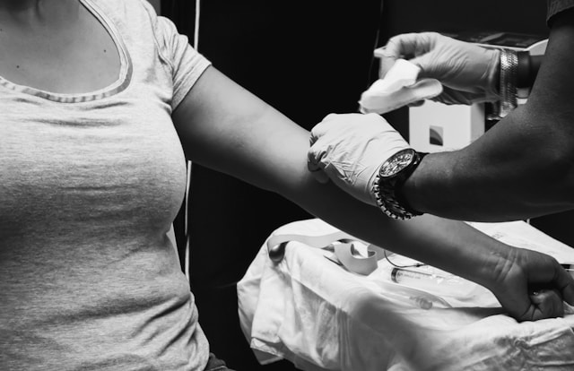

There are endless debates on how to lose weight. I'm bored of them because people have lost weight using numerous diets: [low-fat](/2022/02/in-defense-of-low-fat-dieting/), low-carb, vegan, keto, fasting, and even a [Twinkie Diet](/2013/05/the-twinkie-diet-proved-nothing/). It is the wrong area of focus. The statistic nutritional researchers cite often is that 80% of people who lose weight on a diet will regain it (and often more) within 4-5 years. Assuming one is even successful on their diet and they have an 80% chance of failing to maintain the loss, should they even try? That was the question I posted in this [2021 post](/2021/06/should-one-ever-diet/). One might think there is no harm in trying, but if dieting reduces metabolism, they could end up back at their starting heavier weight in a worse position. I decided to diet and I was successful. In the 2021 post, I credited my success to eating lower-flavor foods that were higher in volume and fiber and tended to have fewer calories. I also shifted to higher protein as I neared my ideal weight. Although I think that primarily explains the fat loss and the lack of hunger, it probably wasn't the full story.

### Seed Oils

In 2022, I posted [The Seed Oil Debate Revisited](/2022/09/the-seed-oil-debate-revisited/). Two of the four reasons I discussed are relevant to this post. Do seed oils reduce metabolism? Do seed oils increase appetite? Exfatloss did a great post recently on [Modern PUFA Theory](https://www.exfatloss.com/p/a-reply-to-dynomights-thoughts-on), which covers both of those questions. Read it all, because he is bringing up points that the seed oil defenders are ignoring. I went through strict PUFA removal starting in 2013. Later I added back nuts and seeds. My body temperature increased from 97F to 99F (it was 98.4 for years, but has increased more recently). Can I give credit to the removal of processed linoleic acid? Is body temperature even the correct way to measure metabolic rate? I'm borrowing this idea from the Ray Peat camp.

### Microplastics

The hot topic today is microplastics. They are everywhere. I asked Claude AI to explain the role microplastics might have on metabolism.

> Some microplastics and the chemicals associated with them, such as bisphenol A (BPA) and phthalates, have been shown to have endocrine-disrupting properties. These substances can interfere with the normal functioning of hormones involved in metabolic processes, such as insulin, thyroid hormones, and sex hormones, potentially leading to metabolic disorders like obesity, diabetes, and thyroid dysfunction.

And...

> Preliminary research suggests that microplastics may interfere with lipid metabolism, potentially contributing to the development of dyslipidemia (abnormal levels of lipids in the blood) and increasing the risk of metabolic diseases like obesity and cardiovascular disorders.

What was I doing to address this problem? I started frequently donating blood in 2010 to reduce iron levels. Microplastics or other endocrine disruptors were not even on my radar at that time. Then for a few years, I frequently went to the sauna. My body was purging things that could potentially be reducing my metabolic rate. A great video on the topic is from Miche, Ph.D. which focuses on pesticides. [Speed Up Your Metabolism: New Research You’ve Never Heard of | 8 Science-Supported Tips](https://veganmiche.blog/2022/10/08/speed-up-your-metabolism-new-research-youve-never-heard-of-8-science-supported-tips/) This confirmed my hunch that saunas and donating blood are tools for removing these metabolic-lowering compounds. Donating plasma is better, but I can't in my area because they only take plasma from blood type AB (I'm B+).  _Donating blood by_ [_Obi - @pixel8propix_](https://unsplash.com/@obionyeador?utm_content=creditCopyText&utm_medium=referral&utm_source=unsplash)

### What Gets Credit?

I've maintained my 40-pound weight loss for almost 5 years now effortlessly. How important are seed oil and microplastic removal to metabolic health, dieting, and weight maintenance? I don't know, so I'll continue eating the [same diet](/2024/03/whats-inside-my-pantry-and-fridge/)\*. I'll still avoid seed oils. Every 56 days, I will donate a pint of blood. And a few times a month, I will spend 20 minutes in a sauna. I would do more saunas, but it is [bad for my skin](/2019/01/regular-sauna-use-the-good-the-bad-and-the-ugly/). I hope we learn more about this in the coming years. What are your thoughts? _\* I still eat fish in the form of sardines, which is likely a source of microplastics. I also supplement with chlorella and spirulina, which probably mitigates some of the problem, as does [cilantro](/2021/10/joe-rogan-sardines-and-arsenic/)._

---

## Comments

### S
*May 19 at 2024 at 7:27 PM*

I also eat cilantro (coriander) daily as well as some Chlorella in a shake - but I saw a comment from Chris Masterjohn re chelation being a minefield (I don't recall in what context) that has made me wonder that even if cilantro/spirulina/cilantro has mild benefits for removing some heavy metals, could they also be removing micronutrients as well?

---

### MAS
*May 19 at 2024 at 7:34 PM*

@S C - I recently read advice to consume the cilantro/spirulina on an empty stomach for detox purposes. I meant to look more into that. Your comment reminded me that I hadn't.

---

### Aaron
*May 20 at 2024 at 5:15 AM*

Hey Mas,

I'm a little surprised you entertain a lot of what exfatloss and Brad Marshall says. To me, it seems like 2 really smart people trying to justify all kinds of quack theories. First off, we all know that one shouldn't be trying to consume refined seed oils. The idea though that EVOO (1-3 Tbsp a day) or eating nuts and seeds (1-2oz a day) in reasonable quantities is a no go flies in the face of almost every very healthy person I know. We aren't going to go into hibernation from these types of intakes. Avoiding the EVOO and nuts/seeds would be akin to a lean mass hyper responder avoiding carbs with sky high cholesterol trying to justify that cholesterol is safe at the high level. (that carbs aren't the answer to their problem, fact check: yes, they are too low in carbs)

When I see a person online say: Quote: Yeah, I'm starting to believe overall health is indicative of saturated to monounsaturated fat ratios in the body...very interesting stuff and I have so much to learn as this is all so new to me (I just shake my head)
All one would have to do is go to Sardinia to see all the nuts/seeds/EVOO/chickpeas they are eating and living a long time. I'd like to see their saturated to monounsaturated ratios.

When Brad says we should minimize seed oils and avoid EVOO because of the monounsaturated fat, I would say, what should we consume? If you were to think that the majority of the diet was carbs and some protein, the rest would have to be saturated fat. Even if you had the content of that diet up to 15% fat &lt;--- it would at a minimum be 50% saturated or something like the fat ratio of grass fed tallow. I&#039;ll consume EVOO, thank you.

You can excrete out some cadmium and some other heavy metals in small quantities in the sauna, but your regular detox system does a good job if you eat vegetables and protein and fruit.

I&#039;m totally in your camp when it comes to giving blood. I&#039;d always want to be on the lower end of iron, and giving blood also stimulates blood stem cells and renews things and is actually a better detoxifier than a sauna.

---

### MAS
*May 20 at 2024 at 1:12 PM*

@Aaron - I can't speak for either exfatloss or Brad, but the way I would answer that is that years or decades of overconsumption of seed oil calories that lead to weight gain could benefit from an over-correction. 

IOW, go super low in PUFA while the body is losing weight. My body temps didn't go up immediately when I did the strict seed oil restriction. It took years. There could have been another reason for the rise. I don't know. 

Once the person is lean, then decide what is best. I only restricted nuts and seeds for the first year. 

I came to the mathematical conclusion that best strategy to accomplish that was increasing carbs. This put me at odds with most of the anti-seed oil crowd, because they have love for low-carb/keto/carnivore.

---

### Rod
*June 1 at 2024 at 2:33 PM*

Regarding pesticides, I am guessing that this would include not bathing in insect repellant as I typically do several times a week to avoid getting chewed up by mosquitoes and the biting insects.  I realize that keeping skin covered with clothing and wearing netting around your face would work but that really isn't practical during hot months when exercising out in the woods is a sweaty endeavor.  

I'm not sure there is a good solution but it makes me wonder how hard to try eating only more expensive organic veggies if I intend to continue to enjoy my times in the woods bite-free.

---

### MAS
*June 1 at 2024 at 3:21 PM*

@Rod - I don't know anything about bug spray toxicity. I did military service at Camp Grayling in the summer (Michigan). I absolutely would reach for bug spray. 

The more I think about this topic, the more it seems obvious that frequent blood/plasma donations and saunas are the biggest levers. Far more important than switching to organic produce. But the majority of people won't take this path, so a cleaner diet is their best option. I could be wrong.

---

### HS
*June 3 at 2024 at 12:02 AM*

I've heard before that microplastics end up in the water supply so a low hanging fruit way to  reduce exposure would be to use a reverse osmosis filter.

Another one I heard in the video below.  Apparently there are a lot of microplastics in dust that we end up inhaling.  So vacuum your floors.

https://www.youtube.com/watch?v=G_2iPKoTjkY

---

### MAS
*June 3 at 2024 at 1:43 PM*

@HS - I watched that same video. The tip I took away was to open your windows when vacuuming.

---

### Hs
*June 5 at 2024 at 1:52 AM*

Yes, he did say that. Both tips have value. Part of the reason to vacuum floors regularly is to keep the dust from getting kicked up in the air so it improves indoor air quality.

---

### Julia
*July 13 at 2024 at 12:56 PM*

I don't want to be of that 80% !! 

Actually, I thought the stats were worse than that! 

Per UK obesity researcher Zoe Harcombe, PhD; 2% of people retain a weight loss of 20 pounds. 

Well, I've lost about 20 pounds (thus far) on weight-loss journey, and I really want to maintain that!! (of course). 

Interestingly, when I get to a certain weight - it gets so much easier, but unfortunately, there has been a heat wave where I live. I just want to eat cold food! Ice cream!!!

---

### MAS
*July 13 at 2024 at 1:37 PM*

@Julia - Zoe may be including the people that failed to lose weight in the first place. The 80% number I cited was people that had already successfully lost weight.

---

