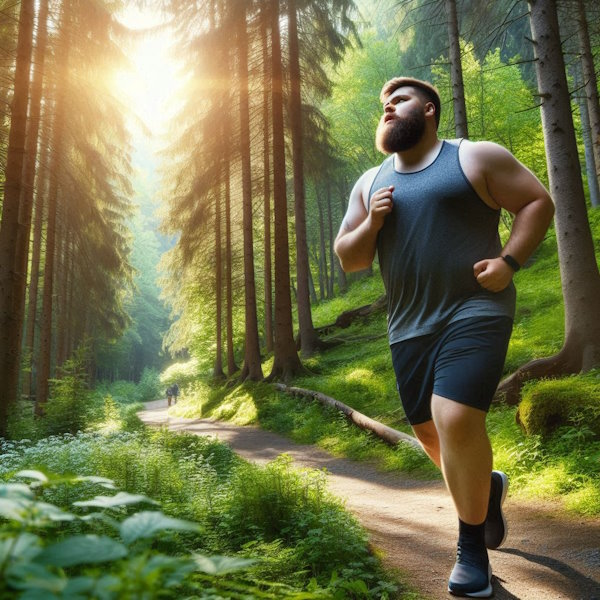

A topic that I've been fascinated with for more than a decade is the role exercise has on appetite. Going back over a decade, I have several posts on my views of exercising while dieting. The short version is that one should focus on nutrition first and slowly add exercise as the weight comes off. Be patient otherwise, you will always be hungry and likely regain.

I've said enough on that point. What about those of us who are weight-stable? Do different forms of exercise have different effects on appetite - even when adjusted for caloric burn?

I don't have a firm opinion on this and it may be woo-woo, but I think the the brain knows when to ramp up appetite to a greater extent depending on the type of exercise. Before I explain, I want to distinguish this idea from the HIT gospel: a muscle doesn't know the difference between free weights and machines when under equal load. That I still believe to be accurate.

Based only on my personal experience and observation, I suspect that exercises that favor being heavier will drive appetite higher, and exercises that favor being lighter will have less of an impact on appetite.

### Bro-Lifting vs Bodyweight

When I focused on doing heavier "bro-lifts" (squats, deadlifts, bench), my appetite was never greater. Weighing more provides an advantage in these lifts. When I focused on body weight exercises such as chin-ups and pushups, my appetite was more in check. In fact, at those times I did the most chin-ups was times when dieting was easier. Did my brain calibrate an appetite for success in both scenarios?

From my [2012 Chin-Up post](/2012/09/how-i-improved-my-chin-ups/):

> Dropping 20 pounds made it seem like I was floating upwards.

One could say that my volume of work was greater when bro-lifting. That is true if you only look at the workouts and not the total activity for the week. When I was bro-lifting, I would collapse into the recliner a lot more. When I did bodyweight, I did more activity throughout the week, such as hiking. If one looked at calorie burn, they would likely be equal. Yet my appetite was higher bro-lifting.

Am I alone? There are a few YouTube channels of former bro-lifters who switched to bodyweight/calisthenics during COVID-19. They switched to exercises that penalize any extra weight and although I don't know if they feel less hungry than when they were in the gym, I suspect they are. They now have a leaner and less bulky look.

I may have the correlation backward. Lean people succeed in bodyweight exercises. Stocky men succeed in bro-lifting. It would be interesting to track athletes who switch from bro-lifting to bodyweight (or vice-versa) and track their appetite perception.

### Walking and Running

Walking doesn't increase my appetite. Back when I was [running distances](/2008/03/the-runner-1989-1995/), I was constantly hungry. Like the bro-lifting example above, although running burns more calories than walking, I spent much more time resting between those runs.

Did the brain ramp up my appetite to compensate for the calories lost during a run and the possibility of needing additional fat stores for future runs? Does my brain keep my appetite in check when I walk 10,000 steps a day because carrying extra weight for that much time would be inefficient?

I don't know the answer. There are a lot of chubby distance runners out there. When I return from a walk, I don't need to eat a plate of pancakes. Back when I was training for a marathon, I was always eating more than I needed. I'm leaner and less hungry walking.

### Your Thoughts?

Again, all this is speculation. I would say I have a 50% chance my thesis is correct. What do you think? Are there exercises that spike your appetite (more than necessary) or exercises that have little to no impact on your appetite?

---

## Comments

### Aaron
*May 5 at 2024 at 10:05 PM*

I'm pretty sure I get an increase in appetite from swimming (because of cold water), but since I'm always hungry, it doesn't really matter.

---

### Stuart
*May 6 at 2024 at 8:22 AM*

MAS,
         I can see where you are coming from…especially with aerobic exercise. When I was running, if I turned down the volume for whatever reason, I always ate less. It’s just like my body self regulated. It was the dialling down of intensity for me.
Now that I’m 57 and walking a lot more and running a heck of a lot less ( in fact I’ve dialled down the intensity…and / or the amount of times I train intensely, in order to save my body) I find that I don’t have to eat as much as when I was in my twenties or thirties, and don’t want to. This has probably been the saving grace that has helped me stay relatively lean.
I remember when training for my one and only triathlon. I would come back from a training session at the local swimming club, a typical session of hard ( for me…a rubbish swimmer) interval style training, and then dive into a family bag of crisps ( chips for my American friends) followed by several pieces of toast and butter. This was after having had a big evening meal earlier in the evening. So swimming was definitely THE worst exercise for me, probably followed by hard running ( no longer do that…these days it’s easy jogging only) but running only kicked in after a waiting period, as I was never ravenously hungry straight after…unlike swimming.

---

### Jim
*May 6 at 2024 at 7:41 PM*

--I haven't noticed much related to exercise and appetite, although I've seen several folks discuss that they tended to organically lose weight when focusing on pullups while they tended to organically gain weight when focusing on weighted pull-downs.  
--I have, however, noticed that I tend to lose weight when I sleep more.  When I changed my wake time from 5AM to 7AM, I lost weight while seemingly eating the same diet.

---

### MAS
*May 7 at 2024 at 1:53 PM*

@Jim - I love your example. Pull-up versus Pulldown. Someone could create a study to test my thesis on those 2 exercises. 

Swimming is a tough one. I could be wrong, but my understanding is being too lean and too heavy is a hinderance to performance. There is a sweet spot of bodyfat and that varies depending on the event and water temperature. Is a pool sprint or an open water triathlon. Wet suit? Probably too hard to nail down. I'd want to hear from a swimming coach on this example.

---

### Aaron
*May 7 at 2024 at 4:16 PM*

Here is a study that has a lot commentary around swimming and appetite. https://www.ncbi.nlm.nih.gov/pmc/articles/PMC2952805/

---

### Geoff
*May 11 at 2024 at 10:48 PM*

Interesting topic, for sure. My personal, n=1 experience is similar to yours for resistance training. For running I respond differently. I’m an endurance athlete, and after long aerobic runs my feelings of hunger are low but my appetite is high - I don’t feel hungry but when I eat to recover I can eat a lot. More intense running like intervals and tempo runs drives my hunger through the roof but my appetite is lower. It takes very little to fill me up after a track session even though I feel very hungry. A gentle 30 km run requires net more energy than a 15 km workout with 5 km of intervals, but the intervals require more carbohydrates than the long run or a walk. Perhaps that explains my experience?

Runners, myself included, are notorious for overestimating the number of calories they burn working out.

---

