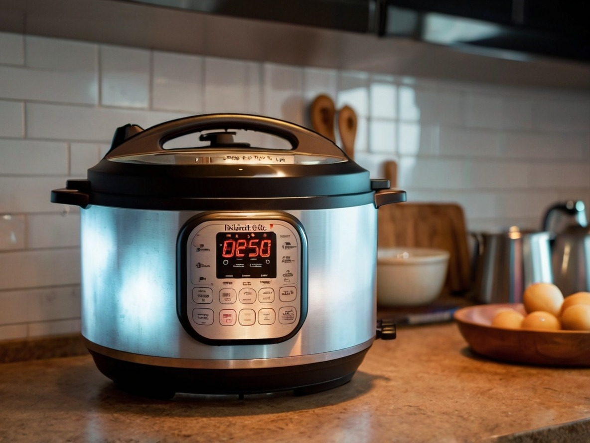

Recently, I was giving the [potato hack](https://potatohack.com) pitch to someone interested in losing weight. Like most of the times I've had this conversation, I could tell my advice would not be followed. Concepts such as food volume, satiety, and how the brain responds to flavor are ideas people can't grasp in an elevator pitch. Later it hit me there was a better reason I got lean that had nothing to do with the potato hack, [protein & potatoes](/2018/12/potatoes-and-protein-a-no-hunger-template-for-fat-loss/), or the [peasant diet](/2017/09/used-peasant-diet-lean/). I was successful because I could food prep. The cooking and kitchen time management skills I had going back to around 2008 were well developed when I decided to lose weight. I am always making time to learn how to cook different cuisines. Instead of bouncing around, I usually have an area of focus and devote effort to what I want to get proficient at. It might be Thai, paleo, Korean, or fermentation. I stick with it until I am not looking at recipes and am instead using muscle memory. Two summers ago, I was focused on Indian cooking. After that, my focus was on soups. This summer it is all about tofu and tempeh. It wasn't always like this. When I lived in California (2000-2007), I had a long commute and ate out for lunch most days. When I got home at the end of the day, I didn't have the energy or motivation to prepare meals that would make me as lean as I am today. Although I mostly ate healthy meals, I'd be up for heading out to a restaurant a few times a week. After moving to Seattle, my commute ended, because I could work from home. This allowed me to develop an interest in cooking and nutrition. By the end of 2008, I realized that [The More You Cook, The Better You Look](/2008/12/the-more-you-cook-the-better-you-look/). It wasn't soda and chips that kept me 20 pounds heavier, it was going to restaurants several times a week. It didn't matter that most of my menu choices were "healthy", they were calorie-dense.

### First the Bad News, then the Good News

With food delivery apps and endless choices for going out to eat, it has never been easier to avoid cooking. The result is we collectively are getting heavier each year. Although it is possible to order foods that would keep us lean, we don't. We want to be entertained with delicious food and to get our money's worth. I'm no different. Even though I rarely go out to eat now, when I do, I tend to pick more flavorful dishes with higher calories than anything I would prepare at home. The good news is that it has never been easier to be lean. Grocery items can be delivered as easily as prepared meals. [My pantry](/2024/03/whats-inside-my-pantry-and-fridge/) is mostly items that Amazon delivered. I have an Instant Pot, a Japanese rice cooker, and an air fryer. I just ordered a veggie chopper this morning. These cooking devices are major time savers. I can prepare meals faster than ordering out. Then between YouTube and AI chats (Claude, ChatGPT, Pi), I have the information to make whatever I need - as healthy as I want - while controlling the ingredients myself. AI chats are an amazing resource for leveling up in the kitchen. I consult with AI chats daily to build recipes and adjust for my needs (cooking method, gluten-free, substitutions, portion size, etc).  _AI draws an Instant Pot_

### Getting Lean with Food Prep

The old-school bodybuilders were pioneers in realizing that meticulous meal preparation, not just training, and steroids, was key to achieving a shredded physique. They transformed their bodies in the kitchen, not restaurants. We don't need to get as lean as them, but we can (once again) use their wisdom to keep us from getting heavy in a world where obesity rates continue to rise. When dining out or purchasing processed foods, you have little control over the ingredients used. Cooking meals at home allows you to carefully monitor what goes into your food, making it easier to maintain a lean and healthy physique. While I now prefer mostly vegan, low-fat diets, success with any dietary approach will greatly benefit from home meal preparation. Food prep is a skill that improves with continued practice.

---

## Comments

### Robert
*June 24 at 2024 at 10:09 PM*

I have had a similar experience with home cooking. I have been exploring japanese food and my fasting blood glucose level has dropped to about 95. Huge improvement and I find I like home fermented Natto.

---

### Jim
*June 25 at 2024 at 11:06 AM*

Nice post.
When I worked at an office (stressful legal work), we worked 10-12 hr. days and you basically needed to go out to lunch to get a break. The NYC deli we went to served these delicious huge sandwiches.  We would always try to just eat half, and leave the other half in the bag to take home.  But it often was too difficult and we would end up eating the second half as well--I could swear it was calling out to me.  :-)  

After I started working from home, I lost about 20 pounds in three months without even trying, just because no human would ever make their own sandwich the size they do at those delis.

---

### MAS
*June 25 at 2024 at 6:13 PM*

@Robert - I made natto twice about a decade ago. Now that I have an Instant Pot, I may try again. 

@Jim - So true. San Diego breakfast burritos were our equivalent. Half of one on the way to work and you were full all day.

---

### Julia
*June 25 at 2024 at 6:21 PM*

I've had a lot of luck with Autumn Elle Nutrition (on Youtube, it's "AutumnBates"). I'm down 19-20 pounds since mid-April (whoohoo!!), about 8 pounds per month which I'm pleased with - I didn't want to lose weight too quickly. I didn't want the loose skin, or stretch marks. At my age, mid-40s, it's so hard to lose weight! But it was so easy to stay lean in my 20s! 

Her strategy is balancing protein, fat, and fiber with each meal, and she pairs that with Intermittent Fasting. So far, so good! 

I have no idea when my "weight loss journey" will end though. I used an InBody (instead of Dexa scan) to determine my Body Fat percentage, so I'm just going to go by body fat percentage. Unfortunately, I have pretty low muscle mass, a.t.m. which I'm trying to improve on. 

Thanks for your suggestion, "The Dorito Effect," I put it on my list to read from the public library. He also has another book I'm interesting in reading after that, "the End of Craving." 

FYI, your diet of preferring "mostly vegan, low-fat..." is the polar opposite of obesity researcher Zoe Harcombe, PhD. She's all about the high-fat, and eating mostly animals for nutrition.

---

### MAS
*June 25 at 2024 at 8:27 PM*

@Julia - Yeah, I mentioned in a different comment to you that I enjoyed "the End of Craving" also. I may post on it in the future.

You can certainly lose fat with a low-carb approach. I've heard Zoe's name before, but I stopped paying attention to the low-carb cult years ago. They can't stop lying about carbs - which makes their views on other nutritional arguments less credible - at least to me.

---

### Julia
*June 26 at 2024 at 11:19 AM*

@MAS, what are you thoughts on a Continuous Glucose Monitor? Too obsessive? 

It's my understanding, a CGM is coming out over the counter soon. Though I know they're expensive.

---

### MAS
*June 26 at 2024 at 2:21 PM*

@Julia - I am a skeptic of CGM when it comes to non-diabetics. This looks like a cash grab by carb-phobic tech bros. 

https://web.archive.org/web/[phone removed]4535/https://thedietwars.com/peter-attia-cgm/

If you follow the cheerleaders in the space, they (or one of their friends) often have a investment in a company profiting from expanding the market. That doesn't mean it might work. It may. 

I know 2 healthy people on CGM. One just got it and he believes it is helping him, because he can see that avoiding alcohol. helps his numbers. Duh! Do you need a monthly subscription to learn that. 

The other loved it at first, but later discovered the data was too varied and concluded it was wasted money that made her neurotic.

---

### Julia
*July 6 at 2024 at 7:31 PM*

I've never thought of using AI to build meals!! 

Maybe I will try it some day.

---

