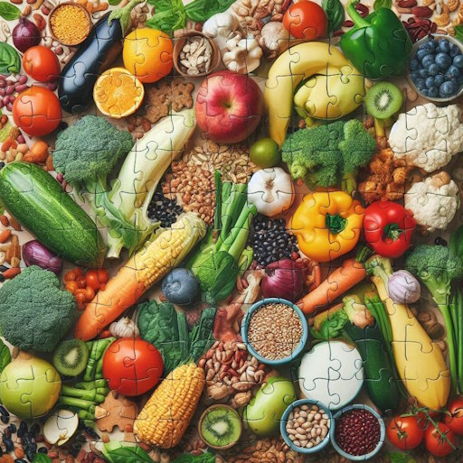

For years, I’ve thought about a topic: How do our beliefs about nutrition take shape, particularly in a field rife with conflicting viewpoints? Over time, I’ve fallen for various nutritional ideas—perhaps I still am. How can we discover the truth when even the experts disagree? In 2015, I posted [Irresponsible Health Blogging](/2015/09/irresponsible-health-blogging/).

> In recent years, I’ve taken a different approach. Instead of taking sides, I acknowledge that I don’t know and do my best to cover the various sides of the argument. Then I will put forth my current view on how it applies to me. Like the investor who thinks he has a good basket of stocks but knows he could be wrong.

Many believe they are skilled enough to read PubMed studies to get to the truth. I acknowledge that I am not. From [(Still) Not a PubMed Warrior](/2023/07/still-not-a-pubmed-warrior/):

> The last few years have shown us that very few people are qualified to not only read a study but also know the quality of the study. They would also need to know the landscape of similar studies in that domain. Is the study confirming a body of knowledge or contradicting it? Who financed the study? This is hard stuff. To become qualified or decent at this skill requires both a high intellect and lots of practice.

I concluded with the framework I used to get closer to the truth.

1.  I collect smart people that can explain studies that are not on a team.
2.  Seek out the counterargument even when a persuasive voice says what we want to believe.

This is a better approach, but it can still be improved upon. When I hear two people smarter on a topic than me who disagree, how do I know who is correct? How does the family dog know which member of the family is smartest? It's probably the one that feeds him the most treats.  _Nutrition puzzle_

### Ranking Credibility version 1.0

This is an opening attempt to rank credibility. I will modify it if needed.

1.  **Tier 1** - Nutritional researchers with PhDs. The people who spend their entire careers studying nutrition and publishing research will likely have the most credibility. Nutritional researchers will be able to determine which studies are good and which aren't. They use statistics over anecdotes. Although everyone can demonstrate having bias, I suspect this group has the least. They aren't trying to sell seats on a low-carb cruise. From my observation, they welcome thoughtful criticism and debate. These are also the least skilled at communicating with the public. They are researching while the hucksters are polishing their Instagram Reels. Thankfully, an increasing number of online resources now provide concise summaries to the general public.
2.  **Tier 2** - Doctors in a related field. Doctors who study their field and can share what they have used successfully with their patients are valuable information. They can sometimes be ahead of researchers in the same way some personal trainers developed exercise protocols years before they were confirmed by academia.
3.  **Tier 3** - Doctors in an unrelated field, independent health researchers, and journalists. This group is important because they can be on the cutting edge of finding ideas that will eventually get validated by nutritional researchers. However, many of the ideas end up being wrong. They also often have the most financial incentives to make exaggerated or contrarian claims
4.  **Tier 4** - Bloggers or social media influencers who are summarizing what we learned from the first 3 Tiers and our personal experience (n=1). I'm in this Tier.

These Tiers don't tell you who is correct when there is a disagreement. The truth can come from any Tier, but this is how I currently rank them.

### Losing Credibility

There are many voices in the nutritional space that I once found credible, but no longer do. How to lose credibility with me:

1.  Emotional-based arguments or dismissive responses to valid criticism. Attack the messenger.
2.  Contrarian on multiple topics. This is a red flag that they are building their brand by telling you "what the experts don't want you to know".
3.  A history of getting things wrong and then moving on without admitting fault.
4.  A history of misrepresenting studies or citations.
5.  Blocking or deleting comments from those with respectful disagreement.

### Thoughts?

I didn't name names or cite examples of disagreement in this post. I want to establish a framework that nutritional enthusiasts can use. Am I on the right path? How do you resolve differences when both sides of the debate are super smart and have studies to support their argument? This blog has nutritional posts going back to 2006. My views have changed over the last 18 years and continue to evolve. I want to revisit several topics but hopefully, do so from a wiser position. I'm not going to claim I know the answer. I'll provide my opinion on the views I find more credible, which changes as I learn more. **UPDATE July 1** I forgot to add "Directional accuracy" as a tool for finding credibility. Good ideas will gain strength and evidence over time. Bad ideas will often fade away. Following this metric, I will "wait out" claims that are out of line with conventional thinking until they are validated by others.

---

## Comments

### garymar
*June 30 at 2024 at 11:50 PM*

All I can say about this post is:

Doctors hate this!

---

### Jan
*July 1 at 2024 at 9:56 AM*

While in broad agreement of the excellent points you're making here, I'd add a couple of  caveats. Firstly, even nutritional researchers with multiple Ph.D's and experienced medics in related fields are frequently funded by bodies with vested interests in research outcomes.  The integrity of all medical/health research (well, all "research" in  truth) is at an all-time low.  Secondly, the most important determinant of outcomes in all health matters is, in my opinion, our individual and unique biologys. "One man's meat is another's poison" is not just a cliché.  In the end, what works for you is the paramount criterion.  If you thrive on a diet of kale and cardboard, go for it; if it's steaks and ale, great!  The key thing is what keeps you happy,  healthy, satiated and thriving.  Listen to your own body - after all, it's known you best all your life.  They don't call our innate wisdom "gut instinct" for nothing.

---

### Joanna
*July 1 at 2024 at 12:21 PM*

As a professor of Public Health, I feel that you have identified the main concerns of reading studies without enough background information spot on! And your framework and tiered expertise system are both sensible. Lots of people don't even get to read the full studies if they are behind a paywall (so just see PubMed abstracts) and the full article is where the "devil is in the detail" comes into play (the science paywall is a whole other contentious topic).

---

### MAS
*July 1 at 2024 at 2:01 PM*

@garymar - ha!

@Jan - Good point. I don't know if there are legitimate researchers that might get funded from industry, so I'm not sure how I can break this group up. 

@Joanna - Thanks. In an upcoming post, I will start building a list of the voices I currently find the most credible. The discredited list would be too long. 

@All - I forgot to add "Directional accuracy" with an explanation, which I will do now.

---

### Jim
*July 1 at 2024 at 4:00 PM*

Maybe there should also be a weighting factor to adjust for newness bias?  As friend of the blog Chris Highcock wrote:

"I am also less inclined to give much attention to the alternative, new or faddish approaches. Ecclesiastes has it right - there is nothing new under the sun. Certainly the science is interesting and is discovering things, but there is little justification for the tabloid excitement about some new diet or exercise."

---

### Adam
*July 3 at 2024 at 3:51 PM*

Excellent points. I feel this applies to all areas of science and especially the heated topics.

One potential solution is to use AI Agents to read the research, find counter arguments and perform critical evaluations in a fully transparent way (so you can check every step). Probably won't get us all the way there but certainly a lot of closer. I'm in the process of building such a system.

---

### Stuart
*July 4 at 2024 at 4:53 AM*

Surely the title of this article could have been “Nutritional and Exercise Persuasion”?
Everything you’ve said about nutritional research could be duplicated around the field of exercise also.

---

### Stuart
*July 4 at 2024 at 6:49 AM*

Regarding studies vs anecdotal evidence…
Sometimes anecdotal does win out. When all is said and done we are essentially an experiment of n=1.
People have varying tolerances and results from different types of food as they do for different types of drugs. If a study came out tomorrow, extolling the virtues of a dairy diet, then that would be of no comfort / use to those who were lactose intolerant.
  Similarly some conclusions drawn from studies by the authors do not pass the common sense sniff test.
Take one study done a while back on running speeds and stress on the joints with regards to injury potential. The study found that higher peak forces on the knee were noted at higher running speeds…no surprises there. But the study went on to state that potentially there were greater dangers to the knees at lower running speeds due to the CUMULATIVE forces on the knee due to more steps being taken at lower speeds as opposed to less being needed at higher speeds, for any given distance. This doesn’t make sense. If cumulative rather than peak forces were the issue, then walking would have the highest injury rates than any other activity, and we know that the injury rates of walking are a minute fraction of running.
If I hit a nail with  a hammer one thousand times with one pound of pressure I am not going to affect the nail as much as if I hit it once with a thousand pounds of pressure.
Sometimes I feel that researchers are so keen to prove something that they forget the common sense conclusions staring them in the face.

---

### MAS
*July 4 at 2024 at 3:03 PM*

@Jim - Agreed

@Adam - Great idea. Ask the AI chats to debate both sides of a topic and see where it goes. If you build such a system, let us know. 

@Stuart - To me, exercise has less confusion. Stay active, stay interested, and don't get hurt. Nutritional mistakes can takes years or decades before you know you messed up. With exercise, one bad rep and you'll know immediately.

---

### Stuart
*July 4 at 2024 at 4:54 PM*

MAS,
Yes and no. 
Yes one bad rep can lead to disaster. But there is also the stuff that Bill DeSimone writes about. The wrong choice of exercise, or performance of exercise that takes years to manifest itself.
Running can be like that for many people. It may take decades for the negative effects to show in some people.

---

### MAS
*July 4 at 2024 at 5:16 PM*

@Stuart - You are correct.

---

### Geoff
*July 17 at 2024 at 12:46 PM*

Thank you for posting this, MAS. Reading this helped me reframe my thinking about nutrition, but also left me with some deeper questions I can't resolve:

1. Are researchers and physicians approaching the topic from the same perspective as me? The research seems focused on broad solutions for a/the general population. That's a valid purpose, but what really matters to me is my personal n=1 experience. The experts can guide me, but what I care about is how my diet and exercise choices impact my own personal experience.

2. Is there really a singular "truth" about nutrition or could there be multiple different approaches that are each equally valid?

3. As long as one isn't following a way of eating that history has already shown to be foolish, how much of a difference is there really in the outcomes for diets generally recognized as "healthy"?

4. How much of the outcome is really within my control and how much depends upon factors like genetics or the place where I happen to have been born?

5.  Are we in the health and fitness community placing too much emphasis on optimizing our diets when adequate nutrition is good enough? 

Perhaps you should consider a "Tier 0" or "Tier Prime" - Things that we have proven through personal experience to be supportive of our individual health and fitness goals. "Tier 0" truth may change with changes in our circumstances and goals, but that does not make it any less true. We just need to recognize that truth can be context-dependent.

---

### MAS
*July 17 at 2024 at 10:37 PM*

@Geoff - Perhaps n=1 is Tier 0, but I've been fooled before. There are so many variables. I now trust the researchers with superior math skills more than myself - unless it is obvious. An example would be my negative reaction to alcohol. Nothing in my genetics would indicate I should have an issue with alcohol, but I do. Other family members are fine. 

There were also times when I was sure I was right, but I wasn't get my blood work done. Today I am. Then I need to question if I'm getting the right tests and the frequency. 

My interests now are more in the longevity space as I am past my "get big" phase and I'm lean enough. Longevity for all of us is unchartered territory. 

I'm following the Conquer Aging channel from a distance. He is about my age and has a very similar diet. He is getting numerous blood tests to test ideas. I'll draft off his success. :) 

https://www.youtube.com/@conqueragingordietrying1797

---

### Chris
*August 1 at 2024 at 9:25 PM*

@Jim - thanks! I'm not sure when I said that but it sounds good and I still believe it.    This morning I was looking back through blog posts I wrote 10-15 years ago and it was interesting to see what I still believed and what had changed.   I'd say I am still 85% in the same place.  My diet thinking has changed a bit but not too much.  I find it interesting now reading the newer writers again how most of it has already been said.  The same messages keep appearing,  There is little that is really new.

---

### exfatloss
*June 29 at 2025 at 6:03 AM*

Ha, my hierarchy is almost the opposite.

1. Nutrition PhDs: unless they have a pretty extreme counter-signal or very good argument, I assume they are wrong about everything. The ship is on fire, I don't need to hear from the people who built it and are claiming it's not their fault. These people would lose their careers, livelihoods, &amp; status if they admitted failure. That's why it's almost impossible for them to be honest.

2. The S-tier for me is people who had a very dramatic problem that is considered unsolvable, or at least not in an easy way - and then solved it. Especially if it's engineers, because engineers are used to solving problems with logic and debugging to the true root cause. Unlike scientists, engineers are paid to get stuff done, not to ask for more money to "do further studies."

That's why I care much more about the opinion of an Amber O'Hearn, Greg Genereux, and similar. I've been in their shoes - I've disproven "the experts" in several nutrition related fields, with effect sizes that are considered impossible and brushed aside as "anecdotes!" by "the experts."

Who would I believe, my experts &amp; their studies or my own, lying eyes?

---

