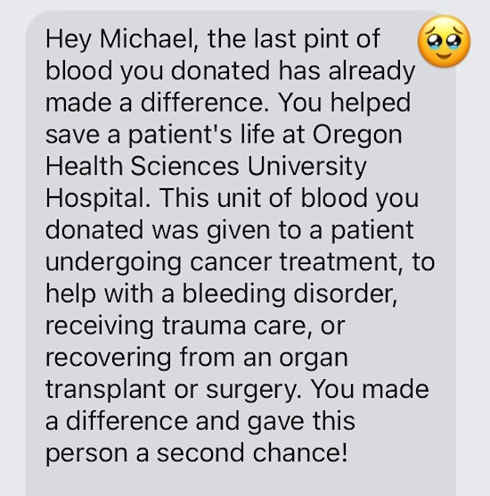

Back in 2010, I posted [The Selfish Case For Donating Blood](/2010/06/the-selfish-case-for-donating-blood/). It was about how I was inspired to donate blood again to reduce iron levels. Years later, my primary motivation shifted to removing [environmental toxins](/2022/07/seed-oils-blood-donations-and-body-temperature/) and later [microplastics](/2024/05/dieting-seed-oils-microplastics/).

Fast forward to 2024 and I've donated almost 6 gallons of blood in Washington. I have also donated a gallon in both Florida and California.

Then last week, I received this text.

Powerful.

While I am busy optimizing my health, someone else is clinging to life. And we both are helping each other. One day that might be me in need of life-saving blood.

Some people whine that they don't like needles as an excuse not to donate. Think about what this patient and his family are going through right now and weigh that against some minor discomfort you might experience.

In my life, I've only had one bad blood draw. My arm was bruised for a bit and I was back donating 56 days later.

Donate blood.

---

## Comments

### Jim
*July 28 at 2024 at 5:18 PM*

@MAS I've been donating every three months for the last 5 years.  I think I was originally inspired by one of your posts.  Interestingly, I actually couldn't donate last time I tried because my iron was too low (just out of range).  I took an iron supplement and retried three days later and was able to donate.

With regard to needles, they often have a hard time tapping my veins because they're too thin and below the skin.  A few times my donation failed because the blood stopped flowing, and it turned out that a clot had formed due to the needle damaging the vessel wall.  

But all in all it's been a great experience.  Thanks for the recommendation.

---

### MAS
*July 29 at 2024 at 11:58 PM*

@Jim - I had the same issue a while back. My last blood draw my iron level did not drop. I donate again on Friday. My summer diet is almost vegan, so it will be interesting to see if my iron levels remain steady.

---

### Notch
*July 30 at 2024 at 11:54 AM*

I've been giving blood for many years; typically twice a year but I've increased to 5-6 times a year over the last 2 or 3 years (I think in part because of your blog).  I never had a bad experience donating and hopefully it's benefitting my health (in addition to potentially saving others) over the long run.  My donations are spread over three different organizations and my old Red Cross donations are not synced w/ current due to email/address changes apparently but I must have donated several gallons.
Red Cross keeps pushing for Power Red or Platelet donations but I'm only interested in giving whole blood.
The "I don't like needles" excuse is weak.  No one "likes" needles and this is a pretty painless procedure.  That said, I still remember the old lancets for the finger prick - that was the most painful part and I still flinch due to memories of those finger jabs.

---

### Jim
*August 2 at 2024 at 1:30 AM*

@MAS I'm sure your blood helped someone, but I wonder if was actually for the specific use they mentioned in their thank you letter?  It seems like it would be a lot of work to send out messages with such specific information?.  I'm thinking it might be like one of those things where you donate to  an African wildlife fund and they send you a picture of a specific elephant you "adopted," but there's a disclaimer that your donation is just used to help the general fund, and the elephant photo is just used as an example.

---

### MAS
*August 3 at 2024 at 12:32 PM*

@All - I donated blood again on Friday. Here is what I learned.

Based on my data and history of donations, 8 weeks is not enough for me to restore middle of the range Iron levels. During the summer, my diet is mostly plant based. I estimate that I'll need 10-12 weeks between donations - unless I supplement with iron. 

The message I received was not generic. There is a chain-of-custody for tracking blood through the system. My pint did go to Oregon. It was given to  man with cancer and he survived. I don't know how long this system has been in place or how long I've been signed up to receive notifications. This was the first message like this that I have received. I chatted with an employee - and frequent donor. He has yet to receive a message like the one I posted above.

---

