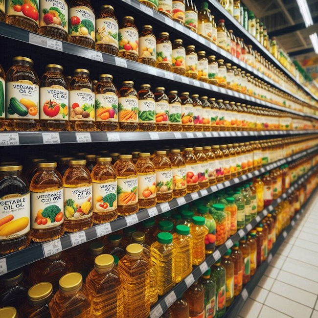

In prior posts, I've mentioned my gradual increase in body temperature since I began severely restricting seed oils. I was going off memory, but thanks to the blood donation portal, I now have 13 years of data where I had my temperature and pulse were measured. All my donations were taken in the early afternoon. There appears to be some missing data. I have donated 45 times in Washington, but only 41 have the screening data saved. _(I donated a few times in California during this period, but I do not have that data)_ [Google Sheet: Body Temp, Weight, Pulse](https://docs.google.com/spreadsheets/d/1obxCFZ1IWa9q3zJpIeFzAc5FOnYzxTMK039D4mgu10Q/edit?usp=sharing) Claude AI sees the pattern too.

> There's a clear upward trend in body temperature over the years. The average temperature has increased from around 97°F in the early years to about 99°F in recent measurements. This trend is statistically significant but small in magnitude (0.04°F per year).

Did seed oil restriction cause my temperature to rise? Or maybe it was the reduction of microplastics through frequent blood donations? Or something else? I don't know. I raised these questions in [Dieting, Seed Oils, Microplastics](/2024/05/dieting-seed-oils-microplastics/). I'd love to see a study where they divided a bunch of people into different groups and then monitored their outcomes.

-   control group
-   no seed oil, no blood donation
-   no seed oil with regular blood donations (like me)
-   seed oil with regular blood donations

Measure their metabolic rate. I used body temperature, which is a crude measurement. I'm sure there are other metrics. Maybe my data means nothing. I'd love to find out if we can tell from a larger sample size. Until then, I'll keep restricting seed oils and donating blood. 

---

## Comments

### Notch
*August 11 at 2024 at 12:30 PM*

Interesting.  I've also noticed an increase in my body temp in recent years as I've donated blood more frequently.  I generally avoid seed oils as well.  I grew up hearing that 98.6F was normal body temp but mine was always below that.  Perhaps the reduction in iron/ferritin is also a contributing factor to increased body temp from regular blood donations.  I'll have to go back and read (or re-read) your related posts.

---

### MAS
*August 11 at 2024 at 1:44 PM*

@Notch - I don't think the iron level reduction was a factor, because it always increased during the gaps between donations in a predictable manner. Longer breaks = greater increase.

---

### Jim
*August 14 at 2024 at 6:21 PM*

I'm personally skeptical of the anti seed oil bias.  But maybe I'm just skeptical of all nutritional bogeymen these days.  Maybe I'm just bitter from all those years avoiding delicious bread.  :-)

---

### Hs
*August 23 at 2024 at 2:53 PM*

Do you eat nuts and seeds?  If it’s simply the type of fat in seeds and presumably nuts, then you would think having those as part of your diet would prevent the temperature increase. perhaps it’s something else about the seed oils

---

### MAS
*August 23 at 2024 at 3:09 PM*

@Hs - Yes, but they were a small percent of calories.  From AI chat:

"Seed oils generally have the highest linoleic acid content, with most containing over 50% and some reaching up to 70%."

"Almonds have a much lower linoleic acid content at about 16%, making them a lower source compared to seed oils."

I've also read that the Vitamin E in nuts/seeds helps negate the issues that seed oil critics raise.

---

### Aaron
*August 24 at 2024 at 7:41 PM*

Hey Mas,

I’m not sure we can shit on polys until we answer these questions. And if you have any answers for any of them, please let me know!

We know that caloric excess and holding extra body weight beyond one’s optimal carrying capacity for fat is bad (and it can be wildly different for individuals). As far as one would use polys in their diet and be in caloric excess, how much does that shift the percentage of our human body fat to polys in and how uniquely dangerous would this be vs increasing mono’s or saturated fats in tissues when in caloric excess? I’m assuming diets of at least 40-55% of carbs and 15-20% protein and the rest would be types of fats.

If one is not in caloric excess and not holding extra body weight, how much will the body incorporate polys into tissues and how bad would that be vs diets higher in saturated or mono fats?

Is the preponderance of low temperatures when someone consumes polys because of a lack of calories in general or possibly something that happens when in caloric excess and the fact that the body starts incorporating more polys into tissues?

The argument that polys are going to cause out of control free radical activity has never sat well with me. If almost everyone who shits on polys says it's gonna take 6 months to a year plus to get rid of most of the polys in one’s body, how is it that one would be experiencing out of control free radical damage. It seems to me that as long as someone is consuming antioxidant rich foods and gets enough vitamin e (not huge levels), their own body’s antioxidants systems work pretty well too to deal with this. And, would this ever even become an issue if one does not have excess fat tissue despite a diet high in polys?

Do poly’s directly signal something to our thyroid to shut down its actively? I’d like more data on this.

---

### MAS
*August 24 at 2024 at 9:00 PM*

@Aaron - Great questions. I wish I knew the answers. 

Some of the sources that support my cautious view include FireInABottle, Hyperlipid, exFatLoss, and some early Ray Peat writings. I don't know if my cautious view is justified. I just ran the experiment on myself and reported my data. 

There could be a 3rd reason for the body temp increase outside of seed oil restriction and blood donations. 

I share some of your skeptisim about what appear to be overclaims from the seed oil haters.

https://criticalmas.org/2022/09/the-seed-oil-debate-revisited/

Until we know the truth - if we ever do - I'll limit my seed oils to trace exposure and continue donating blood regularly.

---

