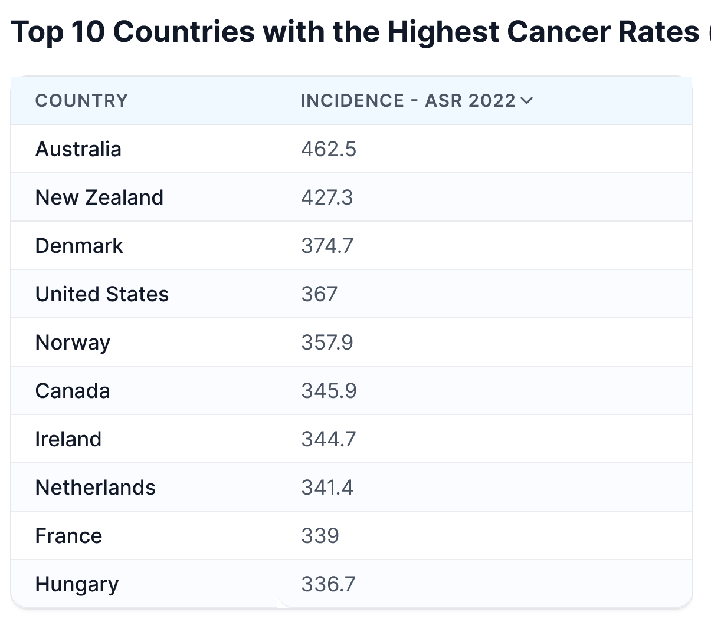

A topic that is getting a lot of publicity this year is the thesis that America has a toxic food problem that is making us sicker and fatter than other countries. RFK Jr. and some prominent voices on X are pushing this narrative.

I have mixed views on this topic and will use this post to sort them out.

### Is it the Chemicals?

From [Policy ideas for a healthier America - The Next #57](https://justinmares.substack.com/p/policy-ideas-for-a-healthier-america) by Justin Mares:

> The American food system is uniquely poisonous. We allow 150 pesticides that Europe bans, and high levels of these toxic pesticides are found in 93% of American’s blood/urine samples. A simple approach would be to adopt the same chemical regulatory approach as the EU. Today, the EU bans 80,000+ chemicals the US allows in our food, water, skincare, and other products.

Sounds scary. I have no idea how to measure the danger Americans have relative to Europeans when it comes to negative health outcomes from these chemicals. If it were a strong signal, would it show up in cancer rates? Let's look at the [top cancer rates by country](https://worldpopulationreview.com/country-rankings/cancer-rates-by-country) from the WHO.

The USA is "middle of the pack" on cancer outcomes.

However, when it comes to obesity, we are higher than all European countries. We also [consume far more ultra-processed foods](https://sapienlabs.org/data_gallery/ranking-of-countries-by-prevalence-of-frequent-ultra-processed-food-consumption/). Ultra-processed foods are the source of many of these chemicals that may be harmful. They are also higher in calories.

So is it the calories or the chemicals that are leading to worse health outcomes? Maybe both? But it doesn't matter, because if one is concerned about the chemicals, they would adopt a more whole food diet and consume fewer calories. Stop eating out at restaurants so much. Cut back on food delivered to your door in plastic containers. Plug in your Instant Pot and start cooking with ingredients that you trust.

I suppose we could study all these chemicals and have a better answer in 10 or 20 years. In the meantime, we can whine on social media about how we feel healthier after our European vacation than we do back home eating DoorDash. It must be the chemicals, right? ‍

_Calories or chemicals? Or both?_

### A Tale of Two Food Supplies

Instead of comparing the worst of America to the best of Europe, let's compare America to itself. America has never had more food choices at the healthy end and it gets better every year. More organic options and more farmers' markets.

When I was in San Diego, 20 years ago, I would spend my weekends driving to Costco and other stores to buy the same bulk staples. After fighting traffic and getting home, I'd be too tired to cook and would go out to eat. My cooking skills were also limited.

Today I have my non-perishable groceries delivered. I recovered all that lost time and now have plenty of energy to cook at home. I have an Instant Pot, an air fryer, and a rice cooker. There are thousands of hours of cooking videos on YouTube. I use chat AI apps to build recipes for me almost every day. _20 years later and I'm 25 pounds lighter!_

If you value healthy eating, there has never been a better time to be alive. But if you don't know how to cook or care to learn, then I don't know what to say.

### How This Story Ends

I know how this push to clean up our food supply will end. Nothing will happen.

Does anyone remember the Great Recession of 2008-2009 when a handful of banks almost destroyed the world economy? People were outraged and united. They demanded action.

Then what happened? The banks got bailed out and the angry citizens who could have moved their deposits to credit unions and regional banks kept their money parked at the big four banks. The big banks got bigger, paid their executives huge bonuses, and we all got 0.1% interest on our savings accounts for a decade.

The entire country was outraged and we did nothing. Today's chemical outrage is 1% of the financial one. Assume nothing will happen. It's up to you to protect yourself and your family. I wish nothing but the best for the group fighting to clean up the quality of our food supply.

### Last Words

There is a related topic on the difference between food in America and Europe that I think has merit. It will be the topic of my [next post](/2024/10/the-end-of-craving/). In the meantime, eat a clean whole food diet and donate blood (or plasma) regularly. Sauna if you can.

---

## Comments

### Jim
*October 10 at 2024 at 3:22 PM*

@ MAS Good post.  In a related issue, I've seen a bunch of memes where they show the ingredients for the same processed food item (like Cheerios) in the US and Europe, with the US item having 25 ingredients and the European one having only 3 ingredients.  It seems convincing.  But then one person in the comments said that the difference was just based on different ingredient listing rules in the US.  So who knows what is really going on?

---

### MAS
*October 11 at 2024 at 4:44 PM*

@Jim - Interesting. I did not know that about the labeling rules.

---

### Grubby
*October 14 at 2024 at 8:02 PM*

Earlier this year Consumer Reports conducted their most comprehensive review ever of pesticides in food and compiled a very helpful list. https://www.consumerreports.org/health/food-contaminants/produce-without-pesticides-a[phone removed]/

---

### MAS
*October 15 at 2024 at 4:30 PM*

@Grubby - Thanks for sharing. Glad I peel my potatoes.

---

### exfatloss
*October 27 at 2024 at 4:50 PM*

Good post. Especially about the nothing will happen. Remember: no one is coming to save you. If you don't unobese yourself, RFK Jr. won't do it for you. This is an n=1 thing.

Also agreed that it's in a sense easier than ever, although it's also more difficult than ever. The food landscape has just diverged so crazy. If you go to an average truck stop in Middle America where a trucker would stop to eat after a long day, you can play the "does it have seed oils game?" and you're guaranteed a 95% hit chance. Probably same for every other sus bad thing/"chemical"/hyperpalatable/ultra-processed.

So the average person just going out and grabbing whatever is worse off than ever. Yet the same person, deciding to go online and look up how to make healthy, cheap, home-cooked meals, would also have it easier than ever.

Personal accountability has become so much more important.

On the calories thing, that is always a cop out for me. Ok, but what has CAUSED us to eat more calories if that's it? What causes us to eat more calories than Europeans?

Humans clearly have a built-in satiety mechanism that makes us stop eating, or at least is supposed to (when not broken).

You can't tell me that people in the 70s were hunting around and starving half of the time and that's why they were so much skinnier. Something's been clearly going on, messing with that satiety signal.

So if you say "carolies" that's just a proximate cause, and now you need to find the real cause.

---

