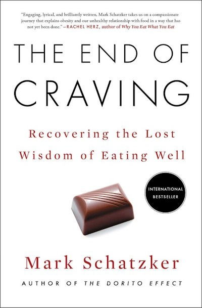

In my [previous post](/2024/10/does-america-have-a-toxic-food-problem/), I discussed whether there is a toxic food problem in America. The short version is that I'm skeptical that added chemicals play a bigger role than the excess calories from ultra-processed foods in worsening health outcomes in America compared to Europe. Maybe they both play a role? Maybe they are connected? But it doesn't matter because we don't need another reason to cook whole food to be healthy.

I concluded with this line, which is the topic of this post.

> There is a related topic on the difference between food in America and Europe that I think has merit.

Earlier this year, I listened to The End of Craving audiobook. It was the most persuasive thesis I've heard to explain American obesity rates when compared to Europe - specifically Northern Italy.

Because the book was written by a journalist, I know to be skeptical. Journalists who write about nutrition tend to be very good writers and convincing. But I've been [burned before](/2015/02/tell-me-low-carb-lies/), which is why I label them Tier 3 in the post [Nutritional Persuasion](/2024/06/nutritional-persuasion/).

### The Thesis

The book has been returned to the library, so I'll be going on memory. The claim is that the people of Northern Italy have an obesity rate of just 8%, which is a fraction of what we have in the USA. The author then goes into some history and possible explanations of the difference.

#### Vitamin Fortification

Both Europe and the USA had a pellagra problem 100 years ago. This comes from a vitamin B-3 deficiency. America solved the problem by adding vitamins to flour. Europe took a food-combining approach. Both worked. The pellagra problem was solved. But did this have an unintended consequence?

Farmers raising pigs learned that adding B vitamins to their chow would result in faster-growing animals than when the animals were raised on pasture. At the same time, we are feeding livestock additional B vitamins, we are consuming more and more processed foods that have been fortified with vitamins. The pigs and humans are now both getting heavier at a faster rate.

This portion of the book reminded me of a series of posts from FreeTheAnimal almost a decade ago. From [How Food Enrichment Promotes Obesity ("Theory of Everything" Wider and Deeper)](https://freetheanimal.com/2016/05/enrichment-promotes-everything.html):

> Whether you’re a farm animal, a rodent, or a human, you must acquire some source of B vitamins to maintain appetite—it doesn’t matter where the B vitamins come from so long as you obtain them to keep your appetite up. As Osbourne and Mendel, and countless other researchers showed, this is why the diets of farm animals and lab rat chow must be fortified. The subjects would not have the appetite and growth response from those purified foods otherwise.

The entire post is worth reading. It includes charts showing that when countries start fortification obesity rates rise shortly afterward. FreeTheAnimal also covers issues with [iron fortification](https://freetheanimal.com/2015/10/fortification-obesity-refinements.html).

#### Nutritional Mimicry

The End of Craving also covers "nutritional mimicry". This is what occurs when foods are engineered to simulate the sensory qualities of nutritious foods without actually providing the same nutritional benefits.

One example is artificial sweeteners, which most of us are aware of.

Food manufacturers have also developed various techniques and ingredients to replicate the creamy, rich texture of fats. These include the use of emulsifiers, stabilizers, and other additives.

Our bodies have evolved to detect nutrients through taste, smell, and other sensory cues. These cues typically signal the presence of important nutrients and calories. Food manufacturers have learned to exploit these mechanisms by creating foods that trigger our nutrient sensors without delivering the expected nutritional payload.

The claim is that this "mimicry" can lead to overconsumption because our bodies continue to crave nutrients that aren't present in sufficient quantities, despite the strong flavors suggesting otherwise.

The American food system is full of products that exploit this nutritional mimicry, which can cause overconsumption of calories and weight gain.

### Toxins, Fortification, or Nutritional Mimicry?

I stopped eating bread/gluten when I was first exposed to Paleo. I also stopped drinking milk. This eliminated almost all my exposure to fortified foods. That wasn't my intent. It just happened.

I still avoid gluten/wheat and the only dairy I regularly consume is fat-free Greek yogurt without fortification. I also don't consume foods with fake sugars or fats. They tend to be processed foods, which I avoid as a category.

If there is merit to these theories, then I had the wind at my back that allowed me to reduce calories without experiencing a spike in appetite. And if the concerns about excess iron from FreeTheAnimal are valid, then the almost 6 gallons of [blood I've donated](/2024/07/donate-blood/) since 2010 have also been another accidental win for my body composition.

Maybe it doesn't matter what which of these factors may or may not be true, because the answer is still the same. Minimize restaurants, food delivery, and processed foods. Eat whole foods. That way you avoid the chemicals, the fortification, and any nutritional mimicry. Or you could just move to Italy to test the thesis. For science!

What are your thoughts on this topic?

---

## Comments

### Sean
*October 14 at 2024 at 6:18 AM*

My money is still on abundance of hyper palatable foods and culture. As long as something is enjoyable enough most human beings will keep on eating past the point of no longer being hungry. I bet Northern Italy's culture frowns more upon hyper palatable foods and overeating than America and has less access to them.

---

### Nick
*October 14 at 2024 at 10:23 PM*

My thoughts are I want to move to Italy. I loved it before and this is just another reason to go. :-)

---

### MAS
*October 15 at 2024 at 4:29 PM*

@Sean - Perhaps. I've never been to Italy, so I can't comment. However, if the regular food one is consuming isn't using nutritional mimickry, then appetite would fall when exposed to junk food. It would less enticing. I think this could all be tested to tease out the appetite differences between the different theories. 

@Nick - For science!

---

### exfatloss
*October 27 at 2024 at 4:35 PM*

Ok just right off the bat, Northern Italy has much higher obesity than 8%. I've vacationed there a number of times and while it might be better than the U.S., it's pretty bad even compared to the rest of Europe I'd say. No way it's 8%. Was that a self reported number or something?

The data that I used for my post was for all of Italy and slightly outdated, but it had Italy just under 20% obesity even then: https://www.exfatloss.com/i/126533270/europe

They're also pretty bad at heart disease from what I know (though all the men there seem to smoke).

Italian food is also hyper-palatable and calorie dense if there ever was a cuisine. Pasta with olive oil sauce, pizza, steaks, extremely sweet desserts..

With all this said, I am also extremely skeptical of our food fortification fetish. Maybe it's just useless, but with a similar "too many cooks" attitude like you mention, I don't need one more sus influence in my kitchen.

One man's vitamin/mineral is another man's chemical. "They're putting chemicals in the food!" Vitamins/minerals are just chemicals. The idea that they are always and everywhere beneficial at any dose is clearly proven wrong for pretty much all of them.

---

### MAS
*October 27 at 2024 at 4:47 PM*

@exfatloss - I'd love for you to read and review the End of Craving. You did a solid job on your review of Burn. 

I'm not sure what to believe, but the red flag for me - so far - is that this book has so far received little attention.

---

### exfatloss
*October 27 at 2024 at 4:55 PM*

@MAS

Ordered. Took the liberty of posting lengthy comments again lol. Last time I got the impression you were mad at me for commenting.

---

### MAS
*October 27 at 2024 at 5:02 PM*

@exfatloss - Not at all. I like reading your stuff.

---

### exfatloss
*October 27 at 2024 at 7:28 PM*

Likewise!

---

### Julia
*October 28 at 2024 at 7:29 PM*

wow, what a love fest between you and exfatloss! I admit, I'm now following his substack since he linked it here, on another post! 

the reason I came here to comment, I was on the Facebook and I saw an article, "the reason why the '80s were the best decade to be alive in America," or some such title - and I immediately thought of you, MAS! LOL. 

I came here to post the article, but then I got distracted, and lost article - plus I was kind of afraid to press a link on FB, always the advertisers.

BTW: I didn't comment on nutrition at all! I've not read "the End of Craving" but it's on my list to read. The next book I'm planning to read on Audible is by Georgia Ede, M.D. Her website is "diagnosisdiet (dot) com" She's another MD telling people to avoid eating the white stuff (sugar, flour, carbohydrates).

---

### MAS
*October 28 at 2024 at 7:54 PM*

@Julia - The best decade to alive is right now. I love the internet, Amazon Prime, and no indoor smoking.

---

### exfatloss
*October 28 at 2024 at 9:21 PM*

I love the no indoor smoking, but I think I might trade Amazon Prime for an obesity rate in the single digits ;)

---

### Julia
*October 30 at 2024 at 1:28 AM*

update to my low-carb, ketogenic diet (Keto Made Simple/Dr. Eric Westman's approach): 13 pounds to go before I weigh what I did when I graduated high school!

---

### MAS
*November 3 at 2024 at 12:51 AM*

@Julia - Congrats. Sorry your comment got flagged as Spam.

---

### Seth
*November 27 at 2024 at 9:43 PM*

I'm reminded of some of Matt Stone's recent videos. 
https://www.youtube.com/watch?v=tQpdMuqN22o
He says he experiences relief from his asthma and allergies when he avoids foods fortified with vitamin A (which can be quite toxic once you exceed your liver's capacity to store it). Interestingly, he doesn't seem to think that seed oils are as bad for human health as he once did.

---

### MAS
*November 28 at 2024 at 2:43 PM*

@Seth - Thanks for the link. I had AI summarize it to save me 24 minutes.

<blockquote>
In the video "MAHA or haha? Can RFK Jr. really Make America Healthy Again?", the speaker recounts their personal struggles with asthma and allergies related to dietary choices , specifically highlighting the harmful effects of ingredients like vitamin A palmitate often found in cereals. They express skepticism regarding RFK Jr.'s health strategies, critiquing his reliance on outdated dietary advice and the oversimplification of nutritional solutions to complex health issues, despite recognizing the presence of harmful additives in our food system. While supporting RFK Jr.’s advocacy against big pharma and improvements in school lunch nutrition, the speaker is apprehensive about the implications of his dietary proposals based on their personal experiences, underscoring the challenge of navigating health amid evolving food regulations and the need for a nuanced approach to dietary health.
</blockquote>

---

### MAS
*June 28 at 2025 at 12:56 PM*

@All - exfatloss has posted his review.  Check it out.
https://www.exfatloss.com/p/book-review-the-end-of-craving

---

### exfatloss
*June 29 at 2025 at 4:01 AM*

Oh, I'm sure this is where I was told about the book! I had totally forgotten, thanks.

---

